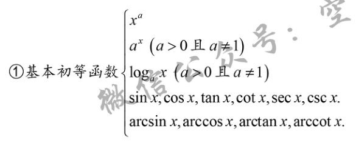
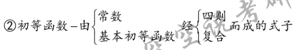

	[003](bookxnotepro://opennote/?nb={e468095d-0a98-4be5-b638-8a7e60819690}&book=8627032c87cf99b087e7c9a8c2e04dea&page=2&x=226&y=699&id=1378&uuid=fbdfee74dd7e28e4217b3fc86debc225)
	基本初等函数

	[004](bookxnotepro://opennote/?nb={e468095d-0a98-4be5-b638-8a7e60819690}&book=8627032c87cf99b087e7c9a8c2e04dea&page=3&x=233&y=91&id=1379&uuid=d9fc346fa1ccf505cfba3813337e2ce6)
	初等函数由基本组合
