# 重点题型讲解

	[008](bookxnotepro://opennote/?nb={eaae9369-1988-4e39-8c00-ce441fc1deb4}&book=54c5b9ae3433e2c72a012cc255d42319&page=7&x=415&y=238&id=19309&uuid=8dc17e0eeaef3195435eae871a1b3bc8)
	对称的题：
	1. 观察范围——x 镜面对称
	2. 再看对称性
	==常数 z，可以看成变量 x、y 的偶函数==——可以变两倍

## 三重积分计算
[007](bookxnotepro://opennote/?nb={eaae9369-1988-4e39-8c00-ce441fc1deb4}&book=54c5b9ae3433e2c72a012cc255d42319&page=6&x=208&y=158&id=19310&uuid=c7ac775a79b0b3525a5457e94f9724ab)

	[009](bookxnotepro://opennote/?nb={eaae9369-1988-4e39-8c00-ce441fc1deb4}&book=54c5b9ae3433e2c72a012cc255d42319&page=8&x=406&y=156&id=19311&uuid=ee9c3bc1cc737c89836a8b494177452b)
	1. [[第十二章 多元积分学及其应用#^fhj01e|先二后一]]
	2. [[第十二章 多元积分学及其应用#^075a83|变量对称性]]+[[第十二章 多元积分学及其应用#^f3d4e8|球坐标]] 

	[013](bookxnotepro://opennote/?nb={eaae9369-1988-4e39-8c00-ce441fc1deb4}&book=54c5b9ae3433e2c72a012cc255d42319&page=12&x=472&y=153&id=19312&uuid=94e86b01753af4f42bb9bfdb83c3769d)
	[[第十二章 多元积分学及其应用#^d53feb|奇偶性]]消掉x
	1. [[第十二章 多元积分学及其应用#^f3d4e8|球坐标]]：虽然不是 $\sqrt{x^2+y^2+z^2}$ 结构，但是仅有一个 z（$r\cos(\varphi)$），相对 x 和 y 来说好代一点。
	2. [[第十二章 多元积分学及其应用#^a7m3ar|先一后二]]常会代入含有根号的边界，但是这里 z 是一次，积分后是二次，刚好消掉根号
	3. [[第十二章 多元积分学及其应用#^fhj01e|先二后一]]的典型结构
	4. [[第十二章 多元积分学及其应用#^310fce|柱坐标]]的图形

## 曲线积分计算
[021](bookxnotepro://opennote/?nb={eaae9369-1988-4e39-8c00-ce441fc1deb4}&book=54c5b9ae3433e2c72a012cc255d42319&page=20&x=198&y=159&id=20043&uuid=8eaea921ae334f2d1d144ab5e643657d)
### 第一类
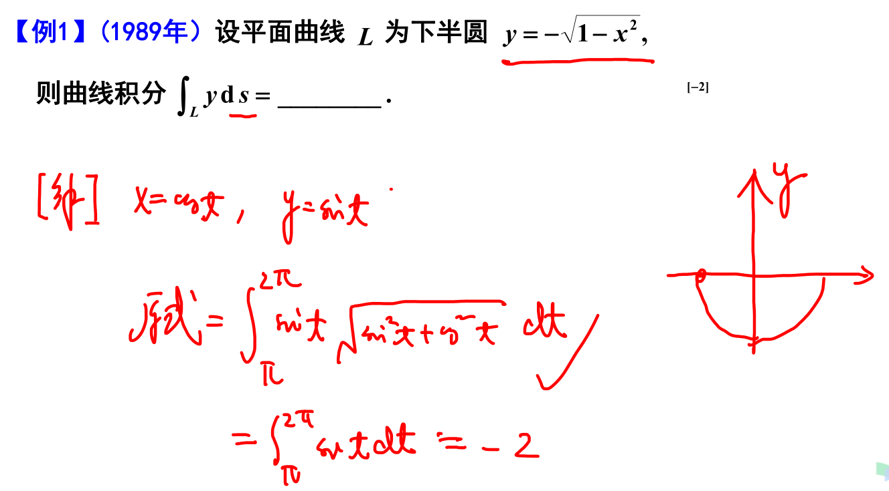
	[024](bookxnotepro://opennote/?nb={eaae9369-1988-4e39-8c00-ce441fc1deb4}&book=54c5b9ae3433e2c72a012cc255d42319&page=23&x=421&y=230&id=20044&uuid=d7c48b7f73901d38d81b0605c9b39e7f)
	 用**参数方程 t**形式表示做方便点——这里最好不要看成极坐标，是 xy 和 t 的关系，不是和 $\rho$ 和 $\theta$ 的

线积分公式可以代入到计算过程中 [025](bookxnotepro://opennote/?nb={eaae9369-1988-4e39-8c00-ce441fc1deb4}&book=54c5b9ae3433e2c72a012cc255d42319&page=24&x=312&y=36&id=20045&uuid=aaeb4d8bec5fe9ac9dc2e6ac26715e36)
[[积分中能够代入的公式]]

### 第二类

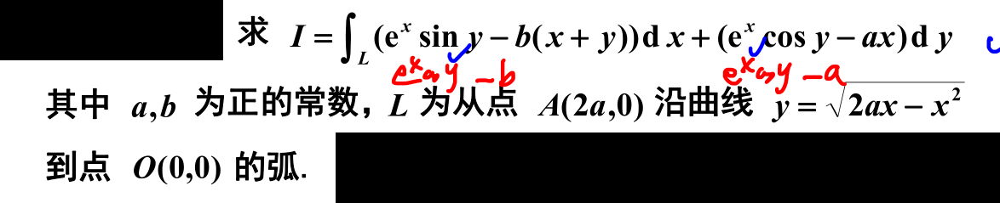
	[031](bookxnotepro://opennote/?nb={eaae9369-1988-4e39-8c00-ce441fc1deb4}&book=54c5b9ae3433e2c72a012cc255d42319&page=30&x=63&y=31&id=20047&uuid=220be91187b47d4853665b774e4fe75d)
	[[@思维]]两个都有 $e^{x}\cos y$，这部分可以分离出来一个路径无关的部分——之后既可以**改换路径或是全微分求原函数**

## 曲面积分计算
### 第一类曲面积分的计算
[007](bookxnotepro://opennote/?nb={eaae9369-1988-4e39-8c00-ce441fc1deb4}&book=9941ea13d386b894e42ffdb607e71fb2&page=6&x=381&y=40&id=20052&uuid=f8fd2b1b9bc775768a6999953650e62e)

### 第二类曲面积分的计算
[010](bookxnotepro://opennote/?nb={eaae9369-1988-4e39-8c00-ce441fc1deb4}&book=9941ea13d386b894e42ffdb607e71fb2&page=9&x=381&y=40&id=20053&uuid=c6d83755a0b03ab22dd7e9a20618cfee)

## 形心和变力做功的计算
[015](bookxnotepro://opennote/?nb={eaae9369-1988-4e39-8c00-ce441fc1deb4}&book=9941ea13d386b894e42ffdb607e71fb2&page=14&x=230&y=159&id=20055&uuid=d0446d6c01e812a92ea52da061e85fa5)

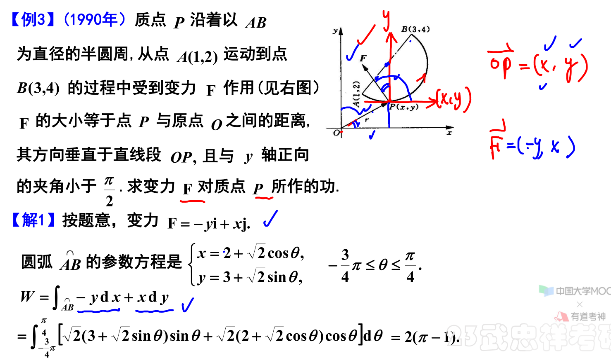
	[018](bookxnotepro://opennote/?nb={eaae9369-1988-4e39-8c00-ce441fc1deb4}&book=9941ea13d386b894e42ffdb607e71fb2&page=17&x=470&y=273&id=20067&uuid=831ff7850445286f78786ae16a08d993)
	 变力做功 [018](bookxnotepro://opennote/?nb={eaae9369-1988-4e39-8c00-ce441fc1deb4}&book=9941ea13d386b894e42ffdb607e71fb2&page=17&x=63&y=33&id=20066&uuid=6b1dabdc993f3d6df953562af16f26b8) 
	 - 力场的表示
	 - 力场向量（P、Q）和 dx，dy 相乘，做 [[第十二章 多元积分学及其应用#对坐标的线积分（第二类线积分）|第二类线积分]]
		 - 当然第二类先积分可以补线

## 梯度、旋度、散度的计算
[022](bookxnotepro://opennote/?nb={eaae9369-1988-4e39-8c00-ce441fc1deb4}&book=9941ea13d386b894e42ffdb607e71fb2&page=21&x=238&y=159&id=20056&uuid=226b7265ccb2a4c9402658e3e42f3058)

求方向导数最大，其中涉及到条件最值 [024](bookxnotepro://opennote/?nb={eaae9369-1988-4e39-8c00-ce441fc1deb4}&book=9941ea13d386b894e42ffdb607e71fb2&page=23&x=922&y=77&id=20026&uuid=b6736203f0a6936adeadaac8d2e4e9c1)

# 处理方法

	[107](bookxnotepro://opennote/?nb={4b0b849c-f284-459f-9b9c-e14b0ecf8ba2}&book=4db326750425a2eac028b50acbc37456&page=106&x=373&y=417&id=108&uuid=d0b7c81af0fec1d9638b093d5a28fe50)
	计算题也要注意对称区间划分
	 ^38u3md

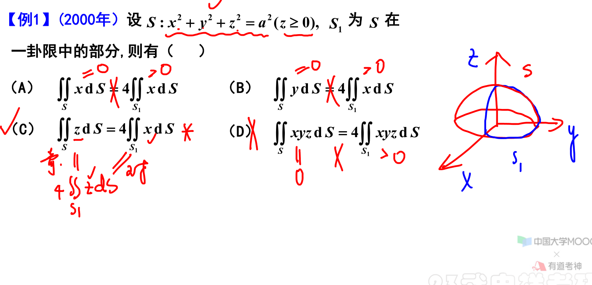
	[007](bookxnotepro://opennote/?nb={eaae9369-1988-4e39-8c00-ce441fc1deb4}&book=9941ea13d386b894e42ffdb607e71fb2&page=6&x=475&y=286&id=20061&uuid=82da9080d820c16412f8314a4de90b19)
	1. 没有 xy 则表示是偶函数，别忘了
	2. 仅在第一象限，根据对称性，x和z 可互换

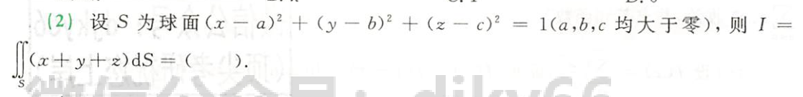
	[056](bookxnotepro://opennote/?nb={4b0b849c-f284-459f-9b9c-e14b0ecf8ba2}&book=4f1972a39d8f1176257957a09d832b75&page=55&x=249&y=249&id=144&uuid=330df372f350daf67e207db5c80388c1)
	球的中心点不在坐标轴上，“平移”——实际上无法平移
	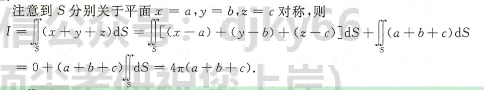
	[156](bookxnotepro://opennote/?nb={4b0b849c-f284-459f-9b9c-e14b0ecf8ba2}&book=4db326750425a2eac028b50acbc37456&page=155&x=270&y=295&id=145&uuid=6d5651fc5d06ac6a98d478d0b1e157bf)
	凑出一个"平移"——处理被积函数到原点
	其实原理没有完全理解😑
	 ^osocjm

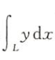
	[056](bookxnotepro://opennote/?nb={4b0b849c-f284-459f-9b9c-e14b0ecf8ba2}&book=4f1972a39d8f1176257957a09d832b75&page=55&x=109&y=495&id=146&uuid=0fb213bc9a4e63cf1413efe1db6e0173)
	这个式子其实是[[第十二章 多元积分学及其应用#对坐标的线积分（第二类线积分）|第二类线积分]]中 dy 前的数字等于 0 的情况
	- 不过积分确实可以直接换成一次积分的积分限制
	- 但多了方向的限制：
	
	[156](bookxnotepro://opennote/?nb={4b0b849c-f284-459f-9b9c-e14b0ecf8ba2}&book=4db326750425a2eac028b50acbc37456&page=155&x=404&y=597&id=147&uuid=cb8a0d99e653248b8dc2782ad2a40eae)
	这个方程从 A 积分到 B，所以不管直接坐标积分——还是换成参数方程，都得从 A（$\theta=\frac{3\pi}{4}$）到 B（$\theta=0$）

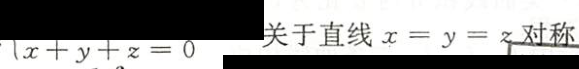
	[157](bookxnotepro://opennote/?nb={4b0b849c-f284-459f-9b9c-e14b0ecf8ba2}&book=4db326750425a2eac028b50acbc37456&page=156&x=234&y=175&id=148&uuid=1bfe8b89789d81edebd65385d3280958)
	注意面 x+y+z=0 也是关于 x=y=z 对称的，第一类曲线积分可用 ^s7mm18

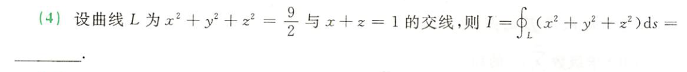
	[056](bookxnotepro://opennote/?nb={4b0b849c-f284-459f-9b9c-e14b0ecf8ba2}&book=4f1972a39d8f1176257957a09d832b75&page=55&x=250&y=571&id=152&uuid=96a241c101fb903adfdc6fe29ad8496f)
	若不用几何法，就得[[第十二章 多元积分学及其应用#^i945rp|空间一型线积分]] 找参数
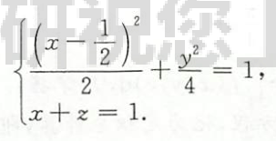
	[157](bookxnotepro://opennote/?nb={4b0b849c-f284-459f-9b9c-e14b0ecf8ba2}&book=4db326750425a2eac028b50acbc37456&page=156&x=230&y=341&id=149&uuid=4cc42ae450180c82f68398feb2a03984)
	椭圆也可以用参数方程：整个看作一个 x:
	
# 反直觉

![[Pasted image 20221016141140.png]]
[011](bookxnotepro://opennote/?nb={eaae9369-1988-4e39-8c00-ce441fc1deb4}&book=54c5b9ae3433e2c72a012cc255d42319&page=10&x=138&y=434&id=19075&uuid=f31e0928af66a9c9f8be1f5ff5d56839)
这里 x+y+z=1 不能带进去，因为是这只是平面上的点，还有平面围成的内部的点呢 [[积分中能够代入的公式]]

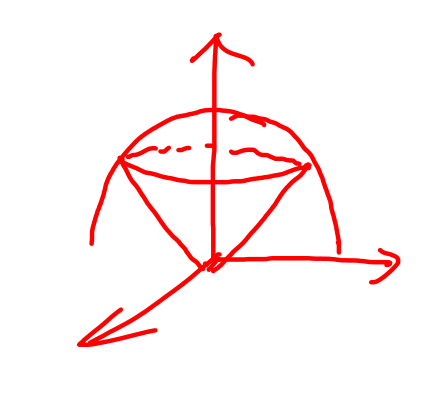
	[011](bookxnotepro://opennote/?nb={eaae9369-1988-4e39-8c00-ce441fc1deb4}&book=9941ea13d386b894e42ffdb607e71fb2&page=10&x=741&y=243&id=20062&uuid=134d4cf3d52d4fb8c2a5541f24871c13)
	这种式形状上适合用三重积分

# 习题积累

	[105](bookxnotepro://opennote/?nb={4b0b849c-f284-459f-9b9c-e14b0ecf8ba2}&book=4db326750425a2eac028b50acbc37456&page=104&x=249&y=624&id=105&uuid=dcceef3e9ad775000979278be3dc220c)
	没必要用 [[第九章 二重积分#^7zfjvz|圆心不在座标轴上（不过圆心）的做法]]而直接用极坐标来做，中间的 $x^2+y^2$ 还可以消掉。
	![[直接用极坐标，不必平移]]

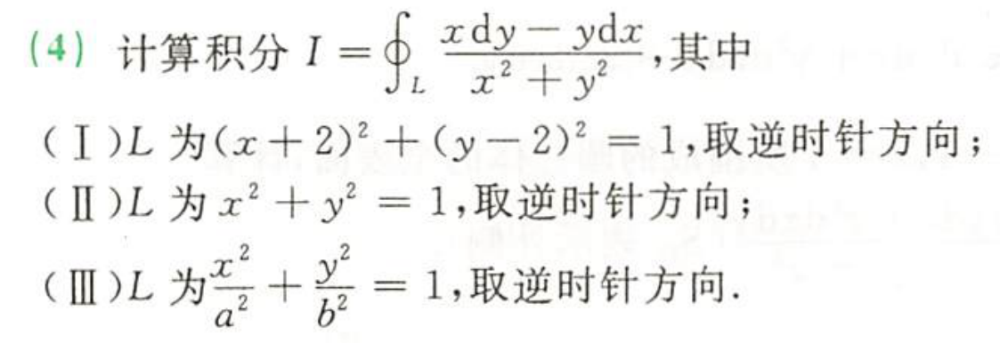
	[057](bookxnotepro://opennote/?nb={4b0b849c-f284-459f-9b9c-e14b0ecf8ba2}&book=4f1972a39d8f1176257957a09d832b75&page=56&x=165&y=221&id=154&uuid=7bdd197226d9af8a0d285d437af0fea8)
	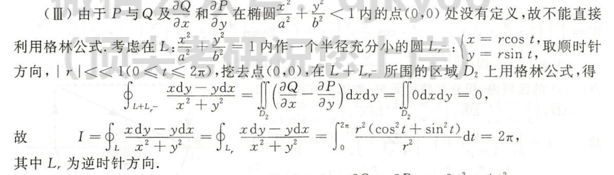
	[159](bookxnotepro://opennote/?nb={4b0b849c-f284-459f-9b9c-e14b0ecf8ba2}&book=4db326750425a2eac028b50acbc37456&page=158&x=232&y=346&id=155&uuid=3433b8be515a99a58c96f755132954f3)
	格林公式要求，圈内没有点，若有点，可以再构造一个小圆 （半径非常小） 挖去
	![[十二章习题 2022-11-11 22.49.56.excalidraw]]
	两圆转向方向相反
	直接法来做好像逆时针是 $(0,2\pi)$, 顺时针 $(2\pi,0)$
	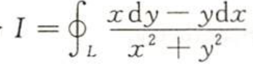
	[057](bookxnotepro://opennote/?nb={4b0b849c-f284-459f-9b9c-e14b0ecf8ba2}&book=4f1972a39d8f1176257957a09d832b75&page=56&x=158&y=194&id=156&uuid=cf3485947cd77ee063538687a06ff17e)
	看分母：这种式子适合挖洞挖圆
	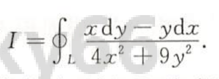
	[057](bookxnotepro://opennote/?nb={4b0b849c-f284-459f-9b9c-e14b0ecf8ba2}&book=4f1972a39d8f1176257957a09d832b75&page=56&x=339&y=273&id=157&uuid=29dc82edd12743619833dea796a6d711)
	这种分母适合挖椭圆
	 ^vzmwek

