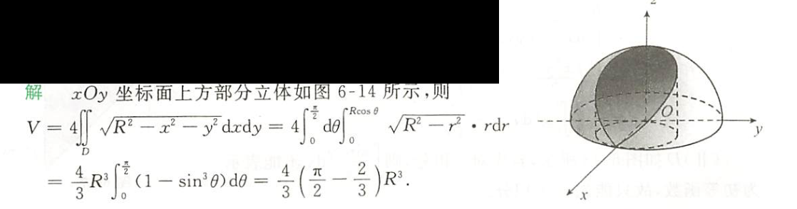

# 重点题型讲解

	[008](bookxnotepro://opennote/?nb={eaae9369-1988-4e39-8c00-ce441fc1deb4}&book=54c5b9ae3433e2c72a012cc255d42319&page=7&x=415&y=238&id=19309&uuid=8dc17e0eeaef3195435eae871a1b3bc8)
	对称的题：
	1. 观察范围——x 镜面对称
	2. 再看对称性
	==常数 z，可以看成变量 x、y 的偶函数==——可以变两倍

## 三重积分计算
[007](bookxnotepro://opennote/?nb={eaae9369-1988-4e39-8c00-ce441fc1deb4}&book=54c5b9ae3433e2c72a012cc255d42319&page=6&x=208&y=158&id=19310&uuid=c7ac775a79b0b3525a5457e94f9724ab)

	[009](bookxnotepro://opennote/?nb={eaae9369-1988-4e39-8c00-ce441fc1deb4}&book=54c5b9ae3433e2c72a012cc255d42319&page=8&x=406&y=156&id=19311&uuid=ee9c3bc1cc737c89836a8b494177452b)
	1. [[第十二章 多元积分学及其应用todo#^fhj01e|先二后一]]
	2. [[第十二章 多元积分学及其应用todo#^075a83|变量对称性]]+[[第十二章 多元积分学及其应用todo#^f3d4e8|球坐标]] 

	[013](bookxnotepro://opennote/?nb={eaae9369-1988-4e39-8c00-ce441fc1deb4}&book=54c5b9ae3433e2c72a012cc255d42319&page=12&x=472&y=153&id=19312&uuid=94e86b01753af4f42bb9bfdb83c3769d)
	[[第十二章 多元积分学及其应用todo#^d53feb|奇偶性]]消掉x
	1. [[第十二章 多元积分学及其应用todo#^f3d4e8|球坐标]]：虽然不是 $\sqrt{x^2+y^2+z^2}$ 结构，但是仅有一个 z（$r\cos(\varphi)$），相对 x 和 y 来说好代一点。
	2. [[第十二章 多元积分学及其应用todo#^a7m3ar|先一后二]]常会代入含有根号的边界，但是这里 z 是一次，积分后是二次，刚好消掉根号
	3. [[第十二章 多元积分学及其应用todo#^fhj01e|先二后一]]的典型结构
	4. [[第十二章 多元积分学及其应用todo#^310fce|柱坐标]]的图形

# 处理方法

	[107](bookxnotepro://opennote/?nb={4b0b849c-f284-459f-9b9c-e14b0ecf8ba2}&book=4db326750425a2eac028b50acbc37456&page=106&x=373&y=417&id=108&uuid=d0b7c81af0fec1d9638b093d5a28fe50)
	计算题也要注意对称区间划分
	 ^38u3md

# 反直觉

![[Pasted image 20221016141140.png]]
[011](bookxnotepro://opennote/?nb={eaae9369-1988-4e39-8c00-ce441fc1deb4}&book=54c5b9ae3433e2c72a012cc255d42319&page=10&x=138&y=434&id=19075&uuid=f31e0928af66a9c9f8be1f5ff5d56839)
这里 x+y+z=1 不能带进去，因为是这只是平面上的点，还有平面围成的内部的点呢
# 习题积累

	[105](bookxnotepro://opennote/?nb={4b0b849c-f284-459f-9b9c-e14b0ecf8ba2}&book=4db326750425a2eac028b50acbc37456&page=104&x=249&y=624&id=105&uuid=dcceef3e9ad775000979278be3dc220c)
	没必要用 [[第九章 二重积分#^7zfjvz|圆心不在座标轴上（不过圆心）的做法]]而直接用极坐标来做，中间的 $x^2+y^2$ 还可以消掉。
	![[直接用极坐标，不必平移]]

