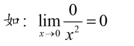
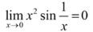
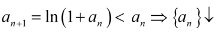
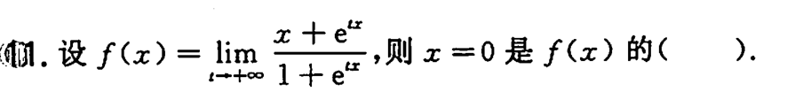
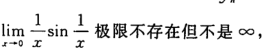
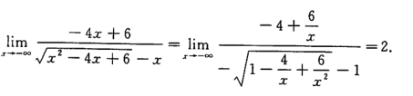
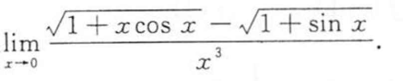
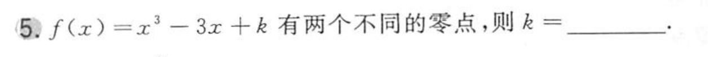
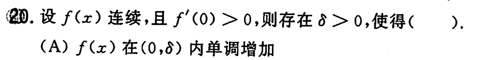
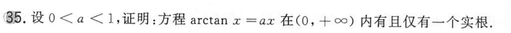

	 [001](bookxnotepro://opennote/?nb={bf3dc445-0c59-4185-bcd0-3d63797cc6cb}&book=43a8ddb447e812db0b53f95f0fb7e921&page=0&x=134&y=477&id=1044)
	 分子为0，不再是等价无穷小

	 [005](bookxnotepro://opennote/?nb={bf3dc445-0c59-4185-bcd0-3d63797cc6cb}&book=43a8ddb447e812db0b53f95f0fb7e921&page=4&x=171&y=224&id=1096)
	 有界函数乘无穷小——这是无穷小的基本性质

	[009](bookxnotepro://opennote/?nb={bf3dc445-0c59-4185-bcd0-3d63797cc6cb}&book=43a8ddb447e812db0b53f95f0fb7e921&page=8&x=183&y=269&id=1162)
	虽然[[第一章 极限与连续#^08d8xt|重要不等式]]是 lnx+1 小于 x，但是这种数列其实是**递减**的。不要单纯把等号换成小于号

求一个选项是几阶无穷小——不要给个比较的阶数就已知洛必达下去，注意结果是0或$\infty$
	时刻注意是否满足$\frac{0}{0}$，不然无法洛必达

	[013](bookxnotepro://opennote/?nb={512382f5-a3a5-4617-b335-e716d4b5f10c}&book=7c79fd0abca65e43b34474f815f9e7ce&page=12&x=164&y=433&id=2)
	这居然好像还是个间断点
		看着是连续的，实际上里面涉及到了极限，不再是初等函数组合了
		 ^lxm652

	[018](bookxnotepro://opennote/?nb={512382f5-a3a5-4617-b335-e716d4b5f10c}&book=b58fa85d19ce1d4b81c4b85dda1d104f&page=17&x=158&y=467&id=31&uuid=41f69afb60ba56d191046b4aa73a53c0)

	[022](bookxnotepro://opennote/?nb={512382f5-a3a5-4617-b335-e716d4b5f10c}&book=b58fa85d19ce1d4b81c4b85dda1d104f&page=21&x=337&y=476&id=40&uuid=9e92fc1bd4d7cdf89f26f3a1aa31cda5)
	x是负数（趋向于$-\infty$)乘进根号要多出一个符号

![[Pasted image 20220824210554.png]]
	[018](bookxnotepro://opennote/?nb={214cb125-5d23-4d98-a6be-193ff2248daa}&book=b031d6b3dcd76797850d98a4b61794f8&page=17&x=318&y=461&id=6730&uuid=fc03bfaebb53187ff03ff5a3d1fb15ee)
	根据导数的图像判断极值
	1. 图像y轴是导数为0的点，不要遗漏
	2. 0处左侧正无穷，右侧负无穷，是极值点——导数不存在的点可能是极值点
	 ^wasbsi

	[023](bookxnotepro://opennote/?nb={512382f5-a3a5-4617-b335-e716d4b5f10c}&book=7c79fd0abca65e43b34474f815f9e7ce&page=22&x=152&y=194&id=93&uuid=d85e91af60eb6f0d7d899cf4d62a00ae)
	直觉想开始taylor，这个没有常数项可以分子有理化的

	[023](bookxnotepro://opennote/?nb={512382f5-a3a5-4617-b335-e716d4b5f10c}&book=7c79fd0abca65e43b34474f815f9e7ce&page=22&x=176&y=574&id=125&uuid=af466a31d80e8d8152957413fc4b25c4)
	![[WIN_20220827_17_05_28_Pro.jpg]]
	两个交点，可以是上面的一条相切，也可以是下面一条相切

	[026](bookxnotepro://opennote/?nb={512382f5-a3a5-4617-b335-e716d4b5f10c}&book=7c79fd0abca65e43b34474f815f9e7ce&page=25&x=187&y=154&id=134&uuid=127e8cb74a0f932ad384225f764354ed)
	导数为正**并不能**表示邻域内单调递增。
	举例：
	$$y=x^{2}sin(\frac{1}{x})$$ 

	[028](bookxnotepro://opennote/?nb={512382f5-a3a5-4617-b335-e716d4b5f10c}&book=7c79fd0abca65e43b34474f815f9e7ce&page=27&x=228&y=66&id=144&uuid=1037bc49ef4d7d386a0cf3e1beb8edb6)
	![[WIN_20220827_22_11_48_Pro.jpg]]
	在正半轴只有一个解，不要想当然以为在数周下面