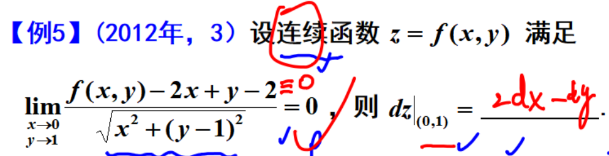
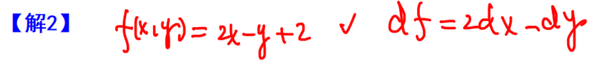

选择题，带进去验算

填空题，最后结果是确定的

	[017](bookxnotepro://opennote/?nb={eaae9369-1988-4e39-8c00-ce441fc1deb4}&book=0da33fe4293e40420460104f8af59907&page=16&x=194&y=57&id=17902&uuid=ab19401dca0a3ca709d92a37c14fb621)
	
	[017](bookxnotepro://opennote/?nb={eaae9369-1988-4e39-8c00-ce441fc1deb4}&book=0da33fe4293e40420460104f8af59907&page=16&x=225&y=334&id=17903&uuid=4ce5e2ee2a068ff6b2ecbdaea4796540)
	找满足条件的其中一个公式，算结果
	注意：在一个点的微分 dx 和 dy 前面的数字并不是变的，可以看作结果是确定的

