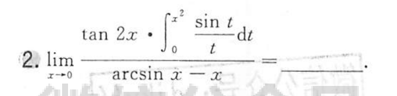
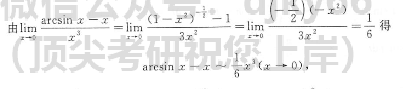

	[034](bookxnotepro://opennote/?nb={512382f5-a3a5-4617-b335-e716d4b5f10c}&book=7c79fd0abca65e43b34474f815f9e7ce&page=33&x=135&y=247&id=440&uuid=90c836ca1ef428673fc7209a63d947d4)
	
	[077](bookxnotepro://opennote/?nb={512382f5-a3a5-4617-b335-e716d4b5f10c}&book=b58fa85d19ce1d4b81c4b85dda1d104f&page=76&x=220&y=312&id=441&uuid=e7e268936c1fd174eb88e58d3a8dfca2)
	有时候，用[[计算处理方法#^kdq34z|洛必达]]比较麻烦（分子两项相乘），直接把分母先处理了比较简便
	 ^uh375y