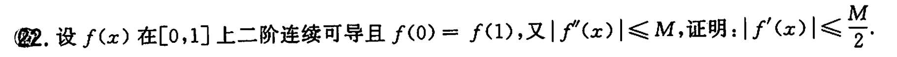

	[022](bookxnotepro://opennote/?nb={512382f5-a3a5-4617-b335-e716d4b5f10c}&book=7c79fd0abca65e43b34474f815f9e7ce&page=21&x=222&y=572&id=100&uuid=540f6a5c6872a686262089ed73ed65e8)
	证明不等式，我根据[[第三章 一元函数微分学的应用#题型九 不等式证明|已知的方法]]尝试了
	1. 凹凸性，能证明一部分
	2. 三点-lagrange，似乎看着没有前途
		实际上非常有前途，我二阶导数>0只考虑到凹凸性，他也表示**一阶导数单调递增**。
	3. 单调性，构造不行

	[024](bookxnotepro://opennote/?nb={512382f5-a3a5-4617-b335-e716d4b5f10c}&book=7c79fd0abca65e43b34474f815f9e7ce&page=23&x=214&y=186&id=127&uuid=76019a25c09e8d07ff82940a3fe58059)
	这个其实是一个[[第三章 一元函数微分学的应用#题型九 不等式证明|单调性证明不等式的问题]]
	这个构造不等式比较有技巧：不能直接左右两边相减，而是相除构成$\frac{f(x)}{e^{x}}$的形式
	1. 首先条件$f'(x)<f(x)$是一种常见形式[[还原成原函数#^1h2wtd|原函数的导数]]
	2. 选项暗示$f(x)$和$e$的关系

	[025](bookxnotepro://opennote/?nb={512382f5-a3a5-4617-b335-e716d4b5f10c}&book=7c79fd0abca65e43b34474f815f9e7ce&page=24&x=241&y=130&id=132&uuid=f6d33b96dc5984201f851f7117acda10)
	这道题是微分定义的问题[[第二章 导数与微分#^m6l1xe]]这个定义似乎没说微分的$dy$是$\Delta y$极限，仅仅是一种表示方法
	$d x$还是$\Delta x$ 只是写法不同
	
	[051](bookxnotepro://opennote/?nb={512382f5-a3a5-4617-b335-e716d4b5f10c}&book=b58fa85d19ce1d4b81c4b85dda1d104f&page=50&x=244&y=284&id=133&uuid=f07fbc15c79fa96a05054578c9262f85)
	答案的意思是$\Delta y$ 的$\xi$ 在$x$ 和$x+\Delta x$  之间，而$dy$ 的$\xi$ 就是$x$  。

	[027](bookxnotepro://opennote/?nb={512382f5-a3a5-4617-b335-e716d4b5f10c}&book=7c79fd0abca65e43b34474f815f9e7ce&page=26&x=241&y=354&id=140&uuid=7a7622d2213b70440b2f0b6111fafeb8)
	
	[056](bookxnotepro://opennote/?nb={512382f5-a3a5-4617-b335-e716d4b5f10c}&book=b58fa85d19ce1d4b81c4b85dda1d104f&page=55&x=233&y=262&id=141&uuid=2df35f27a6e4be67d022589520dd2bde)
	神奇做法：用taylor 来证明不等式
	 ^ffyjpx

	[037](bookxnotepro://opennote/?nb={512382f5-a3a5-4617-b335-e716d4b5f10c}&book=7c79fd0abca65e43b34474f815f9e7ce&page=36&x=104&y=652&id=463&uuid=313f268a1966154dac6258d402f84565)
	
	[084](bookxnotepro://opennote/?nb={512382f5-a3a5-4617-b335-e716d4b5f10c}&book=b58fa85d19ce1d4b81c4b85dda1d104f&page=83&x=241&y=601&id=464&uuid=a2800222caaf903019e7103ce0e3361c)
	拆得细碎+和$e^x$ 的分部积分
	带$e^x$ 的用分布积分是很容易的，只有另一项升幂或降幂	
	![[WIN_20220915_21_52_25_Pro.jpg]]
	就算升幂升到ln了，也能解，只是有点麻烦罢了
	 ^tnzx9o

	[038](bookxnotepro://opennote/?nb={512382f5-a3a5-4617-b335-e716d4b5f10c}&book=7c79fd0abca65e43b34474f815f9e7ce&page=37&x=164&y=184&id=466&uuid=9e42af88d60e32a6e0ca16792332fe71)
	
	[085](bookxnotepro://opennote/?nb={512382f5-a3a5-4617-b335-e716d4b5f10c}&book=b58fa85d19ce1d4b81c4b85dda1d104f&page=84&x=244&y=421&id=468&uuid=34f1b007a9f43edd9c746ca9971a1c14)
	分部
	**出现的y(1) 消不掉，用newton公式再构造一个y(1)；或者把y(1)用newton构造成积分的形式**
	$$y(1)=y(1)-y(0)=\int ^{1}_{0} y'(x)dx=\int^{1}_{0} \arctan{(x-1)^{2}}dx$$
	一个函数==值==已知+导数已知（函数未知）=》可以尝试一下这样表示
	 ^z9u0bx

	[038](bookxnotepro://opennote/?nb={512382f5-a3a5-4617-b335-e716d4b5f10c}&book=7c79fd0abca65e43b34474f815f9e7ce&page=37&x=217&y=469&id=481&uuid=ad5b54845549399756400862b6f059b0)
	[[第三章 一元函数微分学的应用#重点题型讲解|第三章的证明存在习题]] ，用了零点定理
	
	[087](bookxnotepro://opennote/?nb={512382f5-a3a5-4617-b335-e716d4b5f10c}&book=b58fa85d19ce1d4b81c4b85dda1d104f&page=86&x=211&y=118&id=482&uuid=1c6f3313ad8e2afd6f1b7e2686b19e19)
	类似单调性证明方法
	 ^z39mst

	[038](bookxnotepro://opennote/?nb={512382f5-a3a5-4617-b335-e716d4b5f10c}&book=7c79fd0abca65e43b34474f815f9e7ce&page=37&x=229&y=511&id=483&uuid=cd0e3a0e2494d64c9c947b97de532446)
	
	[087](bookxnotepro://opennote/?nb={512382f5-a3a5-4617-b335-e716d4b5f10c}&book=b58fa85d19ce1d4b81c4b85dda1d104f&page=86&x=192&y=224&id=484&uuid=84c18d713881910ac8a28bca7e7d6380)
	题目给的条件和[[收集的习题#^z9u0bx|这道题]]类似，确实可以表示
	这道题还用到了[[第五章 定积分及其应用#比大小性质|定积分比大小性质的柯西拆开方法]]，还提出一个1，把1变成了x——凑柯西的式子
	缩放逻辑根本想不到啊
	具体的就想不到了[[@听讲]]

	[039](bookxnotepro://opennote/?nb={512382f5-a3a5-4617-b335-e716d4b5f10c}&book=7c79fd0abca65e43b34474f815f9e7ce&page=38&x=166&y=106&id=486&uuid=ace2caaf7c48465a6d6ac21103a5e755)
	
	[088](bookxnotepro://opennote/?nb={512382f5-a3a5-4617-b335-e716d4b5f10c}&book=b58fa85d19ce1d4b81c4b85dda1d104f&page=87&x=244&y=286&id=487&uuid=264568b3cb1b5ada64a731d7be333202)
	第二问也用到了[[第五章 定积分及其应用#柯西不等式|可惜不等式]]，也是熟悉的结构
	这题主要意识到一问结果$-\frac{1}{2}$ 是第二问$\frac{1}{4}$ 的平方

	[040](bookxnotepro://opennote/?nb={512382f5-a3a5-4617-b335-e716d4b5f10c}&book=7c79fd0abca65e43b34474f815f9e7ce&page=39&x=254&y=167&id=498&uuid=9f1d857ac1e36ae458e0a5088f24533d)
	
	[091](bookxnotepro://opennote/?nb={512382f5-a3a5-4617-b335-e716d4b5f10c}&book=b58fa85d19ce1d4b81c4b85dda1d104f&page=90&x=237&y=187&id=499&uuid=5ad598ca000bc34c389fd7ed3d4bd196)
	特殊的题，**解函数**
	其中易错：
	![[WIN_20220918_16_23_11_Scan.jpg]]
	 ^mgt5x9

