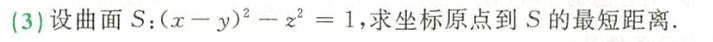

 [[第八章题目#^gahxig]] 中使用了消元法，但需要确定范围，比较特殊——因为这个约束条件是一个我已知结构的圆（了解具体结构的图形）

	[037](bookxnotepro://opennote/?nb={4b0b849c-f284-459f-9b9c-e14b0ecf8ba2}&book=4f1972a39d8f1176257957a09d832b75&page=36&x=203&y=159&id=52&uuid=d001b848cec3bc50db50e14b6ac900b8)
	这道题如果用消元法：
	![[WIN_20221007_21_46_30_Scan.jpg]]
	则最小值为 -1，是因为没有确定变量的范围，变量实际上取不到（0，0），这时 z 会变成虚数
	- 虽然看起来 $z=z(x,y)$ 是一个不能取
	- ==不了解具体形状的约束条件，最好不要用消元法==

