# 第一章 极限与连续
## 函数
[书上的内容，自己看](bookxnotepro://opennote/?nb={bf3dc445-0c59-4185-bcd0-3d63797cc6cb}&book=5a091f463109e55808917619f8d3498b&page=11&x=1084&y=1811&id=1034)

## 极限

数列极限的定义[001](bookxnotepro://opennote/?nb={bf3dc445-0c59-4185-bcd0-3d63797cc6cb}&book=43a8ddb447e812db0b53f95f0fb7e921&page=0&x=102&y=239&id=1045)
函数极限的定义[002](bookxnotepro://opennote/?nb={bf3dc445-0c59-4185-bcd0-3d63797cc6cb}&book=43a8ddb447e812db0b53f95f0fb7e921&page=1&x=103&y=85&id=1046)
函数趋向于无穷的表达式[002](bookxnotepro://opennote/?nb={bf3dc445-0c59-4185-bcd0-3d63797cc6cb}&book=43a8ddb447e812db0b53f95f0fb7e921&page=1&x=104&y=660&id=1084)

---
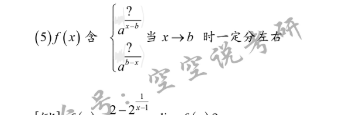
	 [002](bookxnotepro://opennote/?nb={bf3dc445-0c59-4185-bcd0-3d63797cc6cb}&book=43a8ddb447e812db0b53f95f0fb7e921&page=1&x=215&y=374&id=1082)
	 有这个形式的式子一定要**分左右**趋近极限

[[初等函数的图像与特点]]

### 极限的性质
#### 一般性质
[003](bookxnotepro://opennote/?nb={bf3dc445-0c59-4185-bcd0-3d63797cc6cb}&book=43a8ddb447e812db0b53f95f0fb7e921&page=2&x=115&y=316&id=1085)

##### 保号性
[003](bookxnotepro://opennote/?nb={bf3dc445-0c59-4185-bcd0-3d63797cc6cb}&book=43a8ddb447e812db0b53f95f0fb7e921&page=2&x=135&y=405&id=1087)
保号性**证明一个点为函数*极值***两题
	一般已知一个点的极限>> 这个点邻域内保号（和零的关系）>> 满足极值的相关不等式

##### 有界性

没讲

#### 运算性质
没讲

#### 极限存在准则
##### 夹逼定理
[[@核心]] [004](bookxnotepro://opennote/?nb={bf3dc445-0c59-4185-bcd0-3d63797cc6cb}&book=43a8ddb447e812db0b53f95f0fb7e921&page=3&x=142&y=84&id=1089)
有限指数求和开方务必夹逼

	 [004](bookxnotepro://opennote/?nb={bf3dc445-0c59-4185-bcd0-3d63797cc6cb}&book=43a8ddb447e812db0b53f95f0fb7e921&page=3&x=242&y=244&id=1088)
	 [[@记忆]]，有时max内为变量，需要讨论变量取值范围[004](bookxnotepro://opennote/?nb={bf3dc445-0c59-4185-bcd0-3d63797cc6cb}&book=43a8ddb447e812db0b53f95f0fb7e921&page=3&x=334&y=336&id=1090)

##### 单调有界的数列必有极限
基本介绍[004](bookxnotepro://opennote/?nb={bf3dc445-0c59-4185-bcd0-3d63797cc6cb}&book=43a8ddb447e812db0b53f95f0fb7e921&page=3&x=107&y=469&id=1092)

单调性的证明[008](bookxnotepro://opennote/?nb={bf3dc445-0c59-4185-bcd0-3d63797cc6cb}&book=43a8ddb447e812db0b53f95f0fb7e921&page=7&x=232&y=579&id=1107)
	1. 归纳法
	2. 特别不等式——主要是（2）（3）
		![[第一章 极限与连续#^08d8xt]]
	3. 标准不等式等[[不等式]]
		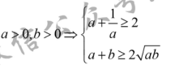
		 [008](bookxnotepro://opennote/?nb={bf3dc445-0c59-4185-bcd0-3d63797cc6cb}&book=43a8ddb447e812db0b53f95f0fb7e921&page=7&x=260&y=704&id=1108) [[@记忆]]
	4. 两式子相减，和0的关系，举例[027](bookxnotepro://opennote/?nb={512382f5-a3a5-4617-b335-e716d4b5f10c}&book=b58fa85d19ce1d4b81c4b85dda1d104f&page=26&x=245&y=304&id=63&uuid=280599c10b432458d9a1be69be61df8a)
	^e1df57
#### 无穷小的性质
[010](bookxnotepro://opennote/?nb={bf3dc445-0c59-4185-bcd0-3d63797cc6cb}&book=43a8ddb447e812db0b53f95f0fb7e921&page=9&x=143&y=490&id=1121)

##### 等价无穷小

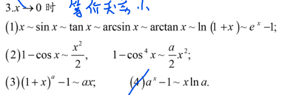
 [011](bookxnotepro://opennote/?nb={bf3dc445-0c59-4185-bcd0-3d63797cc6cb}&book=43a8ddb447e812db0b53f95f0fb7e921&page=10&x=248&y=270&id=1120)
 [[@记忆]]
  ^cfxuv3

### 重要极限+重要不等式

^101a0c

[[@记忆]]

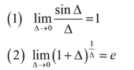
	 [005](bookxnotepro://opennote/?nb={bf3dc445-0c59-4185-bcd0-3d63797cc6cb}&book=43a8ddb447e812db0b53f95f0fb7e921&page=4&x=143&y=561&id=1098)
	 重要极限
	 ^56dfd2

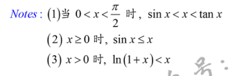
	 [005](bookxnotepro://opennote/?nb={bf3dc445-0c59-4185-bcd0-3d63797cc6cb}&book=43a8ddb447e812db0b53f95f0fb7e921&page=4&x=205&y=639&id=1099)
	 重要不等式
	 ^08d8xt

### 题型
#### 题型一 n项和求极限
 [005](bookxnotepro://opennote/?nb={bf3dc445-0c59-4185-bcd0-3d63797cc6cb}&book=43a8ddb447e812db0b53f95f0fb7e921&page=4&x=148&y=696&id=1100)

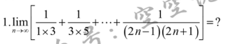
	 [006](bookxnotepro://opennote/?nb={bf3dc445-0c59-4185-bcd0-3d63797cc6cb}&book=43a8ddb447e812db0b53f95f0fb7e921&page=5&x=204&y=119&id=1101)
	 可以直接化简再求和的，较少出现

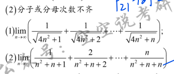
	 [006](bookxnotepro://opennote/?nb={bf3dc445-0c59-4185-bcd0-3d63797cc6cb}&book=43a8ddb447e812db0b53f95f0fb7e921&page=5&x=212&y=395&id=1102)
	*分子或分母次数不齐的，**夹逼定理**求极值*
		齐的地方不动
		齐不齐的计算方法：上式2，分子i次数为1，分母n和i的次数为2和1》》分母不齐
		[[求和公式]]

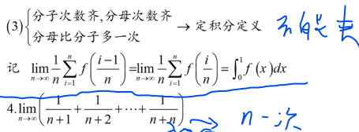
	 [007](bookxnotepro://opennote/?nb={bf3dc445-0c59-4185-bcd0-3d63797cc6cb}&book=43a8ddb447e812db0b53f95f0fb7e921&page=6&x=251&y=537&id=1104)
	 分子分母均齐，分子少分母一次》》**定积分定义**
	 $\frac{1}{n}$，$i$求和$1$到$n$，$\frac{i}{n}$三者相乘>>替换》》从0到1积分，替换$\frac{i}{n}$
		 一般变化过程中，提出一个$\frac{1}{n}$
	 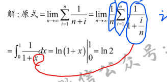
	[例题](bookxnotepro://opennote/?nb={bf3dc445-0c59-4185-bcd0-3d63797cc6cb}&book=43a8ddb447e812db0b53f95f0fb7e921&page=6&x=199&y=655&id=1105) 构建定积分的定义
	[015](bookxnotepro://opennote/?nb={512382f5-a3a5-4617-b335-e716d4b5f10c}&book=7c79fd0abca65e43b34474f815f9e7ce&page=14&x=151&y=656&id=5)自己写加和符号的例题
	^867dfa

#### 题型2 数列极限存在证明
先导内容：
![[#^e1df57]]
习题：

有表达式的：
	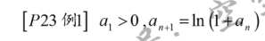
		 [009](bookxnotepro://opennote/?nb={bf3dc445-0c59-4185-bcd0-3d63797cc6cb}&book=43a8ddb447e812db0b53f95f0fb7e921&page=8&x=169&y=118&id=1114)
		归纳法证明存在下界+特殊公式证明单调
	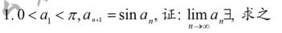
		 [009](bookxnotepro://opennote/?nb={bf3dc445-0c59-4185-bcd0-3d63797cc6cb}&book=43a8ddb447e812db0b53f95f0fb7e921&page=8&x=201&y=454&id=1115)
		归纳法证明存在下届+特殊公式证明单调

没表达式的写出表达式再证明:
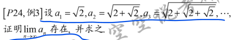
	 [010](bookxnotepro://opennote/?nb={bf3dc445-0c59-4185-bcd0-3d63797cc6cb}&book=43a8ddb447e812db0b53f95f0fb7e921&page=9&x=240&y=97&id=1116)  
	最大值为什么为2，这个汤没讲😑
	表达式，极值和单调性都由归纳法证明
	^cfasod

相邻项相减比较和0的关系
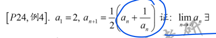
	 [010](bookxnotepro://opennote/?nb={bf3dc445-0c59-4185-bcd0-3d63797cc6cb}&book=43a8ddb447e812db0b53f95f0fb7e921&page=9&x=219&y=334&id=1117)
	 **下界**由特殊公式得到，递减由相邻两项之间的关系

### 不定式
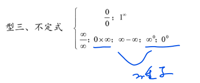
	 [011](bookxnotepro://opennote/?nb={bf3dc445-0c59-4185-bcd0-3d63797cc6cb}&book=43a8ddb447e812db0b53f95f0fb7e921&page=10&x=223&y=550&id=1123)

#### $\frac{0}{0}$

方法
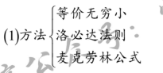
	 [012](bookxnotepro://opennote/?nb={bf3dc445-0c59-4185-bcd0-3d63797cc6cb}&book=43a8ddb447e812db0b53f95f0fb7e921&page=11&x=157&y=136&id=1124)
	 - ![[第一章 极限与连续#^cfxuv3]]

习惯
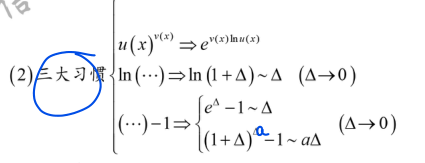
	 [012](bookxnotepro://opennote/?nb={bf3dc445-0c59-4185-bcd0-3d63797cc6cb}&book=43a8ddb447e812db0b53f95f0fb7e921&page=11&x=232&y=231&id=1125)
	 还有**定性和变形分离**——这个习惯不仅$\frac{0}{0}$,其余均可
	 [[@记忆]]

##### 常识：
 
	 [012](bookxnotepro://opennote/?nb={bf3dc445-0c59-4185-bcd0-3d63797cc6cb}&book=43a8ddb447e812db0b53f95f0fb7e921&page=11&x=262&y=322&id=1126)
	[[@记忆]]

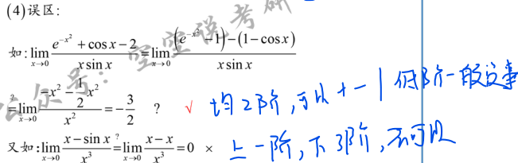
	 [012](bookxnotepro://opennote/?nb={bf3dc445-0c59-4185-bcd0-3d63797cc6cb}&book=43a8ddb447e812db0b53f95f0fb7e921&page=11&x=314&y=418&id=1127)
	 低阶的等价无穷小可以相加减

##### 例题：
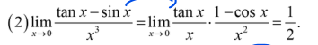
	[012](bookxnotepro://opennote/?nb={bf3dc445-0c59-4185-bcd0-3d63797cc6cb}&book=43a8ddb447e812db0b53f95f0fb7e921&page=11&x=207&y=616&id=1128)
	tanx-sinx提tan转换为1-cosx
	 ^w3ju6u

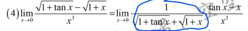
	[012](bookxnotepro://opennote/?nb={bf3dc445-0c59-4185-bcd0-3d63797cc6cb}&book=43a8ddb447e812db0b53f95f0fb7e921&page=11&x=243&y=656&id=1130)
	分子有理化，变式和定式分离

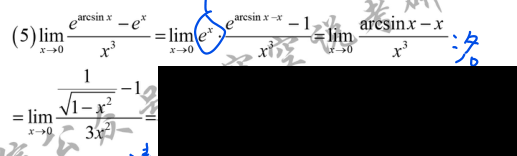
[013](bookxnotepro://opennote/?nb={bf3dc445-0c59-4185-bcd0-3d63797cc6cb}&book=43a8ddb447e812db0b53f95f0fb7e921&page=12&x=251&y=118&id=1131)
三大习惯：
- 提$e^x$构建e-1
- 洛必达构造
	- [[导数列表]]

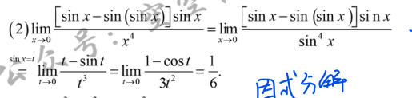
	[013](bookxnotepro://opennote/?nb={bf3dc445-0c59-4185-bcd0-3d63797cc6cb}&book=43a8ddb447e812db0b53f95f0fb7e921&page=12&x=251&y=423&id=1133)
	不仅可以换简单。sinx很多，可以等价无穷小换x为sinx，再换元
	似乎还原看着像等价无穷小替换？就当特例吧😑
	 ^5s2cp0

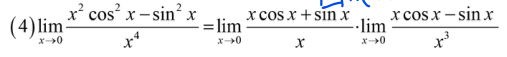
	[013](bookxnotepro://opennote/?nb={bf3dc445-0c59-4185-bcd0-3d63797cc6cb}&book=43a8ddb447e812db0b53f95f0fb7e921&page=12&x=249&y=480&id=1134)
	定式和变式分离的综合应用，下面x的分裂有点难想
	类似的处理方法[017](bookxnotepro://opennote/?nb={bf3dc445-0c59-4185-bcd0-3d63797cc6cb}&book=43a8ddb447e812db0b53f95f0fb7e921&page=16&x=244&y=136&id=1152)
	 ^5dva7y

#### $1^{\infty}$
方法：
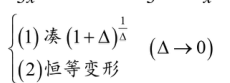
	[013](bookxnotepro://opennote/?nb={bf3dc445-0c59-4185-bcd0-3d63797cc6cb}&book=43a8ddb447e812db0b53f95f0fb7e921&page=12&x=235&y=592&id=1135)
	凑[[#^56dfd2|重要极限之一]]

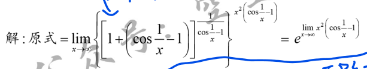
	[014](bookxnotepro://opennote/?nb={bf3dc445-0c59-4185-bcd0-3d63797cc6cb}&book=43a8ddb447e812db0b53f95f0fb7e921&page=13&x=218&y=134&id=1137)
	这里最后一个等式后的处理：先分析是什么类型（是个$\infty \times 0$）型，再处理，不要看到后面是个等价无穷小就着急去变

#### $\frac{\infty}{\infty}$

 方法：
 1. 洛必达

#####  趋向无穷的结论：
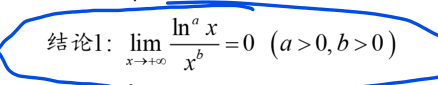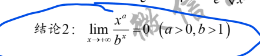
	[014](bookxnotepro://opennote/?nb={bf3dc445-0c59-4185-bcd0-3d63797cc6cb}&book=43a8ddb447e812db0b53f95f0fb7e921&page=13&x=160&y=725&id=1139)
	分子分母趋向于无穷时，不同函数的增长速度：对数<幂（多项式）<指数

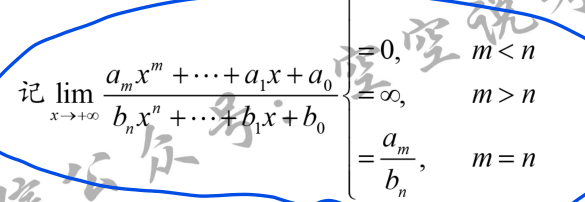
	[015](bookxnotepro://opennote/?nb={bf3dc445-0c59-4185-bcd0-3d63797cc6cb}&book=43a8ddb447e812db0b53f95f0fb7e921&page=14&x=209&y=127&id=1140)
	$\infty /\infty$：多项式

题型（类似待定系数法）：有$\frac{\infty}{\infty}$多项式的极限结果为一个常数，求系数——上下幂相等+结果是上下最高幂的系数之商

好像有的题$\infty$是正的没要求？

#### $0 \times \infty$
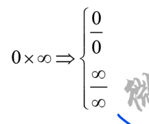
	[015](bookxnotepro://opennote/?nb={bf3dc445-0c59-4185-bcd0-3d63797cc6cb}&book=43a8ddb447e812db0b53f95f0fb7e921&page=14&x=127&y=702&id=1141)
	基础阶段有这两个变化
	没有例题

#### $\infty - \infty$

分为没分母和有分母的：
- 没分母提x等转化为$0 \times \infty$
- 有分母的通分，再随便做

##### 没分母：
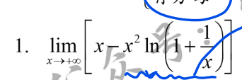
	[016](bookxnotepro://opennote/?nb={bf3dc445-0c59-4185-bcd0-3d63797cc6cb}&book=43a8ddb447e812db0b53f95f0fb7e921&page=15&x=153&y=134&id=1149)
	提$x^2$转化为$0 \times \infty$

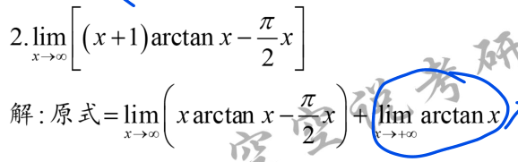
	[016](bookxnotepro://opennote/?nb={bf3dc445-0c59-4185-bcd0-3d63797cc6cb}&book=43a8ddb447e812db0b53f95f0fb7e921&page=15&x=210&y=360&id=1150)
	这里也是转化，不过有个技巧：把有极限的部分提取出来，剩余的部分即可当作$\infty - \infty$来处理 
	^vx7w0d

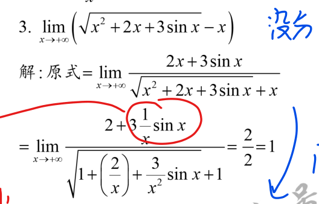
	[016](bookxnotepro://opennote/?nb={bf3dc445-0c59-4185-bcd0-3d63797cc6cb}&book=43a8ddb447e812db0b53f95f0fb7e921&page=15&x=190&y=600&id=1151)
	非典型没分母$\infty - \infty$型
	注意分子有理化后**也要提x出来**哦
	==上下同除x==
	 ^5s5rap
##### 有分母

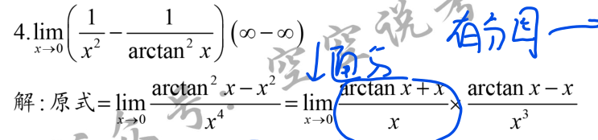
	[017](bookxnotepro://opennote/?nb={bf3dc445-0c59-4185-bcd0-3d63797cc6cb}&book=43a8ddb447e812db0b53f95f0fb7e921&page=16&x=244&y=115&id=1152)
	有分母的，通分，再想办法做
	 ^hpvw88
#### $\infty ^0$和$0^0$

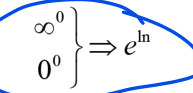
	[017](bookxnotepro://opennote/?nb={bf3dc445-0c59-4185-bcd0-3d63797cc6cb}&book=43a8ddb447e812db0b53f95f0fb7e921&page=16&x=120&y=224&id=1153)
	
## 连续与间断

连续的定义
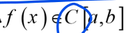
	[017](bookxnotepro://opennote/?nb={bf3dc445-0c59-4185-bcd0-3d63797cc6cb}&book=43a8ddb447e812db0b53f95f0fb7e921&page=16&x=279&y=602&id=1154)

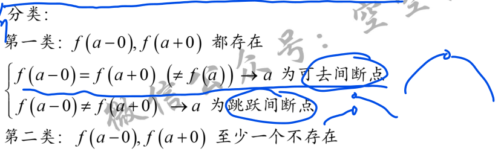
	[017](bookxnotepro://opennote/?nb={bf3dc445-0c59-4185-bcd0-3d63797cc6cb}&book=43a8ddb447e812db0b53f95f0fb7e921&page=16&x=267&y=697&id=1156)
	间断点的分类

[018](bookxnotepro://opennote/?nb={bf3dc445-0c59-4185-bcd0-3d63797cc6cb}&book=43a8ddb447e812db0b53f95f0fb7e921&page=17&x=130&y=301&id=1155)初等函数都连续

### 判断间断点
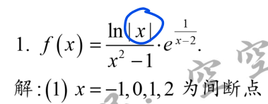
	[018](bookxnotepro://opennote/?nb={bf3dc445-0c59-4185-bcd0-3d63797cc6cb}&book=43a8ddb447e812db0b53f95f0fb7e921&page=17&x=162&y=380&id=1157)
	注意对数不取0和负数
	求间断点出的极限来判断属于哪种间断点

习题上有一个带极限的公式，间断点[[反直觉#^lxm652]]

### 闭区间上的连续函数

性质
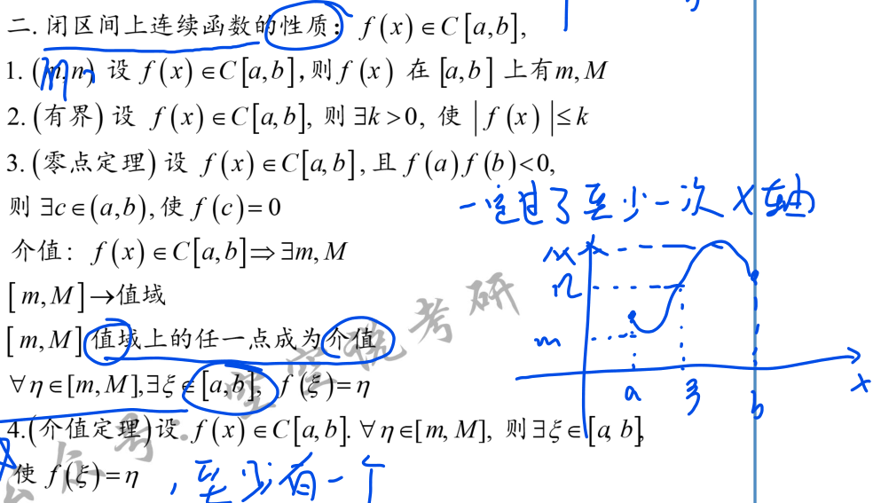
	[019](bookxnotepro://opennote/?nb={bf3dc445-0c59-4185-bcd0-3d63797cc6cb}&book=43a8ddb447e812db0b53f95f0fb7e921&page=18&x=302&y=325&id=1158)
	有最大最小值，有界，[[零点定理]]，介值定理
	- 注意：零点定理的结论在开区间，介值定理是闭区间  ^5a473f

零点定理

#### 介值定理的应用

^86a239

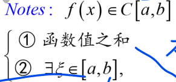
	[019](bookxnotepro://opennote/?nb={bf3dc445-0c59-4185-bcd0-3d63797cc6cb}&book=43a8ddb447e812db0b53f95f0fb7e921&page=18&x=148&y=482&id=1159)
	**闭区间**上的连续函数，
	- 已知函数值之和
	- 求证存在一个值本闭区间

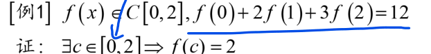
	[019](bookxnotepro://opennote/?nb={bf3dc445-0c59-4185-bcd0-3d63797cc6cb}&book=43a8ddb447e812db0b53f95f0fb7e921&page=18&x=219&y=535&id=1160)
	证明2在连续函数最大值最小值之间即可

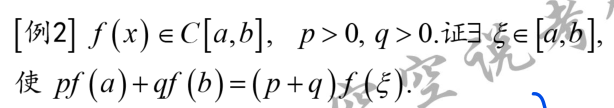
	[020](bookxnotepro://opennote/?nb={bf3dc445-0c59-4185-bcd0-3d63797cc6cb}&book=43a8ddb447e812db0b53f95f0fb7e921&page=19&x=216&y=90&id=1161)
	证明$\frac{pf(a)+qf(b)}{p+q}$在函数最大值最小值之间
		通过最大值最小值存在来证明

## [[重点题型讲解]]

### 题型一 极限的概念与性质
### 题型二 左、右极限
### 题型三 不定型极限的计算问题
![[#不定式]]
### 题型四 n项和或积的极限计算
![[第一章 极限与连续#题型一 n项和求极限]]
### 题型五 极限存在性问题
##### 函数
![[#夹逼定理]]
##### 数列
![[第一章 极限与连续#题型2 数列极限存在证明]]

### 题型六 含参数的极限问题
### 题型七 中值定理法求极限问题
### 题型八 含变积分限的函数极限问题
### 题型九 间断点及其分类
![[#判断间断点]]
### 题型十 闭区间上连续函数性质

[[第二章 导数与微分]]

