课本[114](bookxnotepro://opennote/?nb={eaae9369-1988-4e39-8c00-ce441fc1deb4}&book=d0dac1405a88c26e98b69ca42b093eab&page=113&x=256&y=156&id=53&uuid=022d7b308b67ea144933a58ab144a0fc)

# 常微分方程的基本概念
常微分方程的基本概念  [115](bookxnotepro://opennote/?nb={eaae9369-1988-4e39-8c00-ce441fc1deb4}&book=d0dac1405a88c26e98b69ca42b093eab&page=114&x=232&y=130&id=5586&uuid=7be7fe23e7eb5c623aaddcb3c4c1b10f)

# 一阶微分方程
## 可分离变量的
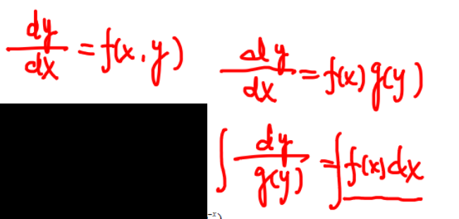
	[005](bookxnotepro://opennote/?nb={eaae9369-1988-4e39-8c00-ce441fc1deb4}&book=2d4af1e467280c844651daee18784021&page=4&x=450&y=80&id=5588&uuid=cc3a4abd94b40b1ed163b2c7072b28a0)
	似乎是朝着努力的方向：导数留在等式的一边，等另一边变成两个乘积的形式

## 齐次方程

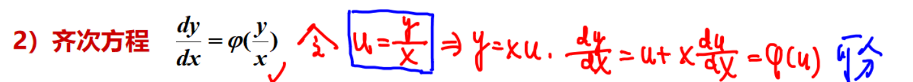
	[006](bookxnotepro://opennote/?nb={eaae9369-1988-4e39-8c00-ce441fc1deb4}&book=2d4af1e467280c844651daee18784021&page=5&x=313&y=30&id=5590&uuid=b8b66419721320bb55416abb9cd61657)

特征：
![[Pasted image 20220921221022.png]]
	[006](bookxnotepro://opennote/?nb={eaae9369-1988-4e39-8c00-ce441fc1deb4}&book=2d4af1e467280c844651daee18784021&page=5&x=295&y=72&id=5591&uuid=9d3f0721f2d0b669809860b363b8de49)
	每一项x 和y 的均为二阶，每一项**次数**一样

举例：
![[第七章 微分方程#^e6td3q]]
## 线性方程

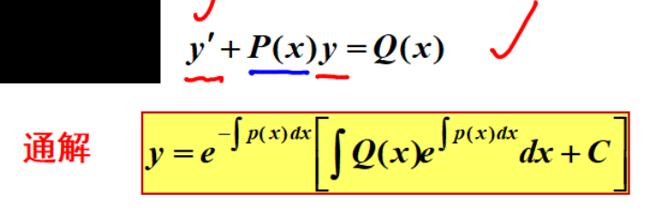
	[007](bookxnotepro://opennote/?nb={eaae9369-1988-4e39-8c00-ce441fc1deb4}&book=2d4af1e467280c844651daee18784021&page=6&x=200&y=53&id=5592&uuid=0b4de974685d7b4062286315fa776bf3)
	$y'$ 系数为1
	大学书上的常数变异法，比较麻烦

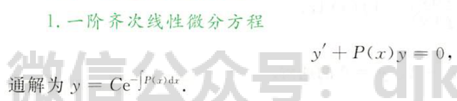
	[186](bookxnotepro://opennote/?nb={c287edd4-3f25-4bbd-a744-a478182b9e21}&book=326d5a790e5c8d426122928be7ab41a9&page=185&x=175&y=264&id=2&uuid=22a025ff42d36da09c03437a60d22614)
	

![[Pasted image 20220921222242.png]]
	[007](bookxnotepro://opennote/?nb={eaae9369-1988-4e39-8c00-ce441fc1deb4}&book=2d4af1e467280c844651daee18784021&page=6&x=270&y=321&id=5593&uuid=2eb55cc16858f18ef484986815e8af1f)
	这个公式积分$\frac{1}{x}$ 得到$\ln x$ 不用加绝对值，也不用加常数

## 伯努利方程

![[Pasted image 20220921224106.png]]
[008](bookxnotepro://opennote/?nb={eaae9369-1988-4e39-8c00-ce441fc1deb4}&book=2d4af1e467280c844651daee18784021&page=7&x=285&y=46&id=5594&uuid=7fc24721a02d548c2b6e148867637a70)
==对$y^{1-\alpha}$ 求导==，除过去代换，变成一阶线性

## 全微分方程
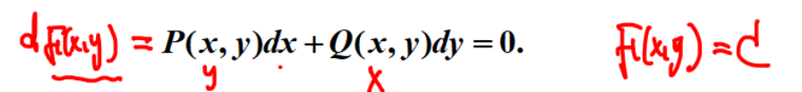
	[008](bookxnotepro://opennote/?nb={eaae9369-1988-4e39-8c00-ce441fc1deb4}&book=2d4af1e467280c844651daee18784021&page=7&x=249&y=137&id=5595&uuid=5451a99c013dfeb93c613f19256c74a8)
	把所有式子都积在微分里，则d后的式子为常数

有时候能看出来，一般不好找

### 判定
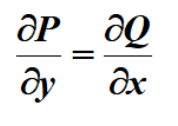
	[008](bookxnotepro://opennote/?nb={eaae9369-1988-4e39-8c00-ce441fc1deb4}&book=2d4af1e467280c844651daee18784021&page=7&x=189&y=188&id=5625&uuid=c2e95711e710cb50cd6baecc0a08cad1)
	满足则是全微分方程存在

### 解法：
#### 偏积分
根据两个偏导数来求原方程

此题第一个解法
![[第八章题目#^b1055g]]
#### 凑微分
第二个解法
![[第八章题目#^b1055g]]
#### 线积分
[[第十二章 多元积分学及其应用]]

# 可降阶的高阶方程
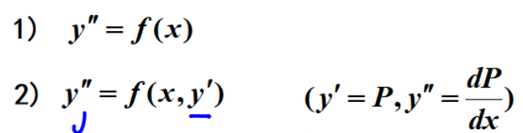
	[009](bookxnotepro://opennote/?nb={eaae9369-1988-4e39-8c00-ce441fc1deb4}&book=2d4af1e467280c844651daee18784021&page=8&x=189&y=73&id=5596&uuid=d147b0a2a418e0e44ef0d5b7051fb5d8)
	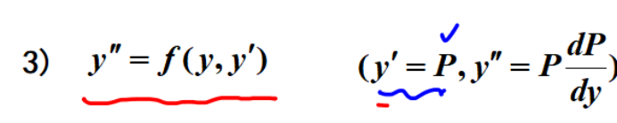
	[010](bookxnotepro://opennote/?nb={eaae9369-1988-4e39-8c00-ce441fc1deb4}&book=2d4af1e467280c844651daee18784021&page=9&x=192&y=35&id=5597&uuid=0501ad2169980fd44c26865d65ebb6a8)
	1. 直接积分
	2. 不显含y 的，$y'$ 当作一个函数来做
	3. 不显含x 的，$y'$ 当作一个函数来做，$y''$ 消掉dx

# 高阶线性微分方程

## 解的结构
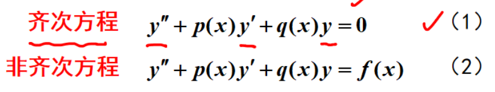
	[012](bookxnotepro://opennote/?nb={eaae9369-1988-4e39-8c00-ce441fc1deb4}&book=2d4af1e467280c844651daee18784021&page=11&x=250&y=68&id=5600&uuid=d15596c241431162aac1ea9e3a094e04)
	高阶：二阶
	线性：各阶导数均是一次

### 性质
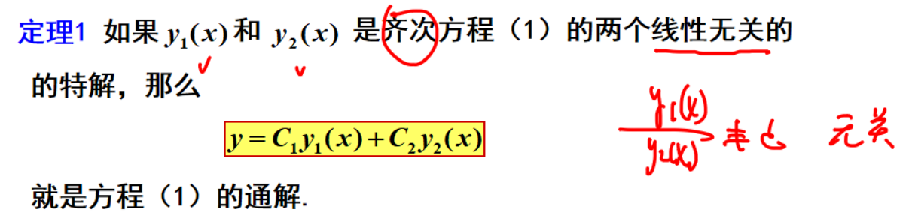
	[012](bookxnotepro://opennote/?nb={eaae9369-1988-4e39-8c00-ce441fc1deb4}&book=2d4af1e467280c844651daee18784021&page=11&x=272&y=162&id=5601&uuid=8931f461556e49ad8eacf096ef25ce83)
	定理一
	可用在常系数线性高阶方程上，和性质题上

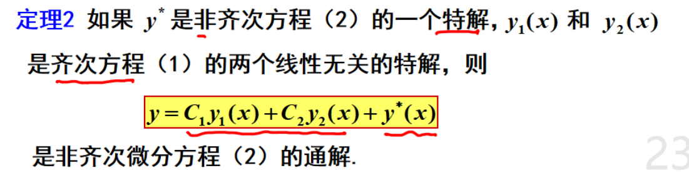
	[012](bookxnotepro://opennote/?nb={eaae9369-1988-4e39-8c00-ce441fc1deb4}&book=2d4af1e467280c844651daee18784021&page=11&x=249&y=294&id=5602&uuid=8d44151e163b93c5ebc4608fa9b508ce)
	定理二

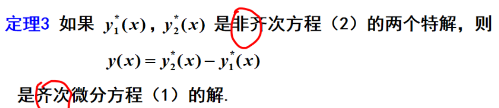
	[013](bookxnotepro://opennote/?nb={eaae9369-1988-4e39-8c00-ce441fc1deb4}&book=2d4af1e467280c844651daee18784021&page=12&x=244&y=53&id=5603&uuid=b0998431c1c624d87a04eb98a6f68266)
	定理三
	性质题
	 ^atc71r

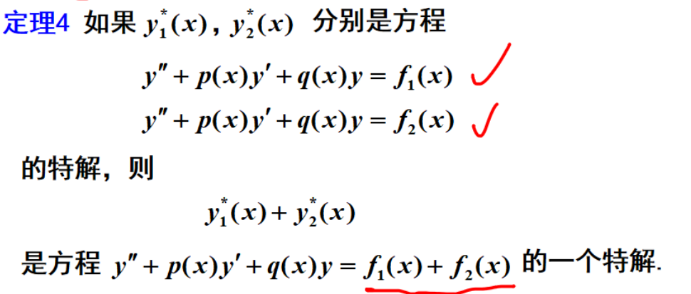
	[013](bookxnotepro://opennote/?nb={eaae9369-1988-4e39-8c00-ce441fc1deb4}&book=2d4af1e467280c844651daee18784021&page=12&x=227&y=199&id=5604&uuid=a09b208411a1ddb514a97d140889bcb4)
	性质四
	组合，**设特解**的题会用
	 ^u47tc1

## 常系数齐次线性微分方程
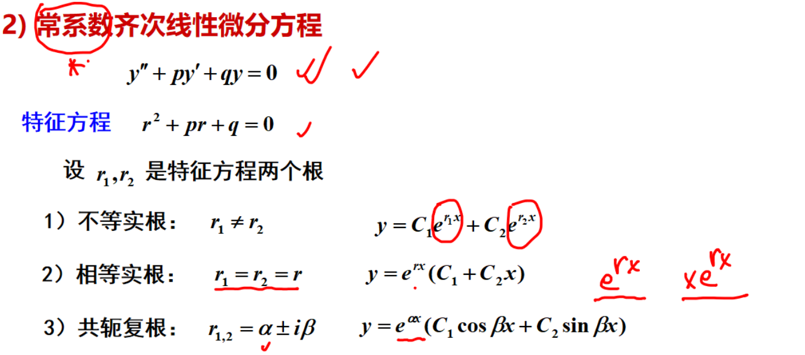
	[014](bookxnotepro://opennote/?nb={eaae9369-1988-4e39-8c00-ce441fc1deb4}&book=2d4af1e467280c844651daee18784021&page=13&x=303&y=132&id=5605&uuid=edd0877d109793eb8dd931ecfb6f6595)
	用特征方程求通解的几个参数，写出通解
	高阶，比如三阶，继续叠加就好：
	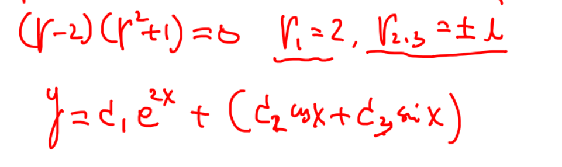
	[017](bookxnotepro://opennote/?nb={eaae9369-1988-4e39-8c00-ce441fc1deb4}&book=2d4af1e467280c844651daee18784021&page=16&x=287&y=246&id=5607&uuid=8e534adef4c3579446de23eed3f934f9)
	

[016](bookxnotepro://opennote/?nb={eaae9369-1988-4e39-8c00-ce441fc1deb4}&book=2d4af1e467280c844651daee18784021&page=15&x=243&y=45&id=5606&uuid=dbe68d7c9568fb30f24a2453401b16b3) 虚数解的题

## 常系数非齐次线性微分方程

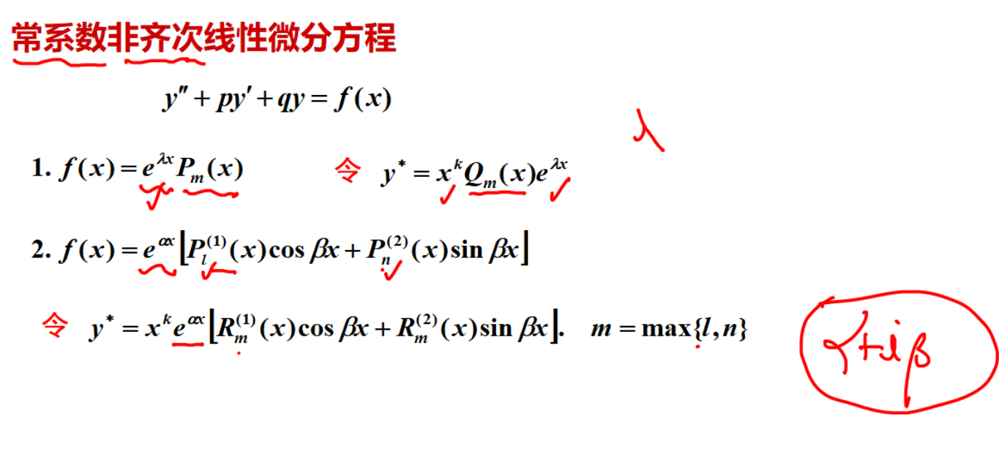
	[018](bookxnotepro://opennote/?nb={eaae9369-1988-4e39-8c00-ce441fc1deb4}&book=2d4af1e467280c844651daee18784021&page=17&x=324&y=133&id=5608&uuid=76e545f912032d1f89f480d90acb5323)
	齐次的通解+一个非齐特解——**设特解**，待定系数法
	k:
	1. f(x)是多项式$\times$ 指数——f(x)中的$e^{ \lambda x}$ 的$\lambda$ 是特征方程的几次根
	2. f(x)是多项式$\times$ 三角$\times$ 指数——f(x)中的$\alpha+i\beta$ 是特征方程的几次根
		注意：设的特解多项式的阶数=两个三角前的多项式阶大的阶数：
		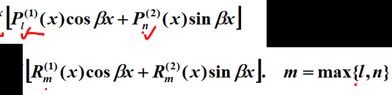
		[018](bookxnotepro://opennote/?nb={eaae9369-1988-4e39-8c00-ce441fc1deb4}&book=2d4af1e467280c844651daee18784021&page=17&x=302&y=170&id=5609&uuid=8df2215b1935cef30cb902aa61156391)
		就算f(x)只有一个三角，也要设两个三角

## 欧拉方程
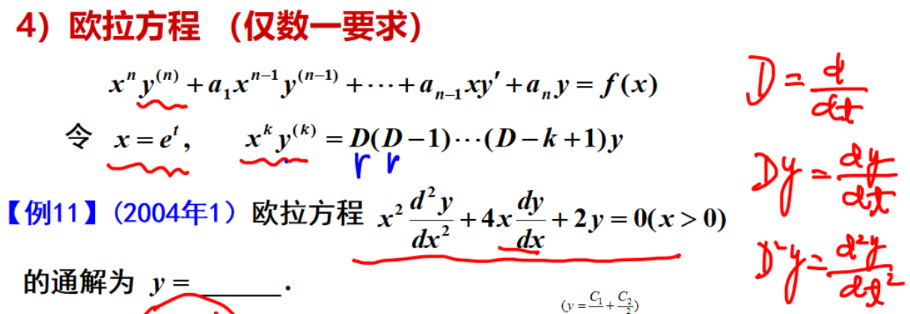
	[021](bookxnotepro://opennote/?nb={eaae9369-1988-4e39-8c00-ce441fc1deb4}&book=2d4af1e467280c844651daee18784021&page=20&x=268&y=100&id=5610&uuid=2e2b4434b995e66468c86c659a6232a6)
	特殊变系数，可以把x消掉。注意替换了之后要对t求导

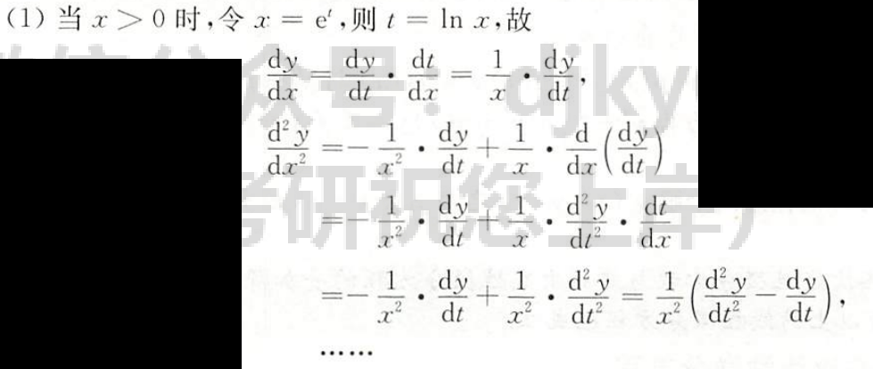
	[194](bookxnotepro://opennote/?nb={c287edd4-3f25-4bbd-a744-a478182b9e21}&book=326d5a790e5c8d426122928be7ab41a9&page=193&x=230&y=314&id=4&uuid=2ab2dfbccfbbba6c0cd40cd00b2146af)
	推导：主要用1. $t = \ln x$ 2. $\frac{dy}{dx}$ 替换为$\frac{dy}{dt} \times \frac{dt}{dx}$ 

一些变系数的参数方程的解法参考：
![[第七章 微分方程#^xab47w]]

# [[重点题型讲解]]

## 微分方程求解

[008](bookxnotepro://opennote/?nb={eaae9369-1988-4e39-8c00-ce441fc1deb4}&book=9a3adc220343a4bc83bce66014118514&page=7&x=143&y=50&id=5612&uuid=9dd37090435ff55d3d6d8cfd5b29f1d7) 齐次：x和y的阶数一般都相等

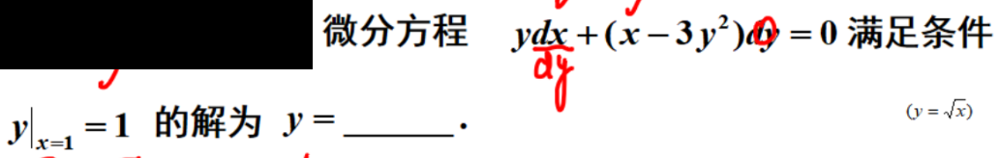
	[009](bookxnotepro://opennote/?nb={eaae9369-1988-4e39-8c00-ce441fc1deb4}&book=9a3adc220343a4bc83bce66014118514&page=8&x=229&y=45&id=5613&uuid=dcd22c55fa7b07991244ee551f328a9b)
	考虑求$\frac{dx}{dy}$ ，都能求出方程
	还有一种方法：分组凑微分：
	
	[009](bookxnotepro://opennote/?nb={eaae9369-1988-4e39-8c00-ce441fc1deb4}&book=9a3adc220343a4bc83bce66014118514&page=8&x=337&y=269&id=5614&uuid=0d6e596fdbf592f2755a056c15e3f11a)
	分组凑[[第七章 微分方程#全微分方程|微分]]

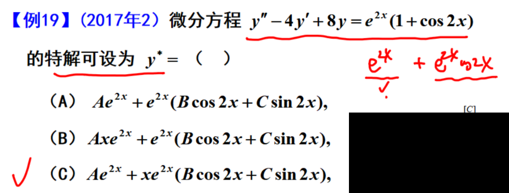
	[011](bookxnotepro://opennote/?nb={eaae9369-1988-4e39-8c00-ce441fc1deb4}&book=9a3adc220343a4bc83bce66014118514&page=10&x=228&y=93&id=5615&uuid=2efa37a3350bf0dc59fedfb4c90ac02b)
	设非齐的特解，使用[[第七章 微分方程#^u47tc1|性质]]两者的和

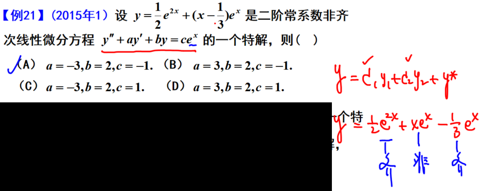
	[013](bookxnotepro://opennote/?nb={eaae9369-1988-4e39-8c00-ce441fc1deb4}&book=9a3adc220343a4bc83bce66014118514&page=12&x=315&y=124&id=5617&uuid=65d10881d4429a50a2726bf952e7dda2)
	知特解找方程——把解带进去硬算也可以
	思路：找特征根
	---
	本题：特解化成三个特解的求和（齐次特解2个、非齐次特解）
		这三个特解的区分不是那眼睛看的，需要用[[#性质|性质]]验证：
			1若是非齐特解，带进整个公式不会相等（e上系数）——非齐特使方程成立
			2**若是齐次特解——前面带x的齐次说明有重根**，而1已经是齐了，没有重根，所以不是齐次特解
			3 排除法
	---
	类似的题：
	![[第七章 微分方程#^86me7d]]

[015](bookxnotepro://opennote/?nb={eaae9369-1988-4e39-8c00-ce441fc1deb4}&book=9a3adc220343a4bc83bce66014118514&page=14&x=216&y=61&id=5618&uuid=6064b3c36b6b61353c10e0fdcc1eab3c) [[#解的结构#性质|性质]]的应用：三个通解可以表示一个二阶常系数非齐次线性微分方程的通解 ^zi2sfg

## 微分方程综合题

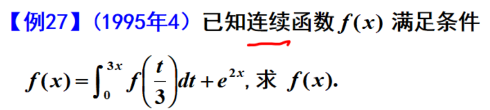
	[019](bookxnotepro://opennote/?nb={eaae9369-1988-4e39-8c00-ce441fc1deb4}&book=9a3adc220343a4bc83bce66014118514&page=18&x=184&y=46&id=5619&uuid=a7bfa51a775c6fbecb3436511a7af103)
	积分方程化为微分方程
	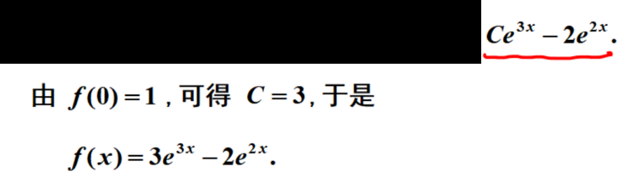
	[019](bookxnotepro://opennote/?nb={eaae9369-1988-4e39-8c00-ce441fc1deb4}&book=9a3adc220343a4bc83bce66014118514&page=18&x=233&y=298&id=5620&uuid=c1cf1f68efd21e85cf239ffe1a2d91e7)
	积分出来是个通解不行，在原式中找条件
	cdz:积分方程似乎自带边界条件

[018](bookxnotepro://opennote/?nb={eaae9369-1988-4e39-8c00-ce441fc1deb4}&book=9a3adc220343a4bc83bce66014118514&page=17&x=181&y=54&id=5623&uuid=7a6e6ba206944ba11c789c27b388b7b2) 导数的定义+微分方程 cdz: 居然是真题，好离谱，例题有：
![[第七章 微分方程#^f2ucye]]

## 微分方程应用题

（三）应用题  [021](bookxnotepro://opennote/?nb={eaae9369-1988-4e39-8c00-ce441fc1deb4}&book=9a3adc220343a4bc83bce66014118514&page=20&x=234&y=27&id=5624&uuid=1b690e2277098b09145d2b2f01a70178)

# 处理方法

$$\ln|u+\sqrt{u^2+1}| = ln x + C$$
这种两边都是 ln 的式子别忘了左右取 e，消去 ln

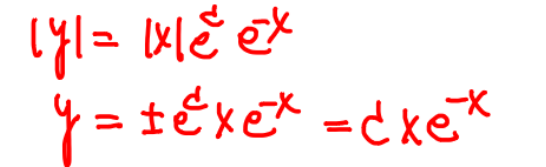
	[005](bookxnotepro://opennote/?nb={eaae9369-1988-4e39-8c00-ce441fc1deb4}&book=2d4af1e467280c844651daee18784021&page=4&x=222&y=294&id=5589&uuid=603fe4bbfb97f25e0f30c2fbdbb548f8)
	任意系数包含正负号

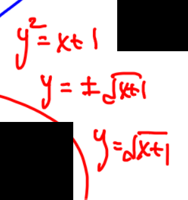
	[010](bookxnotepro://opennote/?nb={eaae9369-1988-4e39-8c00-ce441fc1deb4}&book=2d4af1e467280c844651daee18784021&page=9&x=561&y=187&id=5598&uuid=c46bb10ec2c66eaef75859d7d577e21c)
	y的平方，相当于两个特解，需要再确定

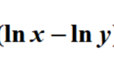
	[008](bookxnotepro://opennote/?nb={eaae9369-1988-4e39-8c00-ce441fc1deb4}&book=9a3adc220343a4bc83bce66014118514&page=7&x=306&y=56&id=5611&uuid=c33e4aaac65768fb1f2f902d40ed2204)
	[[#齐次方程]]的形式构造的典型

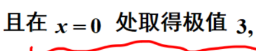
	[012](bookxnotepro://opennote/?nb={eaae9369-1988-4e39-8c00-ce441fc1deb4}&book=9a3adc220343a4bc83bce66014118514&page=11&x=156&y=55&id=5616&uuid=72e9c8eaf614061dc3fb1ae8b94c0658)
	极值：两个条件，值+导数为0

![[第七章 微分方程#^zi2sfg]]

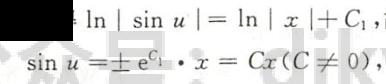
	[125](bookxnotepro://opennote/?nb={4b0b849c-f284-459f-9b9c-e14b0ecf8ba2}&book=4db326750425a2eac028b50acbc37456&page=124&x=227&y=271&id=17&uuid=255f7fefe921679ae1a016dec0c1d4d5)
	两个 ln 绝对值相等，任意常数由于是 $C=e^C$ ，其实是取不了 0 和负数的，经常要单独分析，比如此题 y 为常函数 0 [[自然限定的范围]]

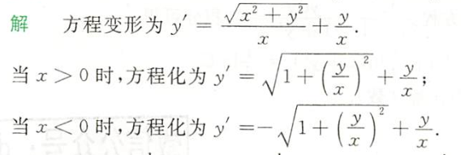
	[126](bookxnotepro://opennote/?nb={4b0b849c-f284-459f-9b9c-e14b0ecf8ba2}&book=4db326750425a2eac028b50acbc37456&page=125&x=182&y=170&id=13&uuid=2d2f6a53234431b53e71dfa9dfb05e10)
	想把一个未知数放进根号，一定要分类讨论未知数的正负
	 ^uomrxj

![[第七章 微分方程#^pdnasj]]

曲线在原点处有拐点  [047](bookxnotepro://opennote/?nb={4b0b849c-f284-459f-9b9c-e14b0ecf8ba2}&book=4f1972a39d8f1176257957a09d832b75&page=46&x=359&y=258&id=3&uuid=9f65e9c4facd0a1b9a373fa80df90878)
两个意思：过**原点**(不只是 x=0 有取值)，x=0 处二阶导为 0

在解微分方程的过程中，不一定要完全求出来后，再求所有常数，直接边做边求常数 [127](bookxnotepro://opennote/?nb={4b0b849c-f284-459f-9b9c-e14b0ecf8ba2}&book=4db326750425a2eac028b50acbc37456&page=126&x=56&y=571&id=24&uuid=d4af6f102ec2a12d99634c9941b0fc87)

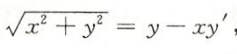
	[128](bookxnotepro://opennote/?nb={4b0b849c-f284-459f-9b9c-e14b0ecf8ba2}&book=4db326750425a2eac028b50acbc37456&page=127&x=154&y=442&id=33&uuid=f4e71867f4cf8e304472f1ea16e6f49f)
	注意结构，x 和 y 的阶次相等，满足齐次方程的形式，不考虑 $y'$
	这里最好把 $f(x)$ 写成 y，方便观察
 ^e6td3q

![[WIN_20220928_20_51_04_Scan.jpg]]
Y 居然带平方了，学到的求不出来，这里 [[cdz]] 用二元一次方程求根公式算出的答案
但中间的正负号不好确定啊

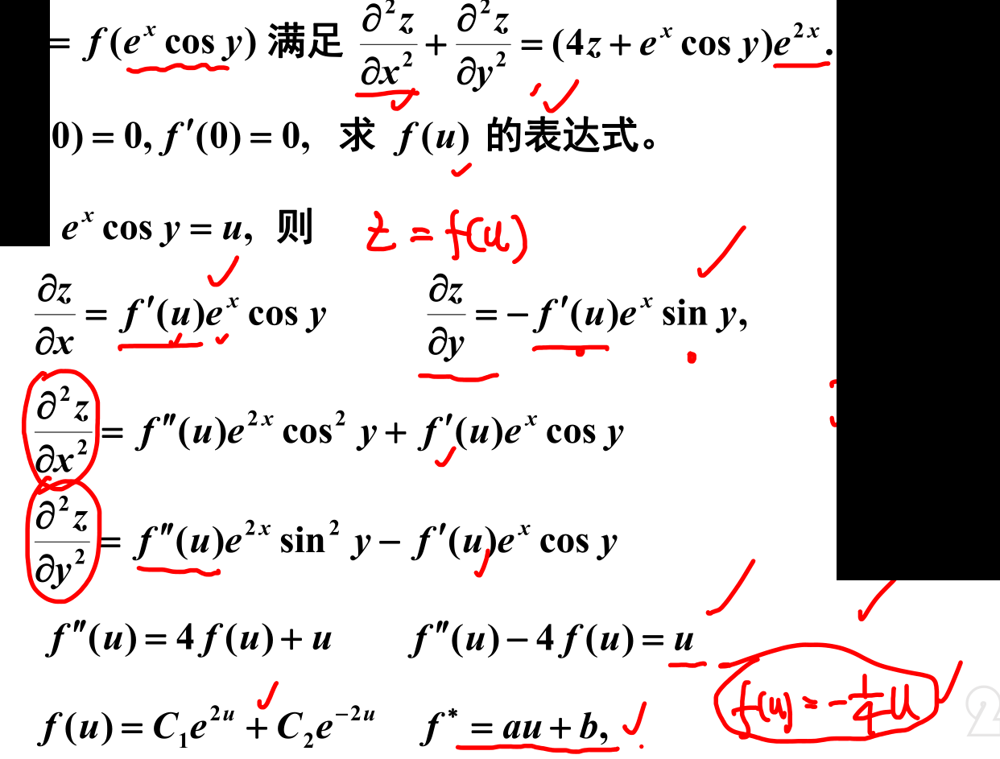
	[015](bookxnotepro://opennote/?nb={eaae9369-1988-4e39-8c00-ce441fc1deb4}&book=8734308cb27c57eb36a49d0cf038f18d&page=14&x=391&y=300&id=17004&uuid=1521be9c90a5112d2e10e28ed959ac05)
	用 u 代替复杂的 $e^{x}\cos y$ 是很方便的。

# 一些细节
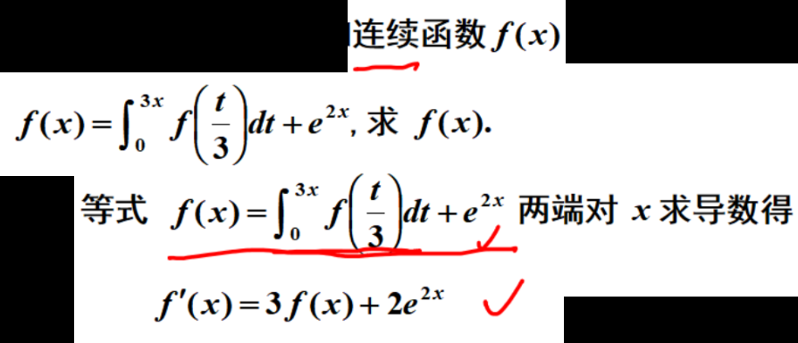
	[019](bookxnotepro://opennote/?nb={eaae9369-1988-4e39-8c00-ce441fc1deb4}&book=9a3adc220343a4bc83bce66014118514&page=18&x=207&y=87&id=5621&uuid=f6063948182c93539bea2b19a452a8da)
	仅仅是个连续函数可以求导的原因是等式右侧是两个可导的，可导的组合可导
	注：连续函数的变现积分可导[[第五章 定积分及其应用#^9beae6]]

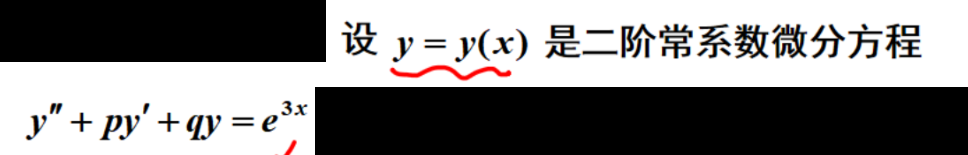
	[017](bookxnotepro://opennote/?nb={eaae9369-1988-4e39-8c00-ce441fc1deb4}&book=9a3adc220343a4bc83bce66014118514&page=16&x=213&y=37&id=5622&uuid=c0a1636677899b7fb908c9fa587d2d17)
	二阶可导，但是导数不一定连续，不能逼近。
	但下面式子，二阶导数等于连续函数求和，固连续

# 习题积累

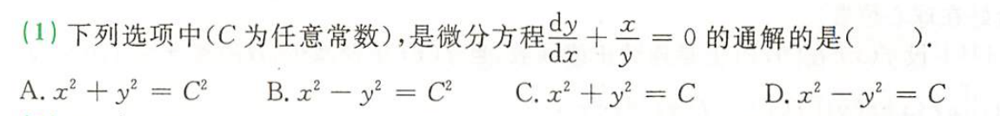
	[046](bookxnotepro://opennote/?nb={4b0b849c-f284-459f-9b9c-e14b0ecf8ba2}&book=4f1972a39d8f1176257957a09d832b75&page=45&x=253&y=211&id=6&uuid=27cc913985f05181c2111fbf89eef632)
	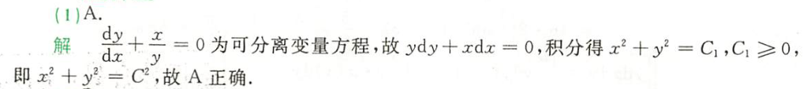
	[124](bookxnotepro://opennote/?nb={4b0b849c-f284-459f-9b9c-e14b0ecf8ba2}&book=4db326750425a2eac028b50acbc37456&page=123&x=252&y=186&id=7&uuid=7c97a4fd910a543152c71c77cdf5d958)
	解出题的解，也要判断一下“任意常数”究竟有没有[[自然限定的范围]]——这里是平方限制C为非负数，所以题目添加了一个$C^2$ 。
	==未知常数的范围一定要指定，经常是“C为任意常数”==,如果来自$e^c$ 则是"C>0"
	 ^pdnasj

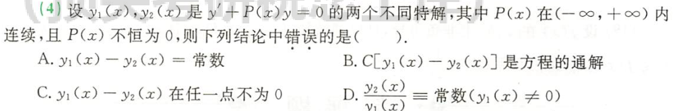
	[046](bookxnotepro://opennote/?nb={4b0b849c-f284-459f-9b9c-e14b0ecf8ba2}&book=4f1972a39d8f1176257957a09d832b75&page=45&x=258&y=356&id=8&uuid=9b8f66b3145d91935ef8e8f4764578e4)
	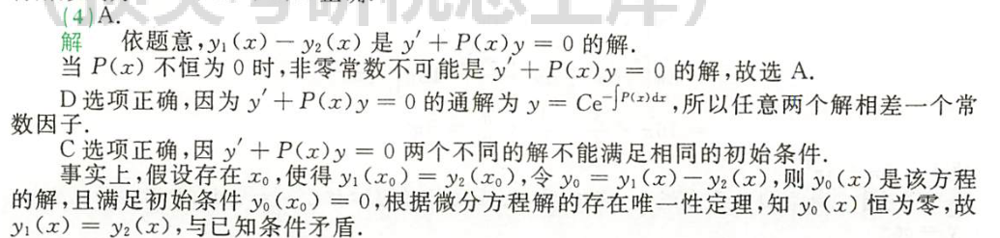
	[124](bookxnotepro://opennote/?nb={4b0b849c-f284-459f-9b9c-e14b0ecf8ba2}&book=4db326750425a2eac028b50acbc37456&page=123&x=257&y=379&id=9&uuid=05bdd1c433ea9dc41c1fe5599f591f28)
	首先这一题是**一阶**，直接用一阶公式，并没有二阶那些性质（甚至二阶性质也不对，两者之差的两者是：[[第七章 微分方程#^atc71r|非齐次特解之差]]，而不是齐次）
	这道题形成的解的结构均有点像二阶，但并不是二阶的😑，他是“一阶”!

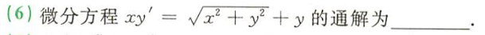
	[046](bookxnotepro://opennote/?nb={4b0b849c-f284-459f-9b9c-e14b0ecf8ba2}&book=4f1972a39d8f1176257957a09d832b75&page=45&x=193&y=623&id=18&uuid=dd98753fd854808247901caf29cfc585)
	如下
	![[第七章 微分方程#^uomrxj]]

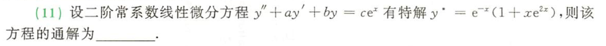
	[047](bookxnotepro://opennote/?nb={4b0b849c-f284-459f-9b9c-e14b0ecf8ba2}&book=4f1972a39d8f1176257957a09d832b75&page=46&x=238&y=91&id=21&uuid=8d8cc431710a22b5bb8b262192fa48ed)
	这个特解求通解的题，只有两个特解的和，应该是齐次项有一个系数为 0
	明确：
	1. 三者之和一定有一个非齐特解
	2. 注意根据两者一个是齐次特解，另一个一定是非齐次来排除
	3. 这道题，没办法，排除法做到底了——但是也比直接把三个特解之和带进去简单
^86me7d

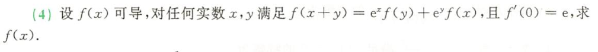
[047](bookxnotepro://opennote/?nb={4b0b849c-f284-459f-9b9c-e14b0ecf8ba2}&book=4f1972a39d8f1176257957a09d832b75&page=46&x=237&y=211&id=31&uuid=b0e7a969eab49406046f5dd53b4ffb7d)
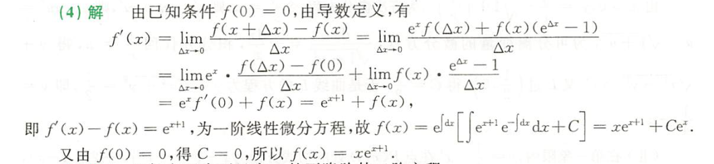
	[127](bookxnotepro://opennote/?nb={4b0b849c-f284-459f-9b9c-e14b0ecf8ba2}&book=4db326750425a2eac028b50acbc37456&page=126&x=232&y=514&id=23&uuid=b2bfe329aec343ea97792b0b9eb0e721)
	综合类题中的函数定义题
	$f(x+y)$ 可以用 $f(x+\Delta x)$ 表示，构成导数定义的形式
^f2ucye

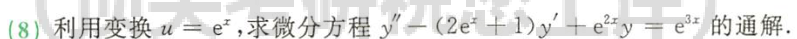
	[047](bookxnotepro://opennote/?nb={4b0b849c-f284-459f-9b9c-e14b0ecf8ba2}&book=4f1972a39d8f1176257957a09d832b75&page=46&x=213&y=328&id=32&uuid=bd3d4e7b1d3f59cf8c939d2cf334539d)
	**二阶、变系数**、非齐次微分方程：参考欧拉方程的代法，想办法把变系数用代换消掉或者转成欧拉方程——cdz：这种东西我感觉看不出来
 ^xab47w

