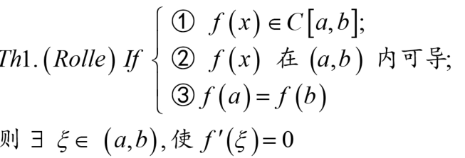
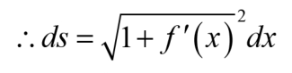
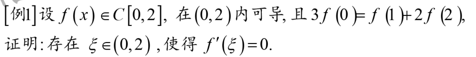
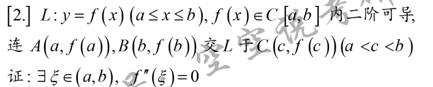

[[收集的习题]]
# 预备知识

极值点的定义[001](bookxnotepro://opennote/?nb={214cb125-5d23-4d98-a6be-193ff2248daa}&book=b031d6b3dcd76797850d98a4b61794f8&page=0&x=124&y=173&id=6650&uuid=c2ff0f3fa0b077dc452ec2e80278a2b7)

一个点的导数值：
- 不存在
- 存在
	- 大于0
	- 小于0
	- 等于0

导数的**邻域保号性**[001](bookxnotepro://opennote/?nb={214cb125-5d23-4d98-a6be-193ff2248daa}&book=b031d6b3dcd76797850d98a4b61794f8&page=0&x=116&y=371&id=6652&uuid=266e2eac5517570d419be46b998fbfbd)  
- 导数作为一种极限的性质，保号用作比大小
- 导数为正，存在邻域内，左小右大
  导数为负，存在邻域内，左大右小
  导数为0，驻点
^feqmr5

## 结论

	[002](bookxnotepro://opennote/?nb={214cb125-5d23-4d98-a6be-193ff2248daa}&book=b031d6b3dcd76797850d98a4b61794f8&page=1&x=250&y=135&id=6655&uuid=d5244447ed5c997bd97c05e4d608d996)
	不可导点和驻点（导数为0）为可疑极值点，不一定
	极值一定是不可导点和驻点

	[002](bookxnotepro://opennote/?nb={214cb125-5d23-4d98-a6be-193ff2248daa}&book=b031d6b3dcd76797850d98a4b61794f8&page=1&x=221&y=400&id=6665&uuid=4601b7e4fa94dbe59e696350f8705b98)
	[[第三章 一元函数微分学的应用#^feqmr5|邻域保号性]]的一侧部分
	^wv8g8k

# 中值定理
常见结构：闭区间连续，开区间可导

## Rolle

	[002](bookxnotepro://opennote/?nb={214cb125-5d23-4d98-a6be-193ff2248daa}&book=b031d6b3dcd76797850d98a4b61794f8&page=1&x=211&y=502&id=6666&uuid=eef93b22b2d2bb539e9ac26ab7f72a48)证明：最值是一种极值，极值导数为0
	**开区间**内存在一点满足导数为0

### 找两相等值，使用rolle证明导数存在0的点

	[003](bookxnotepro://opennote/?nb={214cb125-5d23-4d98-a6be-193ff2248daa}&book=b031d6b3dcd76797850d98a4b61794f8&page=2&x=235&y=103&id=6671&uuid=820c592d7c41cff7a9caa0f6a5d9158a)
	通过[[零点定理]]找两个函数值为$\frac{1}{2}$的点，再用rolle证明存在导数为0

	[003](bookxnotepro://opennote/?nb={214cb125-5d23-4d98-a6be-193ff2248daa}&book=b031d6b3dcd76797850d98a4b61794f8&page=2&x=243&y=288&id=6672&uuid=641ae80c83587d3804a04d16941e9565)
	通过[[第一章 极限与连续#^86a239|介值定理]]来找点
	 ^u61cmu

[[开区间闭区间]]

## Lagrange

	[003](bookxnotepro://opennote/?nb={214cb125-5d23-4d98-a6be-193ff2248daa}&book=b031d6b3dcd76797850d98a4b61794f8&page=2&x=225&y=478&id=6673&uuid=d2876e1a80df8c4fe59efe9fbc45e90d)
	开区间，
	证明需要构造**曲-直**（点斜式）用rolle

	[004](bookxnotepro://opennote/?nb={214cb125-5d23-4d98-a6be-193ff2248daa}&book=b031d6b3dcd76797850d98a4b61794f8&page=3&x=261&y=164&id=6674&uuid=00fa27feb7fbd02cb897f8a3de1e38bf)

## Cauchy

	[004](bookxnotepro://opennote/?nb={214cb125-5d23-4d98-a6be-193ff2248daa}&book=b031d6b3dcd76797850d98a4b61794f8&page=3&x=208&y=318&id=6675&uuid=c13e5687a0e180dc3dd24a3ef63515c1)
	自然分母函数的导数不能为0
	证明：lagrange的点斜式替换b-a

	[004](bookxnotepro://opennote/?nb={214cb125-5d23-4d98-a6be-193ff2248daa}&book=b031d6b3dcd76797850d98a4b61794f8&page=3&x=219&y=424&id=6676&uuid=38e20e2f344ff8181f44d64ed31e3fe2) [005](bookxnotepro://opennote/?nb={214cb125-5d23-4d98-a6be-193ff2248daa}&book=b031d6b3dcd76797850d98a4b61794f8&page=4&x=166&y=81&id=6677&uuid=b1f9a1fe27b54623b6e0868cd2dd7829)
	1. 第一项主要是为了保证分母安全不为0，**注意**：导数不为0可以推导区间内值不等（单调？）
	1. 两边界的导数为0不影响cauchy

## 题型

# 单调性与极值、凹凸性与拐点、函数作图
## 凹凸性
[024](bookxnotepro://opennote/?nb={214cb125-5d23-4d98-a6be-193ff2248daa}&book=b031d6b3dcd76797850d98a4b61794f8&page=23&x=113&y=115&id=6747&uuid=557c9a9c116f12241f68cd9611e3b5f8)定义：1/2处的大小判断凹凸

	[024](bookxnotepro://opennote/?nb={214cb125-5d23-4d98-a6be-193ff2248daa}&book=b031d6b3dcd76797850d98a4b61794f8&page=23&x=231&y=336&id=6748&uuid=838a2a9522eba74ca31d6ac90adc772f)
	只由二阶导数决定
	极值：相当于导数等于0时候的凹（极小）凸（极大）
	[[一阶连续，二阶可导]]
	 ^57bnnp

	[024](bookxnotepro://opennote/?nb={214cb125-5d23-4d98-a6be-193ff2248daa}&book=b031d6b3dcd76797850d98a4b61794f8&page=23&x=218&y=281&id=6749&uuid=958545b0bd112768a13ac95ee3b8e0d6)
	判断拐点：判断二阶导数左右是否变号即可

## 渐近线

	[024](bookxnotepro://opennote/?nb={214cb125-5d23-4d98-a6be-193ff2248daa}&book=b031d6b3dcd76797850d98a4b61794f8&page=23&x=215&y=615&id=6750&uuid=149afeec272ca0927c74a239cfa1c602)
	1. 水平间断点和斜间断点互斥
		正方向互斥，反方向互斥
	2. 铅直渐近线在间断点处

## 曲率半径
![[Pasted image 20220825103457.png]]

## 弧微分

	
	[026](bookxnotepro://opennote/?nb={214cb125-5d23-4d98-a6be-193ff2248daa}&book=b031d6b3dcd76797850d98a4b61794f8&page=25&x=202&y=392&id=6745&uuid=9ddac672a161a8f11be7a0b597f8b62b)
	通过通式直接推导

# 重点题型讲解

## 题型一 证明$f^{(n)}(\xi)=0$

	[005](bookxnotepro://opennote/?nb={214cb125-5d23-4d98-a6be-193ff2248daa}&book=b031d6b3dcd76797850d98a4b61794f8&page=4&x=200&y=147&id=6679&uuid=ecb762bdfcb8228537feac8c41485105)
	case1使用rolle
	case2第二种情况可以用rolle、lagrange等

### 举例

[005](bookxnotepro://opennote/?nb={214cb125-5d23-4d98-a6be-193ff2248daa}&book=b031d6b3dcd76797850d98a4b61794f8&page=4&x=262&y=202&id=6680&uuid=f31d9685e17c1f72bef1d3f68c7da456)
1. 和[[第三章 一元函数微分学的应用#^u61cmu|这个题]]的有一点区别，这里[[第一章 极限与连续#介值定理的应用|介值定理]]处理等号右侧的等式，因为介值定理只能处理相加
2. **这里选择12之间而不是02之间**使用介值定理

	[005](bookxnotepro://opennote/?nb={214cb125-5d23-4d98-a6be-193ff2248daa}&book=b031d6b3dcd76797850d98a4b61794f8&page=4&x=244&y=395&id=6681&uuid=a5db9d367946b33056e37db2e8f55477)
	case2用rolle

	[005](bookxnotepro://opennote/?nb={214cb125-5d23-4d98-a6be-193ff2248daa}&book=b031d6b3dcd76797850d98a4b61794f8&page=4&x=239&y=542&id=6682&uuid=1f76236fdcff8bd1a53a9a8b631a7285)
	case2用lagrange构建两个相等的一阶导数

	[006](bookxnotepro://opennote/?nb={214cb125-5d23-4d98-a6be-193ff2248daa}&book=b031d6b3dcd76797850d98a4b61794f8&page=5&x=242&y=102&id=6683&uuid=3df0ce3a5cc59f30609bbf4865287c69)
	三个点共线，lagrange两个一阶相等导数

[[开区间闭区间]]

## 题型二 待证结论中只有一个中值$\xi$，不含其他字母

### 两项，还原法

	[006](bookxnotepro://opennote/?nb={214cb125-5d23-4d98-a6be-193ff2248daa}&book=b031d6b3dcd76797850d98a4b61794f8&page=5&x=175&y=307&id=6684&uuid=90ad9e87729ea1bd55636322ca926a27)
	还原为原函数，rolle证明原函数导数为0

	[006](bookxnotepro://opennote/?nb={214cb125-5d23-4d98-a6be-193ff2248daa}&book=b031d6b3dcd76797850d98a4b61794f8&page=5&x=241&y=361&id=6685&uuid=7331cb2f06d5b8fe3a57a575649e5ff0)
	 ^p42nez

#### 举例

	[007](bookxnotepro://opennote/?nb={214cb125-5d23-4d98-a6be-193ff2248daa}&book=b031d6b3dcd76797850d98a4b61794f8&page=6&x=246&y=392&id=6687&uuid=cc9b5d5b25400091122b0f3a83d632af)
	1. 两项(等式左右两边均一项)
	2. 只含有$\xi$
	3. 导数差一阶
	构造将ln内的函数构造为原函数

### 分组法

转化为还原法的形式（两项、仅有$\xi$、导数差一阶）

#### 举例

	[008](bookxnotepro://opennote/?nb={214cb125-5d23-4d98-a6be-193ff2248daa}&book=b031d6b3dcd76797850d98a4b61794f8&page=7&x=246&y=173&id=6688&uuid=8487f9f3afc470d9a00ba3d3a8382e16)
	把常数项作为函数的一部分

## 题型三 结论中含$\xi$，含$a, b$ 

	[008](bookxnotepro://opennote/?nb={214cb125-5d23-4d98-a6be-193ff2248daa}&book=b031d6b3dcd76797850d98a4b61794f8&page=7&x=240&y=556&id=6689&uuid=889e3a25684423a9bf8e8575f4db3f5a)
	1. 能分开的，构造成lagrange或cauchy的形式
	2. 不能分开的，**还原法**，还原导数的加减还原如下
		
	 ^d6ubkr

### 举例：

	[009](bookxnotepro://opennote/?nb={214cb125-5d23-4d98-a6be-193ff2248daa}&book=b031d6b3dcd76797850d98a4b61794f8&page=8&x=239&y=92&id=6691&uuid=b090d8c2f3d57bc2081493d24afa2b35)
	可拆用cauchy，注意cauchy分母的函数要证明不为0:
	

	[009](bookxnotepro://opennote/?nb={214cb125-5d23-4d98-a6be-193ff2248daa}&book=b031d6b3dcd76797850d98a4b61794f8&page=8&x=261&y=406&id=6693&uuid=e006b328bc3d40ca20f9b7d73c9daa08)
	不可拆的，去分母、还原

## 题型四 结论中含两个或两个以上中值的问题
不用考虑端点ab
### 仅有一阶$f'(\xi),f'(\eta)$

	[010](bookxnotepro://opennote/?nb={214cb125-5d23-4d98-a6be-193ff2248daa}&book=b031d6b3dcd76797850d98a4b61794f8&page=9&x=182&y=110&id=6694&uuid=fd2f8825bd8fbe6bef72f0366cdeb71a)
	硬找三个点，用lagrange表示这两个$f'(\xi),f'(\eta)$
	

#### 例题

	[010](bookxnotepro://opennote/?nb={214cb125-5d23-4d98-a6be-193ff2248daa}&book=b031d6b3dcd76797850d98a4b61794f8&page=9&x=250&y=163&id=6695&uuid=102e0f655d158f51818c20f8000c59be)
	1. 第一问，没有导数项——[[第一章 极限与连续#闭区间上的连续函数|连续性]]（介值定理、零点定理）中选择零点定理来做。
	2. 第二问，没有三个点，**硬构造三个点**：有两个边界点，构造一个第三个点（lagrange）直接带入公式中即可
	^ghaufq

	[010](bookxnotepro://opennote/?nb={214cb125-5d23-4d98-a6be-193ff2248daa}&book=b031d6b3dcd76797850d98a4b61794f8&page=9&x=251&y=442&id=6696&uuid=b880805dfa3d83af2cda151349869b0e)
	1. 这种题，[[第一章 极限与连续#闭区间上的连续函数|连续性]]两个定理，要证闭区间用介值，要证开区间用零点。——这里用零点(小于号是开区间)
	2. 三个点，表示lagrange 
	^59l32i

	[011](bookxnotepro://opennote/?nb={214cb125-5d23-4d98-a6be-193ff2248daa}&book=b031d6b3dcd76797850d98a4b61794f8&page=10&x=225&y=93&id=6697&uuid=40f75be3d6747e1c04ab7d9e4513c37e)
	1. 注意：也可以看作是这个类型的题目**这也是仅有一阶$f'(\xi),f'(\eta)$的问题**，虽然是不等式+两式子。
		这种理解可以做，但找点就不太逻辑通顺
	2. 另一种理解：可以理解为两个式子，分别证明。有倒数，[[#题型六 拉格朗日中值定理的两种惯性思维|明显用lagrange]]来做
	3. 找点，用[[第三章 一元函数微分学的应用#^wv8g8k|导数单侧邻域保号]]来找高于$f(a)$的点

	[027](bookxnotepro://opennote/?nb={512382f5-a3a5-4617-b335-e716d4b5f10c}&book=7c79fd0abca65e43b34474f815f9e7ce&page=26&x=245&y=109&id=138&uuid=f4b3c2bc912314c9054e493a3cb87a30)
	这个题，直接找中点了，是反向分析出来找中点的

### 有复杂项

	[011](bookxnotepro://opennote/?nb={214cb125-5d23-4d98-a6be-193ff2248daa}&book=b031d6b3dcd76797850d98a4b61794f8&page=10&x=227&y=263&id=6698&uuid=af9ae080672f1294ec8dfeea8e5e0467)
	两个中值项的复杂结构：
	1. 留复杂中值的项
	2. 对复杂的项用还原法，还原为原函数
	3. 原函数的lagrange公式导数一侧变为变为原复杂项。再处理分式侧内容
		1. 感觉虽是还原，但却不是还原法。还是一种表示法

感觉除了表示法就是还原法（rolle)
### 例题

	[011](bookxnotepro://opennote/?nb={214cb125-5d23-4d98-a6be-193ff2248daa}&book=b031d6b3dcd76797850d98a4b61794f8&page=10&x=266&y=361&id=6706&uuid=db50b9ad1704ee980961ba2cdade91db)
	
	用了两个lagrange，
	1. 本题型的处理方法
	2. 右侧形成新的lagrange形式（肯定会形成，因为本来就是langrang公式，但条件消掉了一点内容），变化。

	[012](bookxnotepro://opennote/?nb={214cb125-5d23-4d98-a6be-193ff2248daa}&book=b031d6b3dcd76797850d98a4b61794f8&page=11&x=230&y=103&id=6708&uuid=73cbb84f3691fd3107ec843e5bac92e2)
	复杂项cauchy
	一出现cauchy，注意检验

	[012](bookxnotepro://opennote/?nb={214cb125-5d23-4d98-a6be-193ff2248daa}&book=b031d6b3dcd76797850d98a4b61794f8&page=11&x=224&y=404&id=6709&uuid=cd4e4b230d8de6e769c2e66ba20a9e48)
	$\eta^2f'(\eta)$这种形式化为$\frac{f'(\eta)}{\frac{1}{\eta^2}}$方便使用cauchy
## 题型五 中值定理中关于$\eta$的问题
基础阶段先不讲

## 题型六 拉格朗日中值定理的两种惯性思维
[[习惯思维]]

	[013](bookxnotepro://opennote/?nb={214cb125-5d23-4d98-a6be-193ff2248daa}&book=b031d6b3dcd76797850d98a4b61794f8&page=12&x=199&y=141&id=6710&uuid=8f783475baa23bf2736b11ff1ae9bbde)
	1. 看到**函数值之差**想到lagrange
	2. 看到**三个点或者三个导数值**想到lagrange
	3. **函数和函数的导数的关联**想到lagrange

### $f(b)-f(a)$

	[013](bookxnotepro://opennote/?nb={214cb125-5d23-4d98-a6be-193ff2248daa}&book=b031d6b3dcd76797850d98a4b61794f8&page=12&x=184&y=208&id=6711&uuid=6784816a61f53f6ce678e839a912811a)
	lagrange将**性质相同的两项的差**转化成**两项之积**
	导数内的未确定的参数$\eta$，极限中可以夹逼
	[[求极限方法]]：相减的极限

	[013](bookxnotepro://opennote/?nb={214cb125-5d23-4d98-a6be-193ff2248daa}&book=b031d6b3dcd76797850d98a4b61794f8&page=12&x=241&y=404&id=6713&uuid=d2543e75afc51e7b07b9f45b578a306b)
	x和x-1很简洁
	
### 三个点
提到三个点的，都是和lagrange有关的，一个是[[#题型四 结论中含两个或两个以上中值的问题|两个一阶导中值证明题]]硬找三个点来构造两个lagrange，一个是看到三个点下意识lagrange

	[013](bookxnotepro://opennote/?nb={214cb125-5d23-4d98-a6be-193ff2248daa}&book=b031d6b3dcd76797850d98a4b61794f8&page=12&x=197&y=576&id=6714&uuid=f7065af5cb561517c0ffb37547dfc93e)
	这个题看似无头绪，特殊条件是二阶导大于零。
	但因为有三个点。
	构建lagrange会出现一阶导，接近二阶导一点
	
	

### 函数和导数的关联想到lagrange

	[014](bookxnotepro://opennote/?nb={214cb125-5d23-4d98-a6be-193ff2248daa}&book=b031d6b3dcd76797850d98a4b61794f8&page=13&x=228&y=104&id=6716&uuid=84b009e8708585e8930e302f9c9f1caf)
	1. ”至少有一个零点“——出现第三个点，三个点lagrange
	2. 题目内是函数满足一些关系，导数满足一些关系——可以作为是lagrange的参考

## 题型七 泰勒公式的常规证明问题
前提

	[014](bookxnotepro://opennote/?nb={214cb125-5d23-4d98-a6be-193ff2248daa}&book=b031d6b3dcd76797850d98a4b61794f8&page=13&x=309&y=263&id=6717&uuid=3eb513d6d5e00759dd6cb0843ea44d0f)

	[014](bookxnotepro://opennote/?nb={214cb125-5d23-4d98-a6be-193ff2248daa}&book=b031d6b3dcd76797850d98a4b61794f8&page=13&x=307&y=352&id=6718&uuid=ec8c86c898bedb8381b98a2175a73e22)
	taylor公式

	[014](bookxnotepro://opennote/?nb={214cb125-5d23-4d98-a6be-193ff2248daa}&book=b031d6b3dcd76797850d98a4b61794f8&page=13&x=263&y=438&id=6719&uuid=bd7a77010d7171b53fa0880367fde780)

### taylor公式记忆
[[@记忆]]

	[014](bookxnotepro://opennote/?nb={214cb125-5d23-4d98-a6be-193ff2248daa}&book=b031d6b3dcd76797850d98a4b61794f8&page=13&x=262&y=609&id=6720&uuid=82266effa3eccab65a3dd4f617166cd1)
	7中有理数无理数正负数均可以作为a
	$\ln(1+x)$没有1

	
	[015](bookxnotepro://opennote/?nb={214cb125-5d23-4d98-a6be-193ff2248daa}&book=b031d6b3dcd76797850d98a4b61794f8&page=14&x=138&y=106&id=6721&uuid=9e51b87b900cdf9e0f60d7e2db06bb0c) 
	[[求极限方法]]$\frac{0}{0}$型

## 题型八 二阶导数保号性问题

## 题型九 不等式证明

	[021](bookxnotepro://opennote/?nb={214cb125-5d23-4d98-a6be-193ff2248daa}&book=b031d6b3dcd76797850d98a4b61794f8&page=20&x=197&y=533&id=6738&uuid=6fdf8cea0ca04aeab127caf6a70a6c1a)
	单调性和高中一样，懂得**看**出一些特殊的值0，1等

### 题型

	[022](bookxnotepro://opennote/?nb={214cb125-5d23-4d98-a6be-193ff2248daa}&book=b031d6b3dcd76797850d98a4b61794f8&page=21&x=182&y=525&id=6741&uuid=0692bec870c0682bbd6b204d92358d1e)
	常规单调性做法

	[023](bookxnotepro://opennote/?nb={214cb125-5d23-4d98-a6be-193ff2248daa}&book=b031d6b3dcd76797850d98a4b61794f8&page=22&x=184&y=90&id=6743&uuid=6299d501454e9357e0b86d7b596828e8)
	这道题有
	1. 令函数，用x替换b（大的），单调性——能做，不一定好做
	2. 中值定理+重要不等式

	[023](bookxnotepro://opennote/?nb={214cb125-5d23-4d98-a6be-193ff2248daa}&book=b031d6b3dcd76797850d98a4b61794f8&page=22&x=223&y=326&id=6744&uuid=8fab5e0f86d592bcf7edf82fb11359e3)
	这道题是中值定理的结构，但不是，需要用单调性做

### 其他方法

用taylor来做

![[收集的习题#^ffyjpx]]

## 题型十 函数的零点或方程根的个数问题

### 零点定理和rolle

	[020](bookxnotepro://opennote/?nb={214cb125-5d23-4d98-a6be-193ff2248daa}&book=b031d6b3dcd76797850d98a4b61794f8&page=19&x=269&y=120&id=6732&uuid=59337b397429a26dfb16750b9d395c73)
	方法：零点定理和rolle

#### 例题

	[020](bookxnotepro://opennote/?nb={214cb125-5d23-4d98-a6be-193ff2248daa}&book=b031d6b3dcd76797850d98a4b61794f8&page=19&x=204&y=197&id=6733&uuid=fa5607e5c59f8ddf08dfb48bb00013dc)
	至少一个正根——在(0,$+\infty$)内存在一个解（让此式等于0）
	这里用rolle

	[020](bookxnotepro://opennote/?nb={214cb125-5d23-4d98-a6be-193ff2248daa}&book=b031d6b3dcd76797850d98a4b61794f8&page=19&x=216&y=322&id=6734&uuid=2bf17dbf27fbc713b9aebfb84de0de91)
	不可能——反证法可以多一个条件
	 ^6lbvh6

#### 单调性

画出函数的图像

	[020](bookxnotepro://opennote/?nb={214cb125-5d23-4d98-a6be-193ff2248daa}&book=b031d6b3dcd76797850d98a4b61794f8&page=19&x=213&y=509&id=6735&uuid=d9b5000167db65b375e81ff76df1c688)
	高考做法

	
	[020](bookxnotepro://opennote/?nb={214cb125-5d23-4d98-a6be-193ff2248daa}&book=b031d6b3dcd76797850d98a4b61794f8&page=19&x=188&y=585&id=6736&uuid=06093d3ef7113ab96e1bfbb4397458aa)
	注意：可以注意缩小判断取值范围，减少讨论工作

## 题型十一 函数的单调性与极值、渐近线

### 极值点判断

	[017](bookxnotepro://opennote/?nb={214cb125-5d23-4d98-a6be-193ff2248daa}&book=b031d6b3dcd76797850d98a4b61794f8&page=16&x=157&y=271&id=6724&uuid=efa986bbcbf5339acb3345de8d8ba38f)
	1. 确定x的范围
	2. 求导，找到可疑点（不存在或驻点）
	3. 判别法[017](bookxnotepro://opennote/?nb={214cb125-5d23-4d98-a6be-193ff2248daa}&book=b031d6b3dcd76797850d98a4b61794f8&page=16&x=225&y=399&id=6726&uuid=3161e588456811de50fdc70787ba59b2)
		1. 一点邻域导数两侧一正一副——通用判别法
		2. 一阶导数为0，通过二阶正负判断极值方向
			证明[017](bookxnotepro://opennote/?nb={214cb125-5d23-4d98-a6be-193ff2248daa}&book=b031d6b3dcd76797850d98a4b61794f8&page=16&x=94&y=522&id=6725&uuid=24e37f5c21c8ff4f44a70eb2551f2e42)也是证明一点左右两侧的导数正负

#### 例题
![[Pasted image 20220824205834.png]]
[018](bookxnotepro://opennote/?nb={214cb125-5d23-4d98-a6be-193ff2248daa}&book=b031d6b3dcd76797850d98a4b61794f8&page=17&x=244&y=109&id=6727&uuid=f917814e9f58bbc4bad69c71404702c5)
1. 用判别法1：左右极限判断导数大小
2. 判别法2：凑二次导数公式
	
	[018](bookxnotepro://opennote/?nb={214cb125-5d23-4d98-a6be-193ff2248daa}&book=b031d6b3dcd76797850d98a4b61794f8&page=17&x=223&y=237&id=6728&uuid=cc388cb66bf79781cd7776cc9433dca2)
	等价无穷小的变化操作
	![[Pasted image 20220824210236.png]]
---
![[反直觉#^wasbsi]]

	[019](bookxnotepro://opennote/?nb={214cb125-5d23-4d98-a6be-193ff2248daa}&book=b031d6b3dcd76797850d98a4b61794f8&page=18&x=222&y=101&id=6731&uuid=31ecfa6bd839a77531f00b6262eee686)
	1. 根据连续性、极限的除法，求出一阶导数为0
	2. 一阶导数为0，自然用推论2，凑二阶导数

