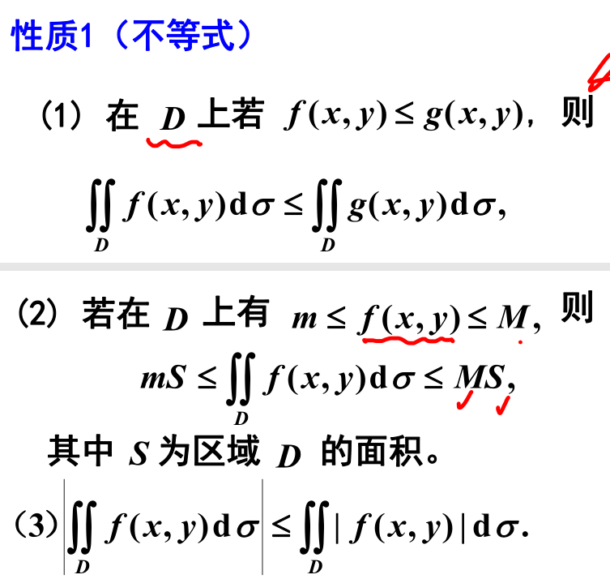
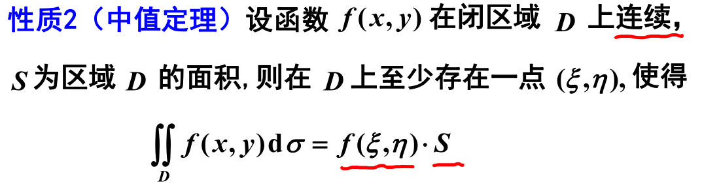
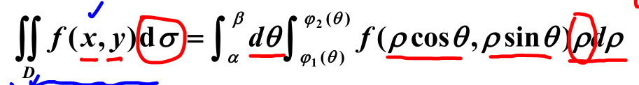
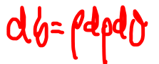
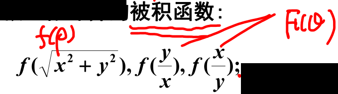
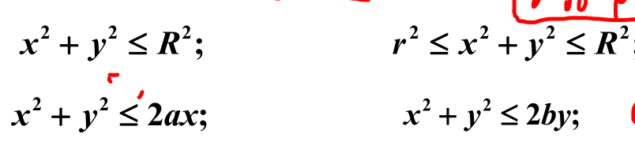
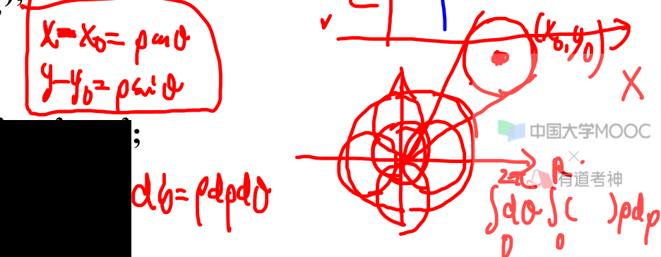
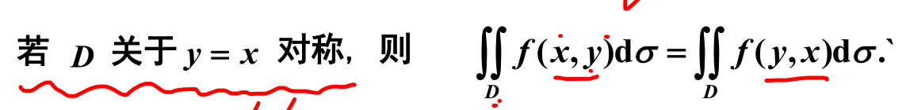
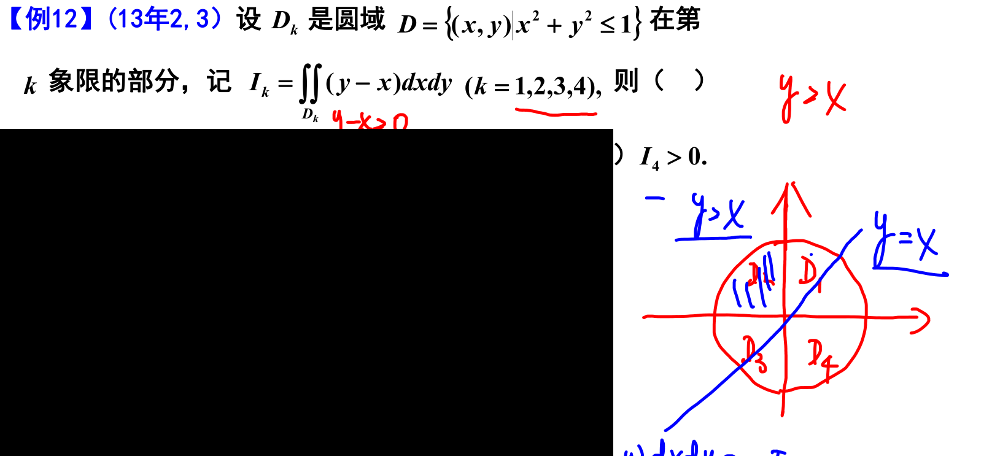

# 二重积分概念与性质

概念  [003](bookxnotepro://opennote/?nb={eaae9369-1988-4e39-8c00-ce441fc1deb4}&book=5196c24459f0aa255f7fa5bec6dcb155&page=2&x=235&y=160&id=18931&uuid=74cd69adb61bd69e2785adc5c45e77cd)

## 性质

	[003](bookxnotepro://opennote/?nb={eaae9369-1988-4e39-8c00-ce441fc1deb4}&book=5196c24459f0aa255f7fa5bec6dcb155&page=2&x=265&y=559&id=18932&uuid=59dd1489dbf2d39138a924bf8e587fe5)
	性质和[[第五章 定积分及其应用#^9rc6u8|定积分比大小性质]]类似
	：保序、最大值最小值、绝对值

	[004](bookxnotepro://opennote/?nb={eaae9369-1988-4e39-8c00-ce441fc1deb4}&book=5196c24459f0aa255f7fa5bec6dcb155&page=3&x=341&y=296&id=18933&uuid=122cd47513bf4706305ae88afd125038)
	中值定理：要求连续

# 二重积分计算

直角坐标计算  [004](bookxnotepro://opennote/?nb={eaae9369-1988-4e39-8c00-ce441fc1deb4}&book=5196c24459f0aa255f7fa5bec6dcb155&page=3&x=227&y=449&id=18934&uuid=75782737da68283fca90bd34c6e8da09)

## 极坐标计算

	[005](bookxnotepro://opennote/?nb={eaae9369-1988-4e39-8c00-ce441fc1deb4}&book=5196c24459f0aa255f7fa5bec6dcb155&page=4&x=476&y=154&id=18935&uuid=c67b000d1a40649ddff10c558cb43417)
	极坐标计算：
	
	不要忘了 $\rho$ 
	

### 适合极坐标计算特征

#### 被积函数
主要看被积函数

	[005](bookxnotepro://opennote/?nb={eaae9369-1988-4e39-8c00-ce441fc1deb4}&book=5196c24459f0aa255f7fa5bec6dcb155&page=4&x=360&y=308&id=18936&uuid=61c94088ad71d846ffb5553efde2b64a)
	被积函数

#### 积分域

	[005](bookxnotepro://opennote/?nb={eaae9369-1988-4e39-8c00-ce441fc1deb4}&book=5196c24459f0aa255f7fa5bec6dcb155&page=4&x=303&y=462&id=18937&uuid=d449366a66361382cfdb5c1631bd4ead)
	主要都是圆和偏心圆

	[005](bookxnotepro://opennote/?nb={eaae9369-1988-4e39-8c00-ce441fc1deb4}&book=5196c24459f0aa255f7fa5bec6dcb155&page=4&x=685&y=439&id=18938&uuid=5150648610ceab15e6dff77b69703449)
	圆心不在坐标轴上 ^7zfjvz

举例：[[第九章习题#变极坐标]]

## 对称性和奇偶性

轴对称——可以理解成关于平面垂直的镜面

对称性  [006](bookxnotepro://opennote/?nb={eaae9369-1988-4e39-8c00-ce441fc1deb4}&book=5196c24459f0aa255f7fa5bec6dcb155&page=5&x=162&y=39&id=18939&uuid=96302b7995b5a6674c7ecb073d455688)
1. 多项式可拆，用对称性
2. 判断 x 时，y 也可以看成常数（因为轴面对称每一列的 y 的取值都固定）

## y=x对称性

	[007](bookxnotepro://opennote/?nb={eaae9369-1988-4e39-8c00-ce441fc1deb4}&book=5196c24459f0aa255f7fa5bec6dcb155&page=6&x=396&y=107&id=18940&uuid=4f96fcf8b63647a83697c9d863d23dbd)
	一般的换变量（定积分换标记）会改变 D 的范围。
	若区间对称，则换了 D 的范围不变

	[022](bookxnotepro://opennote/?nb={eaae9369-1988-4e39-8c00-ce441fc1deb4}&book=5196c24459f0aa255f7fa5bec6dcb155&page=21&x=475&y=219&id=18953&uuid=535f46fd7b0a3d9bdc3803a34fcc9505)
	[[结论]]：Y-x、x-y 函数，画圆，2 象限大于零，13 象限等于 0

举例：
 ![[第九章习题#^n866sd]]

#  ![[第九章习题]]
