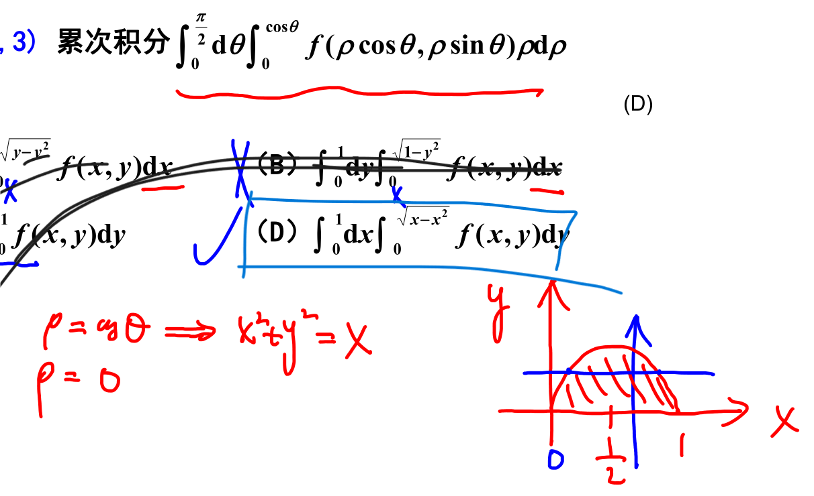
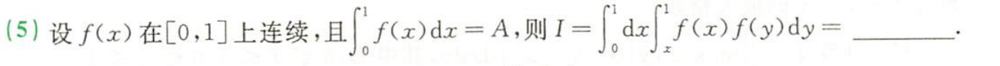
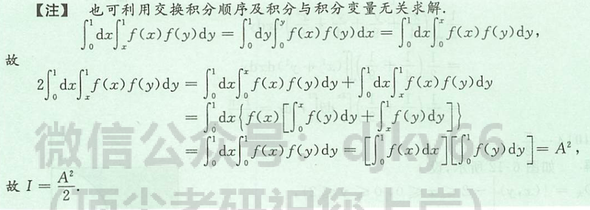

# 重点题型讲解

1. 二重积分：
	1. 累次积分换次序
	2. 极坐标
	3. 对称性
	4. 轮换 y=x 对称性
2. 不等式题  [023](bookxnotepro://opennote/?nb={eaae9369-1988-4e39-8c00-ce441fc1deb4}&book=5196c24459f0aa255f7fa5bec6dcb155&page=22&x=40&y=36&id=18954&uuid=c0238c97c394254f29a6f86581ffb2e0)

## 累次积分交换次序及计算

1. 画域
2. 定——计算

### 换次序
[[第九章习题#^g0apvm]]
[[第九章习题#^nmp14u]]

###  变极坐标
[[第九章习题#^l8tcn3]] 极坐标变直角
[012](bookxnotepro://opennote/?nb={eaae9369-1988-4e39-8c00-ce441fc1deb4}&book=5196c24459f0aa255f7fa5bec6dcb155&page=11&x=299&y=33&id=18944&uuid=147e6e301a8fb41177bc70ed0b335070) 直角坐标变极坐标

## 二重积分

方法：

### 圆域对称性——奇偶性+极坐标

	[013](bookxnotepro://opennote/?nb={eaae9369-1988-4e39-8c00-ce441fc1deb4}&book=5196c24459f0aa255f7fa5bec6dcb155&page=12&x=372&y=278&id=18945&uuid=ddcfc0d1eabb6bbd6aa8b9a8e0d29e28)
	本题为圆域对称性：三个性质
	
	[013](bookxnotepro://opennote/?nb={eaae9369-1988-4e39-8c00-ce441fc1deb4}&book=5196c24459f0aa255f7fa5bec6dcb155&page=12&x=543&y=226&id=18946&uuid=976c59f9cb463f08e3ed38a5406de4b2)
	1. 用对称性化简积分
	2. 用 y=x 对称性化成典型圆的极坐标形式
	3. 用极坐标

# 一些细节

# 处理方法

1. 极坐标不会画域？后半部分 $\rho$ 可以化成直角把轮廓画出来
	
	[010](bookxnotepro://opennote/?nb={eaae9369-1988-4e39-8c00-ce441fc1deb4}&book=5196c24459f0aa255f7fa5bec6dcb155&page=9&x=523&y=213&id=18942&uuid=5c379e6af14a353baf7309b9a8897a8c)
	和积分边界等于一般常数有区别，这里的积分边界包含变量 y，是一条边界线，可以画出来。
	 ^l8tcn3

	[011](bookxnotepro://opennote/?nb={eaae9369-1988-4e39-8c00-ce441fc1deb4}&book=5196c24459f0aa255f7fa5bec6dcb155&page=10&x=344&y=43&id=18943&uuid=04740affbef9d12e020d600e473a0705)
	公式里不含 y，交换次序，把含 x 式子当常数算
	 ^g0apvm

	[015](bookxnotepro://opennote/?nb={eaae9369-1988-4e39-8c00-ce441fc1deb4}&book=5196c24459f0aa255f7fa5bec6dcb155&page=14&x=434&y=39&id=18948&uuid=1cd6d860a42ab5c5aac366835c08e44b)
	先求 x，x 的结构简单，y 得配方
	 ^nmp14u

椭圆的就坐标处理不方便

	[017](bookxnotepro://opennote/?nb={eaae9369-1988-4e39-8c00-ce441fc1deb4}&book=5196c24459f0aa255f7fa5bec6dcb155&page=16&x=237&y=124&id=18949&uuid=7a8d6993a238e6df8316457f3dc4b596)
	圆域，拆开平方奇偶性

	[018](bookxnotepro://opennote/?nb={eaae9369-1988-4e39-8c00-ce441fc1deb4}&book=5196c24459f0aa255f7fa5bec6dcb155&page=17&x=369&y=250&id=18950&uuid=c2b52552578a1c70ebb2bcc7bf0ff30c)
	迂回表示，减法。
	变成只有矩形正方形边界-圆边界的问题

	[020](bookxnotepro://opennote/?nb={eaae9369-1988-4e39-8c00-ce441fc1deb4}&book=5196c24459f0aa255f7fa5bec6dcb155&page=19&x=477&y=151&id=18951&uuid=0241a69db517261ac6e04c0fc09d8811)
	这个图形是 y=x 对称性，可互换
	
	[020](bookxnotepro://opennote/?nb={eaae9369-1988-4e39-8c00-ce441fc1deb4}&book=5196c24459f0aa255f7fa5bec6dcb155&page=19&x=244&y=92&id=18952&uuid=c383b0b1f9827a28d534219cb9fd4a60)
	典型的 xy 互换可消掉可的结构类似
	[[第五章 定积分及其应用#sin cos互换——0-$ pi/2$结构|类似sin和cos的互换]]
	 ^n866sd

# 反直觉

# 习题积累

	[041](bookxnotepro://opennote/?nb={4b0b849c-f284-459f-9b9c-e14b0ecf8ba2}&book=4f1972a39d8f1176257957a09d832b75&page=40&x=255&y=385&id=101&uuid=b7708a2a29d6bdb2765527d7886d0f0a)
	这道题计算特殊：没有两层逐次积分：再第一类换元（当作 $F(x)$ 当作x ）
	![[WIN_20221021_15_16_14_Scan.jpg]]
	还有一个感觉有点怪的操作：
		
	[103](bookxnotepro://opennote/?nb={4b0b849c-f284-459f-9b9c-e14b0ecf8ba2}&book=4db326750425a2eac028b50acbc37456&page=102&x=223&y=255&id=102&uuid=0fed378e577d13cee1a098e537f40671)
	[[定积分积分变量可换]]：以后理解一下