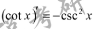

# 导数与微分的基本概念

## 导数
[001](bookxnotepro://opennote/?nb={e468095d-0a98-4be5-b638-8a7e60819690}&book=8627032c87cf99b087e7c9a8c2e04dea&page=0&x=116&y=164&id=1363&uuid=68ef632b410eac6332f34fb162b77021)导数的定义

	[001](bookxnotepro://opennote/?nb={e468095d-0a98-4be5-b638-8a7e60819690}&book=8627032c87cf99b087e7c9a8c2e04dea&page=0&x=175&y=336&id=1364&uuid=5fe4a6903f6984f8fa1f350092e82f2f)
	表示方式

### 性质

	[001](bookxnotepro://opennote/?nb={e468095d-0a98-4be5-b638-8a7e60819690}&book=8627032c87cf99b087e7c9a8c2e04dea&page=0&x=207&y=513&id=1365&uuid=4b0ab3542fa983d28a2e465ae3c5b26e)
	极限存在=导数左右极限都存在

	[002](bookxnotepro://opennote/?nb={e468095d-0a98-4be5-b638-8a7e60819690}&book=8627032c87cf99b087e7c9a8c2e04dea&page=1&x=228&y=239&id=1366&uuid=8d69034cf3fd67cf2fa5e33f6e2743c2)
	可导一定连续，连续一定可导

![[Pasted image 20220812234848.png]]
	[002](bookxnotepro://opennote/?nb={e468095d-0a98-4be5-b638-8a7e60819690}&book=8627032c87cf99b087e7c9a8c2e04dea&page=1&x=228&y=497&id=1367&uuid=ad8f2b26869345662ae44fe394ac1aaf)
	本结构（分子为函数与**常数**差，分母为自变量与其极限的差（趋向为0）），该**常数**为该函数的极限
	 ^7xthat

## 可微分
![[Pasted image 20220813021711.png]]
	[003](bookxnotepro://opennote/?nb={e468095d-0a98-4be5-b638-8a7e60819690}&book=8627032c87cf99b087e7c9a8c2e04dea&page=2&x=156&y=125&id=1369&uuid=0dda36d675b5a1ab55248d56832b87c1)
	定义 ^m6l1xe

	[003](bookxnotepro://opennote/?nb={e468095d-0a98-4be5-b638-8a7e60819690}&book=8627032c87cf99b087e7c9a8c2e04dea&page=2&x=254&y=171&id=1368&uuid=efaa2f9206d3f134d7c98ac070beb521)
	写法

属性说明

	[003](bookxnotepro://opennote/?nb={e468095d-0a98-4be5-b638-8a7e60819690}&book=8627032c87cf99b087e7c9a8c2e04dea&page=2&x=227&y=214&id=1371&uuid=0763191b6c0d9a1725acb8ee5ac13db2)
	可导可微等价

	[003](bookxnotepro://opennote/?nb={e468095d-0a98-4be5-b638-8a7e60819690}&book=8627032c87cf99b087e7c9a8c2e04dea&page=2&x=205&y=521&id=1375&uuid=f74aca6088910114fe9ec68f9048c8f0)
	一个点的可微

	[003](bookxnotepro://opennote/?nb={e468095d-0a98-4be5-b638-8a7e60819690}&book=8627032c87cf99b087e7c9a8c2e04dea&page=2&x=184&y=570&id=1376&uuid=46f02208b9d6d593994a5e9ac764a13d)
	处处可导，处处的可微

# 求导公式与法则
[[初等函数的图像与特点]]
[[导数列表]]

## 基本公式

	[004](bookxnotepro://opennote/?nb={e468095d-0a98-4be5-b638-8a7e60819690}&book=8627032c87cf99b087e7c9a8c2e04dea&page=3&x=129&y=127&id=1380&uuid=13381ce7e4b533b9011c1d3c20e36bc6)
	求导公式

[[@记忆]]
## 四则求导+复合求导
 
 [004](bookxnotepro://opennote/?nb={e468095d-0a98-4be5-b638-8a7e60819690}&book=8627032c87cf99b087e7c9a8c2e04dea&page=3&x=146&y=481&id=1384&uuid=71f78bb02c406051d16decdcc5801b48) 四则

[005](bookxnotepro://opennote/?nb={e468095d-0a98-4be5-b638-8a7e60819690}&book=8627032c87cf99b087e7c9a8c2e04dea&page=4&x=142&y=80&id=1387&uuid=ed324f757dfd94e307ed8d13e017ad01) 复合求导

	[005](bookxnotepro://opennote/?nb={e468095d-0a98-4be5-b638-8a7e60819690}&book=8627032c87cf99b087e7c9a8c2e04dea&page=4&x=220&y=117&id=1388&uuid=86624434f61ce614c7c59303abb8beae)
	注意：内函数每个点导数都不为0——可以说明导数恒为正或负、函数单调

### 例题

	[004](bookxnotepro://opennote/?nb={e468095d-0a98-4be5-b638-8a7e60819690}&book=8627032c87cf99b087e7c9a8c2e04dea&page=3&x=254&y=657&id=1386&uuid=104e44e1c7b7e9841bf8a5470cfe85ab)
	本题直接用定义或者直接求导（但不同的表示方法）

## 反函数求导

反函数

	[005](bookxnotepro://opennote/?nb={e468095d-0a98-4be5-b638-8a7e60819690}&book=8627032c87cf99b087e7c9a8c2e04dea&page=4&x=240&y=527&id=1391&uuid=16a286f2f7c20d16d50fcfb27f3f34f1)
	要求严格单调

求反函数的一个技巧
![[计算处理方法#^8pt3en]]

反函数性质

	[006](bookxnotepro://opennote/?nb={e468095d-0a98-4be5-b638-8a7e60819690}&book=8627032c87cf99b087e7c9a8c2e04dea&page=5&x=261&y=102&id=1392&uuid=886aa337582ca9433955e58d8c8c5276)
	可导，导数不为0，反函数也可导+表示方式如上

# 求导类型
## 定义求导
[006](bookxnotepro://opennote/?nb={e468095d-0a98-4be5-b638-8a7e60819690}&book=8627032c87cf99b087e7c9a8c2e04dea&page=5&x=120&y=268&id=1393&uuid=eb29c5d93f8584b038d912d1ebbd4a17)

	[006](bookxnotepro://opennote/?nb={e468095d-0a98-4be5-b638-8a7e60819690}&book=8627032c87cf99b087e7c9a8c2e04dea&page=5&x=221&y=480&id=1394&uuid=e8a60f0737c1e2559b9bb43510242a73)
	用到了[[第二章 导数与微分#^7xthat|导数的性质]]

## 显函数求导
[006](bookxnotepro://opennote/?nb={e468095d-0a98-4be5-b638-8a7e60819690}&book=8627032c87cf99b087e7c9a8c2e04dea&page=5&x=142&y=565&id=1395&uuid=b86d97ff416d867a6653c663e25655f9)

	[007](bookxnotepro://opennote/?nb={e468095d-0a98-4be5-b638-8a7e60819690}&book=8627032c87cf99b087e7c9a8c2e04dea&page=6&x=176&y=96&id=1396&uuid=721e1a5867a3676eff54bd9260d19f07)
	底数和指数都为需要转化为e为底的形式
	
## 隐函数求导

	[007](bookxnotepro://opennote/?nb={e468095d-0a98-4be5-b638-8a7e60819690}&book=8627032c87cf99b087e7c9a8c2e04dea&page=6&x=211&y=389&id=1397&uuid=2f4a858ce434e533a6ee97b772a824ea)
	等式两边求导

	[007](bookxnotepro://opennote/?nb={e468095d-0a98-4be5-b638-8a7e60819690}&book=8627032c87cf99b087e7c9a8c2e04dea&page=6&x=183&y=632&id=1398&uuid=908c8f259f3b8811906f44031c45dd1a)
	求一点的导数：分三步
	1. **求该点的函数值**
	2. 求导
	3. 代值

## 参数方程确定的函数的求导

	[008](bookxnotepro://opennote/?nb={e468095d-0a98-4be5-b638-8a7e60819690}&book=8627032c87cf99b087e7c9a8c2e04dea&page=7&x=183&y=151&id=1399&uuid=a230be3ff80a071ca8c120bfbdd82ffa)
	定理：注意分母函数对于参数求导不为0

![[Pasted image 20220813012941.png]]
	[008](bookxnotepro://opennote/?nb={e468095d-0a98-4be5-b638-8a7e60819690}&book=8627032c87cf99b087e7c9a8c2e04dea&page=7&x=170&y=418&id=1400&uuid=89eb8151a2ab12f94841714c05799319)
	1. 计算时**不用验证**求导是否为0
	2. 二阶时，注意化成如图形式，并上下继续针对参数t求导

## 分段函数求导

	[009](bookxnotepro://opennote/?nb={e468095d-0a98-4be5-b638-8a7e60819690}&book=8627032c87cf99b087e7c9a8c2e04dea&page=8&x=203&y=125&id=1401&uuid=a4c4f0fe8f8d2bf24261c236a6ae2a6f)
	分段函数求未知参数
	1. 有倒数-》连续的等式
	2. 导数存在等式——左导右导等于导数
	3等2等

	[009](bookxnotepro://opennote/?nb={e468095d-0a98-4be5-b638-8a7e60819690}&book=8627032c87cf99b087e7c9a8c2e04dea&page=8&x=225&y=360&id=1402&uuid=82f4f9c876fc5058106a4cac4a72297e)
	求导——间断处单独考虑
## 高阶导数求导
### 归纳法
一阶一阶写，观察形成的式子，直接写结论

	[010](bookxnotepro://opennote/?nb={e468095d-0a98-4be5-b638-8a7e60819690}&book=8627032c87cf99b087e7c9a8c2e04dea&page=9&x=173&y=311&id=1403&uuid=3561dc53f8a1e2b2dfaaf4a8d17e45e1)
	[[@记忆]]
### 公式法
没讲
# 重点题型讲解

## 题型一 导数与微分的基本概念
## 题型二 基本求导类型
![[第二章 导数与微分#例题]]
[[第二章 导数与微分#反函数求导]]这个似乎没有例题
![[第二章 导数与微分#求导类型]]
## 题型三 导数的几何应用
## 题型四 高阶导数
![[#高阶导数求导]]