# 定积分的概念与基本性质

背景[001](bookxnotepro://opennote/?nb={ec423aab-2142-4b0d-a00e-1aaa4360aa38}&book=80380b5d846461f8589b47936e6657ca&page=0&x=116&y=185&id=4634&uuid=e711dc2c5b221f12d51eff6f6e8499a9)

## 定义
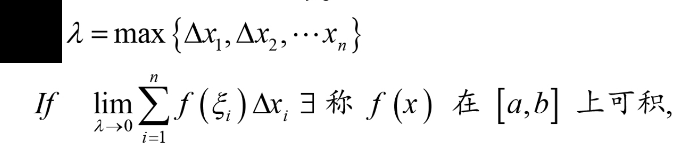
	[002](bookxnotepro://opennote/?nb={ec423aab-2142-4b0d-a00e-1aaa4360aa38}&book=80380b5d846461f8589b47936e6657ca&page=1&x=227&y=266&id=4638&uuid=b079fb7bb9eee96c6e76cfd78729fbad)
	定义——分区间、取值、求极限

![[Pasted image 20220902170437.png]]
[002](bookxnotepro://opennote/?nb={ec423aab-2142-4b0d-a00e-1aaa4360aa38}&book=80380b5d846461f8589b47936e6657ca&page=1&x=301&y=441&id=4640&uuid=95380814374c3babc6ff44b9a7d4e0f5)
2.连续一定可积
4.有界不一定可积——那个有理数无理数取不同值的函数

![[Pasted image 20220902171144.png]]
[003](bookxnotepro://opennote/?nb={ec423aab-2142-4b0d-a00e-1aaa4360aa38}&book=80380b5d846461f8589b47936e6657ca&page=2&x=200&y=117&id=4641&uuid=5dffa55251b021a5cec374be2ce06afe)
定积分的定义中，区间最大长度趋近于0=>分无穷个区间，反之不能。

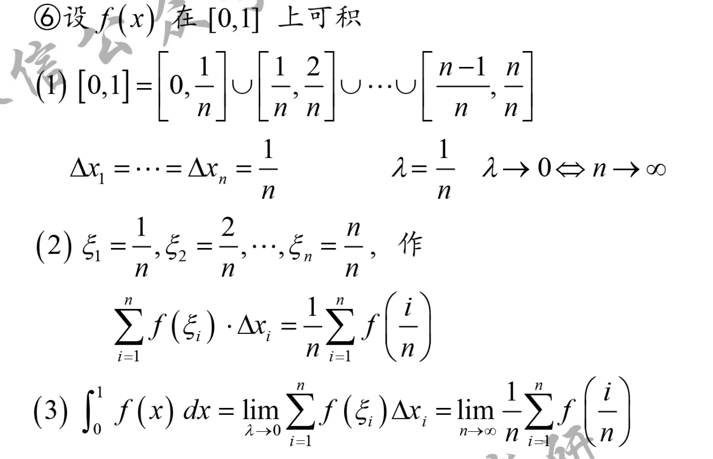
	[003](bookxnotepro://opennote/?nb={ec423aab-2142-4b0d-a00e-1aaa4360aa38}&book=80380b5d846461f8589b47936e6657ca&page=2&x=233&y=250&id=4642&uuid=ed649c2ab66ccd9a8a70502e0a85efa5)
	1. 将0-1等分
	2. 取各个区间端点的点
	3. 求和
	形成[[第一章 极限与连续#^867dfa|第一章中积分定义法求极限]]的结构

## 性质
[[汤家凤]]：基础阶段很多性质没讲

### 四则运算
[003](bookxnotepro://opennote/?nb={ec423aab-2142-4b0d-a00e-1aaa4360aa38}&book=80380b5d846461f8589b47936e6657ca&page=2&x=104&y=584&id=4643&uuid=3b08b22dcf385c18a67729006342c8b1)

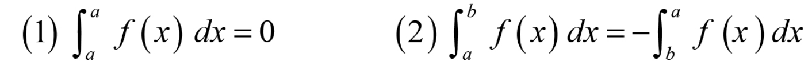
	[003](bookxnotepro://opennote/?nb={ec423aab-2142-4b0d-a00e-1aaa4360aa38}&book=80380b5d846461f8589b47936e6657ca&page=2&x=236&y=612&id=4644&uuid=a662e38440c5de2b2c898b08bb0e8e94)

### 积分中值定理
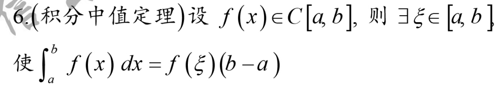
	[004](bookxnotepro://opennote/?nb={ec423aab-2142-4b0d-a00e-1aaa4360aa38}&book=80380b5d846461f8589b47936e6657ca&page=3&x=219&y=194&id=4646&uuid=df2984e9ed110defd3ffe582180f8fe0)
	积分中值定理——闭区间
	[[求极限方法]]
	证明用介值定理  [004](bookxnotepro://opennote/?nb={ec423aab-2142-4b0d-a00e-1aaa4360aa38}&book=80380b5d846461f8589b47936e6657ca&page=3&x=97&y=229&id=4647&uuid=2bc57c4549e7b904225a2e05f49aef1d)
	在证明题中作用：去掉外面的积分限
	![[Pasted image 20220902210817.png]]

![[计算处理方法#^y8o8l2]]
#### 积分中值定理的推广
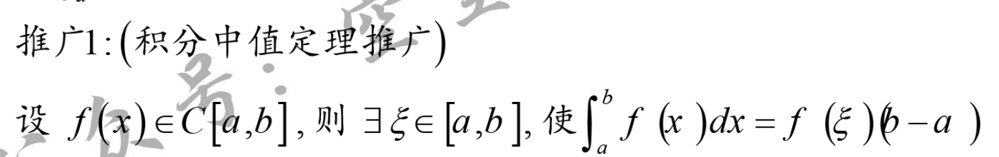
	[004](bookxnotepro://opennote/?nb={ec423aab-2142-4b0d-a00e-1aaa4360aa38}&book=80380b5d846461f8589b47936e6657ca&page=3&x=249&y=417&id=4648&uuid=bfb4d0f5674d49c41a661e875d771907)
	开区间：区间**内**一定有一点
	证：通过变限函数+ragrange  [004](bookxnotepro://opennote/?nb={ec423aab-2142-4b0d-a00e-1aaa4360aa38}&book=80380b5d846461f8589b47936e6657ca&page=3&x=91&y=459&id=4649&uuid=068966992eb3fea24d1462d063edc840)

### 积分第一中值定理
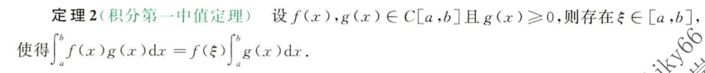
	[111](bookxnotepro://opennote/?nb={82757539-2f94-4bc3-ace0-02a57aaa9f41}&book=dd575b1c384fc27331e42ad3fcdc2613&page=110&x=1040&y=2494&id=14&uuid=7036c110eff5edb29fd6147a9aea2fc2)
	闭区间

### 比大小性质

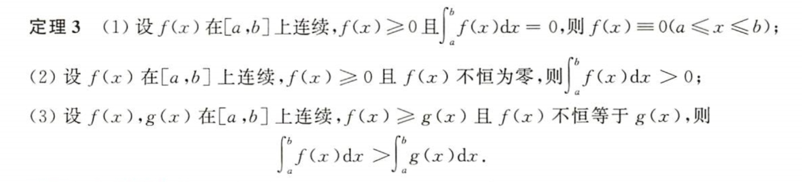
	[112](bookxnotepro://opennote/?nb={82757539-2f94-4bc3-ace0-02a57aaa9f41}&book=dd575b1c384fc27331e42ad3fcdc2613&page=111&x=1043&y=887&id=16&uuid=cdcf6453fc80807f8a95d5b6e96ef88e)
	

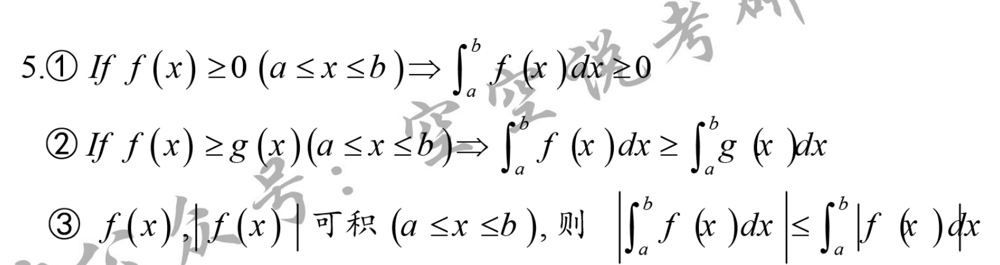
	[004](bookxnotepro://opennote/?nb={ec423aab-2142-4b0d-a00e-1aaa4360aa38}&book=80380b5d846461f8589b47936e6657ca&page=3&x=262&y=118&id=4645&uuid=0430bf89cae38208f62e30ed9ce6b34e)
	保号性：函数一直为正，积分为正
	保序性：一个函数一直比两一个函数大（不管正负）积分也大
	不等式：因为函数值有正有负[[@核心]] 

#### 柯西不等式
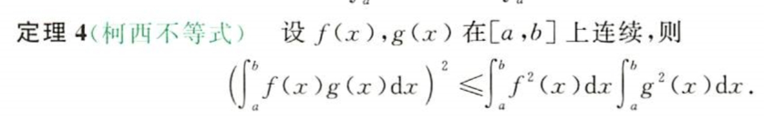
	[112](bookxnotepro://opennote/?nb={82757539-2f94-4bc3-ace0-02a57aaa9f41}&book=dd575b1c384fc27331e42ad3fcdc2613&page=111&x=823&y=1162&id=15&uuid=0013176ae0cd8cf59d8fb9c04cf4c5b5)
	目前是用把积分的平方进行缩放的

### 定积分的特殊性质
#### 对称性质
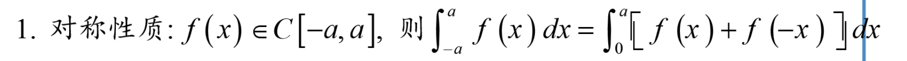
	[007](bookxnotepro://opennote/?nb={ec423aab-2142-4b0d-a00e-1aaa4360aa38}&book=80380b5d846461f8589b47936e6657ca&page=6&x=279&y=313&id=4659&uuid=ec594b59a9b4f60af3de9655f80779e8)
	对称性质：只要区间对称，就能写成单边
	证明：换元
	对称区间的奇偶函数用于化简公式 [007](bookxnotepro://opennote/?nb={ec423aab-2142-4b0d-a00e-1aaa4360aa38}&book=80380b5d846461f8589b47936e6657ca&page=6&x=218&y=589&id=4660&uuid=268801696e4f3c8c50b145163d610982)

#### 定积分三角函数性质

##### sin cos互换——0-$\pi/2$结构
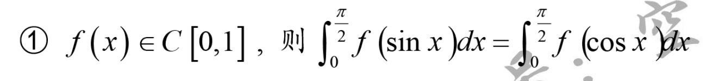
	[007](bookxnotepro://opennote/?nb={ec423aab-2142-4b0d-a00e-1aaa4360aa38}&book=80380b5d846461f8589b47936e6657ca&page=6&x=224&y=659&id=4661&uuid=beec4d3c1acdd32445a1e126706d2fbd)
	外函数在0-1连续+定积分范围在0-$\frac{\pi}{2}$，sinx、cosx 可以对调
	证明:换元[[@重点|重点证明]]

###### 计算递推公式

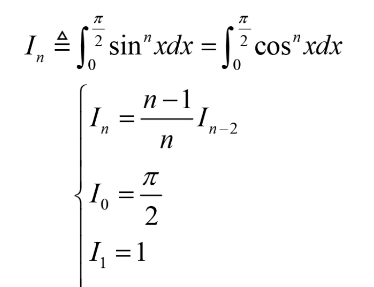
	[008](bookxnotepro://opennote/?nb={ec423aab-2142-4b0d-a00e-1aaa4360aa38}&book=80380b5d846461f8589b47936e6657ca&page=7&x=162&y=280&id=4670&uuid=fc1775ca3fa33d5f5479c933005e24ac)
	[[@记忆]] 以上计算递推公式符合sin cos互换的形式，但用于计算结果
	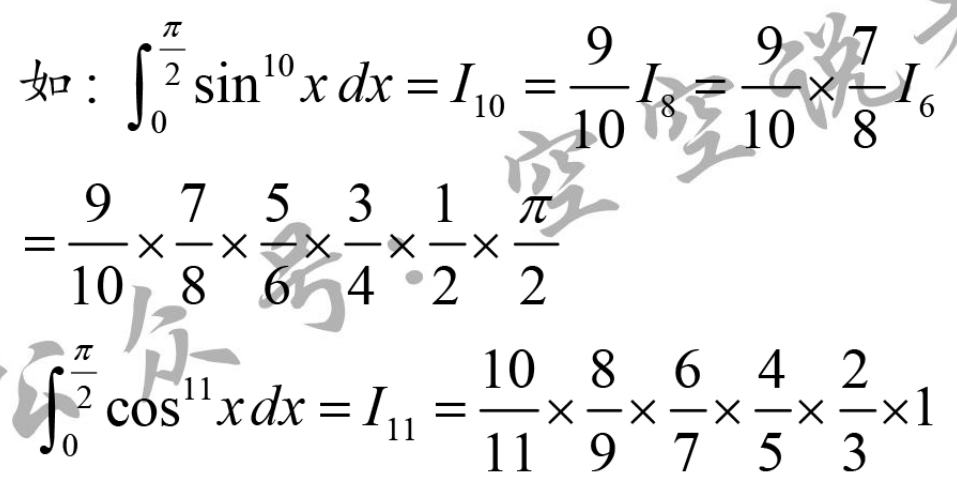
	[008](bookxnotepro://opennote/?nb={ec423aab-2142-4b0d-a00e-1aaa4360aa38}&book=80380b5d846461f8589b47936e6657ca&page=7&x=190&y=413&id=4671&uuid=f45b75100be16920501b9854c16a147f)
	

例题：
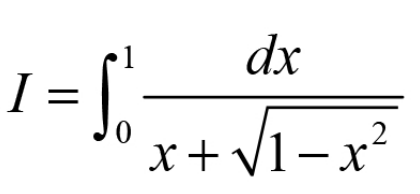
	[008](bookxnotepro://opennote/?nb={ec423aab-2142-4b0d-a00e-1aaa4360aa38}&book=80380b5d846461f8589b47936e6657ca&page=7&x=160&y=100&id=4668&uuid=60f82d265cc15111184ebcce53238345)
	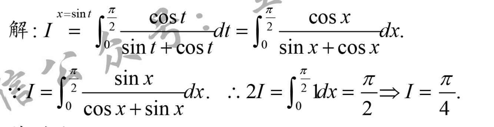
	[008](bookxnotepro://opennote/?nb={ec423aab-2142-4b0d-a00e-1aaa4360aa38}&book=80380b5d846461f8589b47936e6657ca&page=7&x=231&y=161&id=4669&uuid=67935f721844256084905a20b2dec152)
	求导中产生满足性质的[[特殊结构]]——换一种方式表示自己，两个自己相加等于常数

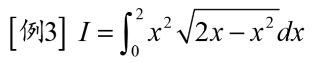
	[008](bookxnotepro://opennote/?nb={ec423aab-2142-4b0d-a00e-1aaa4360aa38}&book=80380b5d846461f8589b47936e6657ca&page=7&x=154&y=483&id=4672&uuid=45050630c1fb3b1cd4b9818f5cc9fff9)
	这道题主要是三角代换后会用到计算递推公式，前期处理中的一个处理方法：
	![[Pasted image 20220903230410.png]]
	1. 这个式子里有一阶和二阶，硬指标：先**配方**——cdz:我觉得是积分公式都是两项的，一个二次和一个常数项
	2. 之后代换可以直接把配方的结果看作一个整体，换元方便计算
	 ^b5tfhy

##### 0-$\pi$ 结构

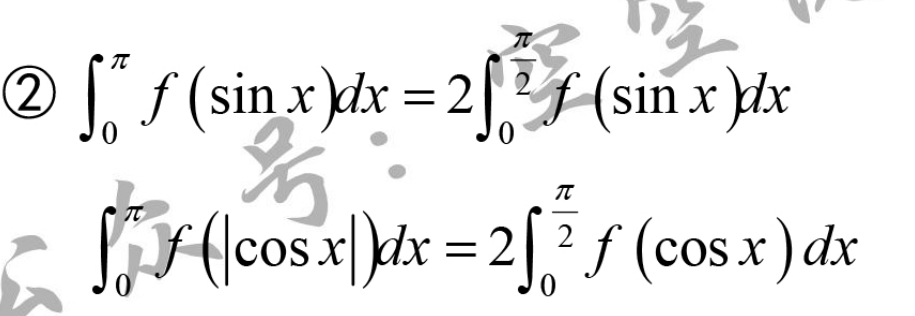
	[009](bookxnotepro://opennote/?nb={ec423aab-2142-4b0d-a00e-1aaa4360aa38}&book=80380b5d846461f8589b47936e6657ca&page=8&x=189&y=418&id=4673&uuid=d380c4b15c807e1e30a52913475e91ee)
	cos函数要求取绝对值——比如cos的偶次方
	证明：分段+换元

###### 等式中多一个x
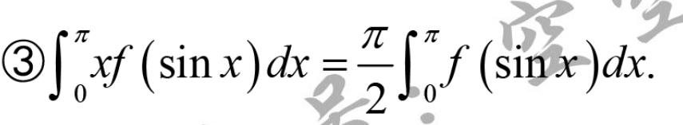
	[010](bookxnotepro://opennote/?nb={ec423aab-2142-4b0d-a00e-1aaa4360aa38}&book=80380b5d846461f8589b47936e6657ca&page=9&x=182&y=123&id=4675&uuid=e9aadd9c515d5f6c889400d97cfbd7cb)
	证明：换元(换范围不变)+ 将自己令作I

#### 周期函数的积分
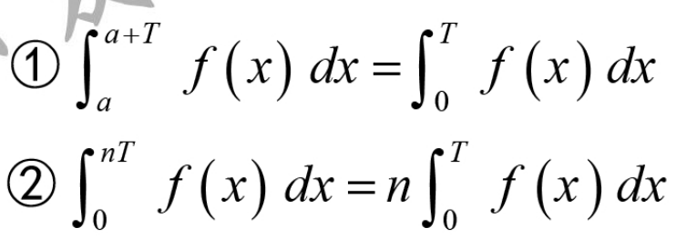
	[010](bookxnotepro://opennote/?nb={ec423aab-2142-4b0d-a00e-1aaa4360aa38}&book=80380b5d846461f8589b47936e6657ca&page=9&x=184&y=468&id=4676&uuid=66ba61e35df9a6a339e36ed376e16d5c)
	连续函数

# 基本理论

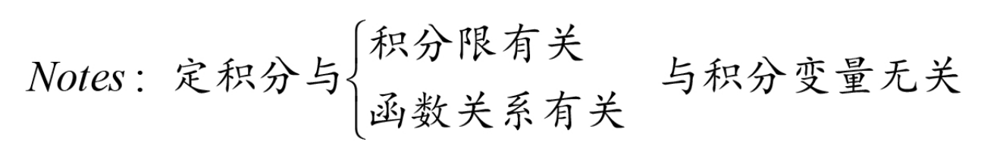
	[005](bookxnotepro://opennote/?nb={ec423aab-2142-4b0d-a00e-1aaa4360aa38}&book=80380b5d846461f8589b47936e6657ca&page=4&x=228&y=579&id=4650&uuid=77480ef789d0077702ff89c8fba46b5e)

## 积分上限函数

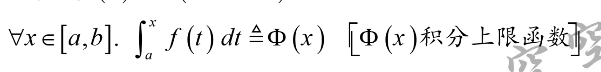
	[005](bookxnotepro://opennote/?nb={ec423aab-2142-4b0d-a00e-1aaa4360aa38}&book=80380b5d846461f8589b47936e6657ca&page=4&x=236&y=638&id=4651&uuid=ef84a323c9ca472b593e76a1b2ad6dc3)
	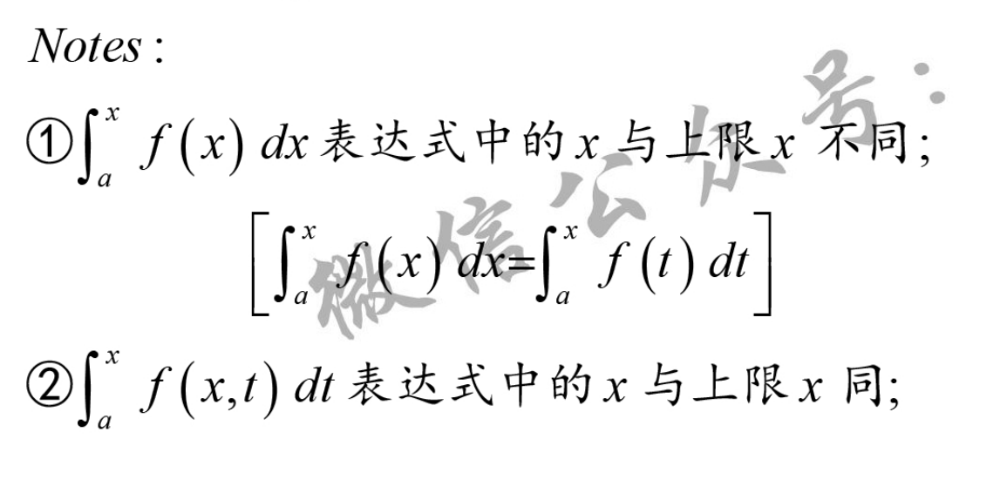
	[005](bookxnotepro://opennote/?nb={ec423aab-2142-4b0d-a00e-1aaa4360aa38}&book=80380b5d846461f8589b47936e6657ca&page=4&x=209&y=715&id=4652&uuid=7ac3a97a715732981a55ecd9ff3a9c30) 函数内变量和积分限中的变量

计算
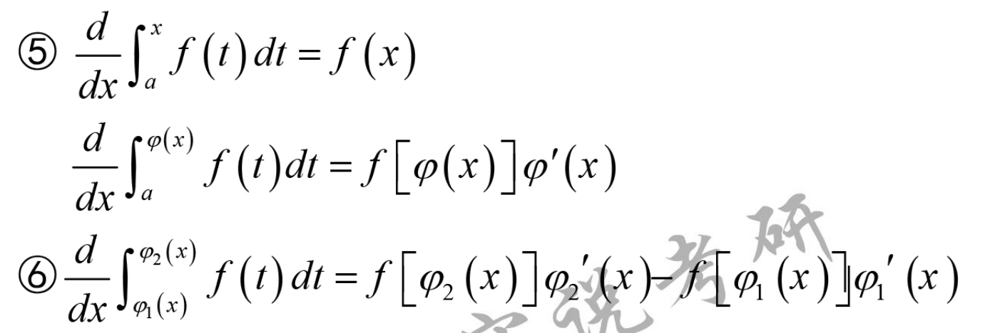
	[006](bookxnotepro://opennote/?nb={ec423aab-2142-4b0d-a00e-1aaa4360aa38}&book=80380b5d846461f8589b47936e6657ca&page=5&x=238&y=330&id=4655&uuid=eeee70d36a9aeaceff13d2a09b26b3b3)
	变现积分函数求导配合洛必达[[求极限方法|求极限]] 

### 定理
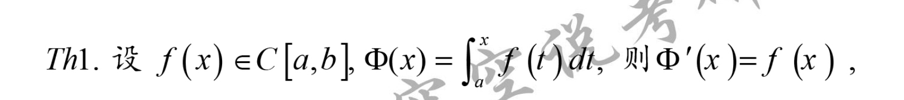
	[006](bookxnotepro://opennote/?nb={ec423aab-2142-4b0d-a00e-1aaa4360aa38}&book=80380b5d846461f8589b47936e6657ca&page=5&x=250&y=95&id=4653&uuid=dfb36ce57fa62c02664e7f6a711b3c93)
	连续函数的“升级”——函数连续-》原函数可导
	证：照结论列导数的表达式+lagrange  [006](bookxnotepro://opennote/?nb={ec423aab-2142-4b0d-a00e-1aaa4360aa38}&book=80380b5d846461f8589b47936e6657ca&page=5&x=100&y=127&id=4654&uuid=4d7c64c1f191c7e263a15bed72f74c93) ^9beae6

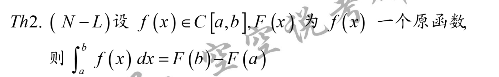
	[007](bookxnotepro://opennote/?nb={ec423aab-2142-4b0d-a00e-1aaa4360aa38}&book=80380b5d846461f8589b47936e6657ca&page=6&x=261&y=103&id=4657&uuid=72fad508d421ed392fa25da67bcd3a3f)
	Newton-Leibniz 公式
	证:构造两个原函数（变现积分函数+未知原函数）两者差恒为常数，两个端点差也恒为常数  [007](bookxnotepro://opennote/?nb={ec423aab-2142-4b0d-a00e-1aaa4360aa38}&book=80380b5d846461f8589b47936e6657ca&page=6&x=97&y=146&id=4658&uuid=4b81608e4f111a845f4b4d53a4102d47)

# 广义积分

## 定义法
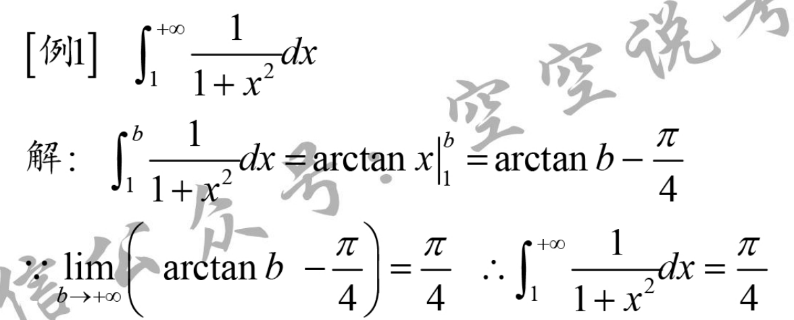
	[012](bookxnotepro://opennote/?nb={ec423aab-2142-4b0d-a00e-1aaa4360aa38}&book=80380b5d846461f8589b47936e6657ca&page=11&x=210&y=133&id=4681&uuid=5a842c62f3c7fff1c502f46b0c905fc6)

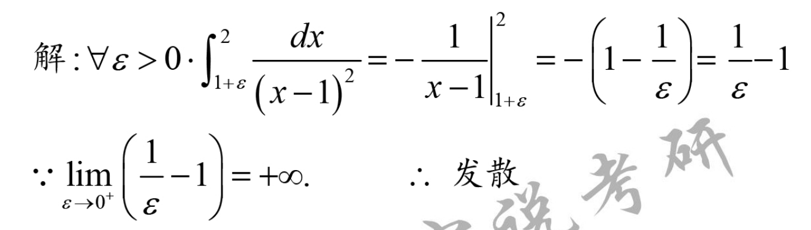
	[014](bookxnotepro://opennote/?nb={ec423aab-2142-4b0d-a00e-1aaa4360aa38}&book=80380b5d846461f8589b47936e6657ca&page=13&x=223&y=338&id=4689&uuid=f0c336846393a605f15a2b9b10d678bc)
	

## 区间无限

	[011](bookxnotepro://opennote/?nb={ec423aab-2142-4b0d-a00e-1aaa4360aa38}&book=80380b5d846461f8589b47936e6657ca&page=10&x=197&y=301&id=4677&uuid=adff9a2a3734cd673745a7d6ce976bae)
	定义：
	极限存在：广义积分收敛
	极限不存在：广义积分发散

![[Pasted image 20220906220338.png]]
	[012](bookxnotepro://opennote/?nb={ec423aab-2142-4b0d-a00e-1aaa4360aa38}&book=80380b5d846461f8589b47936e6657ca&page=11&x=256&y=218&id=4678&uuid=159bc5580dcfd3a7eeefffcdbc6819c6)
	负无穷判别法是趋近于负无穷 [[@记忆]] 注意这是极限不是积分

### $\Gamma$ 函数

[[@重点]]

![[Pasted image 20220904210134.png]]
[012](bookxnotepro://opennote/?nb={ec423aab-2142-4b0d-a00e-1aaa4360aa38}&book=80380b5d846461f8589b47936e6657ca&page=11&x=136&y=331&id=4679&uuid=6ca95699eba28f61923131fdd08ecbcb)

	[012](bookxnotepro://opennote/?nb={ec423aab-2142-4b0d-a00e-1aaa4360aa38}&book=80380b5d846461f8589b47936e6657ca&page=11&x=140&y=420&id=4680&uuid=ddc9b3306e683c91d91da08989dfbc64)
	cdz:似乎$\Gamma(2)=1!$ 是负指数分布😁

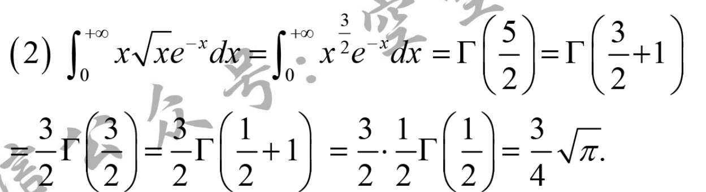
	[013](bookxnotepro://opennote/?nb={ec423aab-2142-4b0d-a00e-1aaa4360aa38}&book=80380b5d846461f8589b47936e6657ca&page=12&x=223&y=146&id=4682&uuid=a768d1c8081fff527c45904d77f8dcaa)
	应用举例

## 区间有限
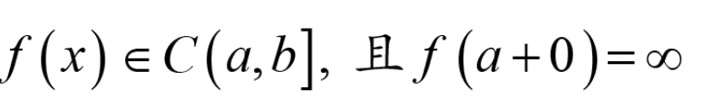
	[013](bookxnotepro://opennote/?nb={ec423aab-2142-4b0d-a00e-1aaa4360aa38}&book=80380b5d846461f8589b47936e6657ca&page=12&x=205&y=491&id=4684&uuid=e6ce454aade9cb0c0d56857347dbf254)
	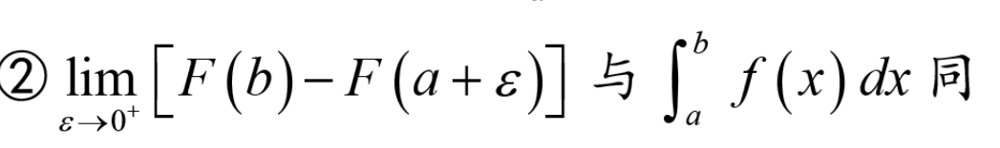
	[013](bookxnotepro://opennote/?nb={ec423aab-2142-4b0d-a00e-1aaa4360aa38}&book=80380b5d846461f8589b47936e6657ca&page=12&x=205&y=578&id=4683&uuid=84b5cec1c1d62add622351a2fa68362c)
	极限存在——收敛，不存在——发散

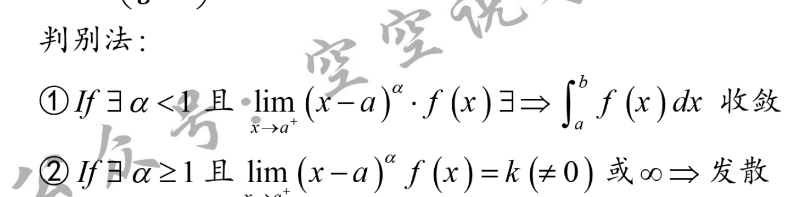
	[014](bookxnotepro://opennote/?nb={ec423aab-2142-4b0d-a00e-1aaa4360aa38}&book=80380b5d846461f8589b47936e6657ca&page=13&x=231&y=413&id=4686&uuid=9d0d080bb9b0c463af0778448890123f)
	判别法，和区间无限的区别是$\alpha <1$ [[@记忆]] 注意是极限不是积分

右侧极限[015](bookxnotepro://opennote/?nb={ec423aab-2142-4b0d-a00e-1aaa4360aa38}&book=80380b5d846461f8589b47936e6657ca&page=14&x=96&y=95&id=4687&uuid=b86e90134eee83362770dd3a66c3da83)

![[Pasted image 20220904214319.png]]
[015](bookxnotepro://opennote/?nb={ec423aab-2142-4b0d-a00e-1aaa4360aa38}&book=80380b5d846461f8589b47936e6657ca&page=14&x=109&y=265&id=4688&uuid=85b564b6536547f19d321ebfd0c2adfa)
总之是正数的幂函数

# 定积分的应用
## 几何应用
解题三步骤
![[Pasted image 20220904223246.png]]
按照x或y取小块——cdz:或者极坐标
微分表示
按照一个指标积分

### 面积

![[Pasted image 20220904215757.png]]
[016](bookxnotepro://opennote/?nb={ec423aab-2142-4b0d-a00e-1aaa4360aa38}&book=80380b5d846461f8589b47936e6657ca&page=15&x=91&y=162&id=4691&uuid=9a8c0b613d5ba848777d767e2b7526cc)
坐标面积

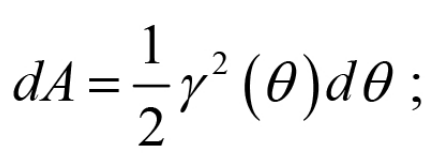
	[016](bookxnotepro://opennote/?nb={ec423aab-2142-4b0d-a00e-1aaa4360aa38}&book=80380b5d846461f8589b47936e6657ca&page=15&x=150&y=289&id=4690&uuid=55dd7a67d60956f24bf85cee352f4ac2)
	扇形面积——极坐标
	扇形面积差：
	![[Pasted image 20220904215604.png]]

![[Pasted image 20220904220331.png]]
[016](bookxnotepro://opennote/?nb={ec423aab-2142-4b0d-a00e-1aaa4360aa38}&book=80380b5d846461f8589b47936e6657ca&page=15&x=92&y=387&id=4692&uuid=d5b3d731dae6e8c498b912070d6dfa8c)
表面积——注意用弧长

#### 例题

![[Pasted image 20220904222716.png]]
![[Pasted image 20220904222702.png]]
[017](bookxnotepro://opennote/?nb={ec423aab-2142-4b0d-a00e-1aaa4360aa38}&book=80380b5d846461f8589b47936e6657ca&page=16&x=92&y=560&id=4698&uuid=aec168b38c8c7dfa5348753e55e4878c)
求表面积，取小ds——弧长

### 体积
![[Pasted image 20220904220848.png]]
[016](bookxnotepro://opennote/?nb={ec423aab-2142-4b0d-a00e-1aaa4360aa38}&book=80380b5d846461f8589b47936e6657ca&page=15&x=88&y=487&id=4693&uuid=e3e2917a68a6298a202f7762f1276a7d)
绕x轴转

![[Pasted image 20220904220940.png]]
[016](bookxnotepro://opennote/?nb={ec423aab-2142-4b0d-a00e-1aaa4360aa38}&book=80380b5d846461f8589b47936e6657ca&page=15&x=91&y=557&id=4694&uuid=0703e36eeb4cacbdf0b48626c95ceec1)
绕y轴转，**注意方向，取绝对值**
![[Pasted image 20220904221024.png]]

![[Pasted image 20220904221127.png]]
[016](bookxnotepro://opennote/?nb={ec423aab-2142-4b0d-a00e-1aaa4360aa38}&book=80380b5d846461f8589b47936e6657ca&page=15&x=90&y=632&id=4695&uuid=fff4aeecdaee249d05a6f46abde0ed09)
提供截面面积的

### 弧长

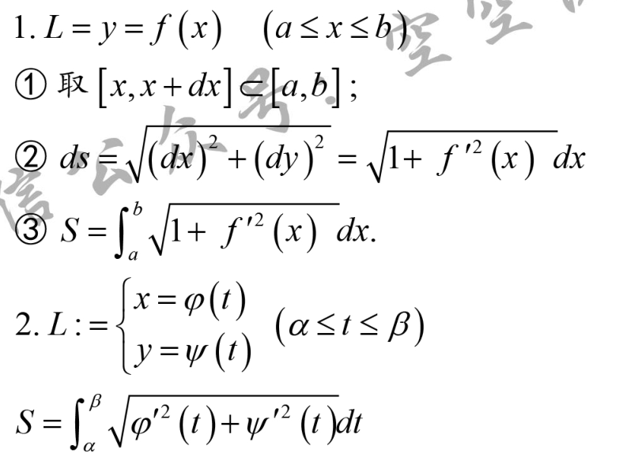
	[017](bookxnotepro://opennote/?nb={ec423aab-2142-4b0d-a00e-1aaa4360aa38}&book=80380b5d846461f8589b47936e6657ca&page=16&x=202&y=188&id=4696&uuid=2afcce95a8284824f6002aafc78d3967)
	

## 物理应用
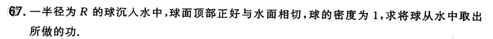
	[040](bookxnotepro://opennote/?nb={512382f5-a3a5-4617-b335-e716d4b5f10c}&book=7c79fd0abca65e43b34474f815f9e7ce&page=39&x=253&y=641&id=507&uuid=e7ee6ac1b01e81ac61152b1e92b07fb2)
	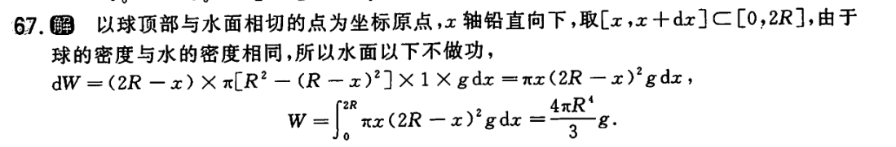
	[093](bookxnotepro://opennote/?nb={512382f5-a3a5-4617-b335-e716d4b5f10c}&book=b58fa85d19ce1d4b81c4b85dda1d104f&page=92&x=242&y=555&id=508&uuid=b609c831bb76427d5bb5e185ce2dc3fd)
	看起来也是取一个$[x,x+\Delta x]$ 的形式
	这个题比较特殊：密度一样，物体在水下的部分不做功
	坐标系选在球顶，是为了方便用2R-x表示每个部分移动的高度
	构造的时候，坐标系可以不按照右正上正来画

# [[重点题型讲解]]

## 题型一 定积分的概念与性质
![[第五章 定积分及其应用#定积分的概念与基本性质]]
## 题型二 变积分限的函数问题
![[第五章 定积分及其应用#积分上限函数]]
## 题型三 定积分的计算
## 题型四 定积分的证明
## 题型五 广义积分
![[第五章 定积分及其应用#广义积分]]
## 题型六 定积分的应用
![[第五章 定积分及其应用#定积分的应用]]
# 定积分换元积累
![[Pasted image 20220903221847.png]]

![[Pasted image 20220904195645.png]]

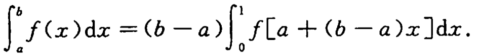
	[033](bookxnotepro://opennote/?nb={512382f5-a3a5-4617-b335-e716d4b5f10c}&book=7c79fd0abca65e43b34474f815f9e7ce&page=32&x=290&y=529&id=208&uuid=07f2387792e0e6f3abedbb3a1da579bd)
	![[Pasted image 20220906153605.png]]

# 定积分计算处理方法

![[计算处理方法#^i17tzt]]

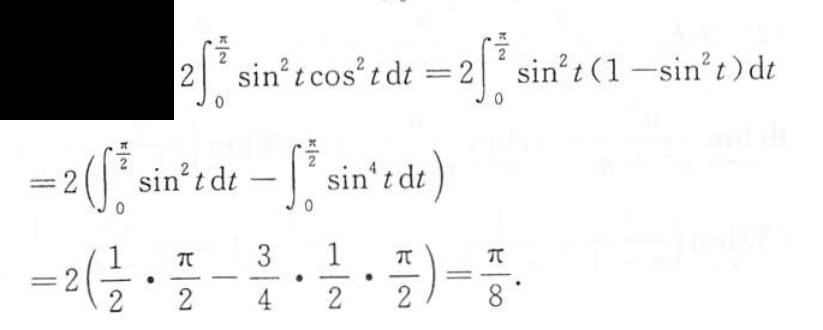
	[071](bookxnotepro://opennote/?nb={512382f5-a3a5-4617-b335-e716d4b5f10c}&book=b58fa85d19ce1d4b81c4b85dda1d104f&page=70&x=317&y=483&id=270&uuid=16b3356d7e5beda9b9bcaee1524a8c83)
	尽量变成sin的n次方的形式，用计算递推公式做

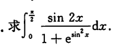
	[037](bookxnotepro://opennote/?nb={512382f5-a3a5-4617-b335-e716d4b5f10c}&book=7c79fd0abca65e43b34474f815f9e7ce&page=36&x=93&y=413&id=454&uuid=8b9650dc3e163de6eb79a37b314d7d6f)
	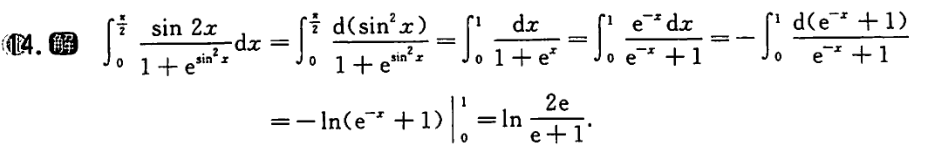
	[083](bookxnotepro://opennote/?nb={512382f5-a3a5-4617-b335-e716d4b5f10c}&book=b58fa85d19ce1d4b81c4b85dda1d104f&page=82&x=219&y=603&id=455&uuid=e4f77e3ad7cd2032fb6cb9cc9d359915)
	$\sin^{2}x$ 换成x只是[[第四章 不定积分#第一类换元积分法|不定积分的第一类换元法]] 
	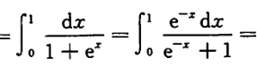
	[083](bookxnotepro://opennote/?nb={512382f5-a3a5-4617-b335-e716d4b5f10c}&book=b58fa85d19ce1d4b81c4b85dda1d104f&page=82&x=268&y=588&id=456&uuid=2ba1a098dc8414187e45a3ee7efe1d6c)
	这个处理记忆吧
	 ^8tgznf

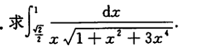
	[037](bookxnotepro://opennote/?nb={512382f5-a3a5-4617-b335-e716d4b5f10c}&book=7c79fd0abca65e43b34474f815f9e7ce&page=36&x=112&y=478&id=457&uuid=b9daf565b26d8b2bfe61e597b3e008b0)
	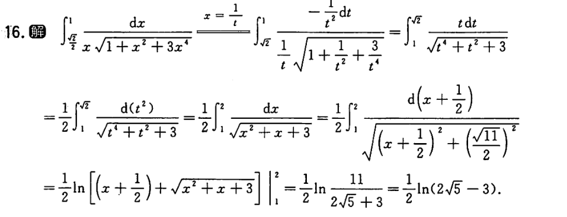
	[084](bookxnotepro://opennote/?nb={512382f5-a3a5-4617-b335-e716d4b5f10c}&book=b58fa85d19ce1d4b81c4b85dda1d104f&page=83&x=243&y=145&id=458&uuid=c721cfe1b56a7f39cf7d436aa08f7c01)
	第二类换元法，要求一一对应，考虑范围
	这种结构记忆？