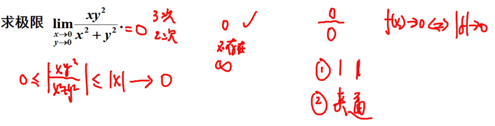
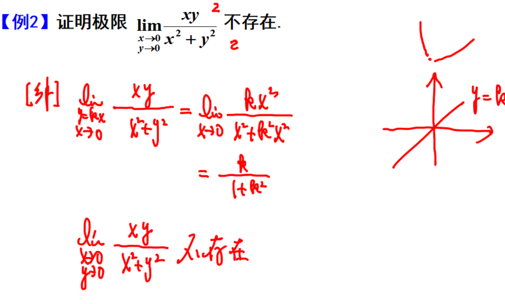
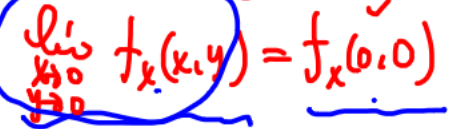
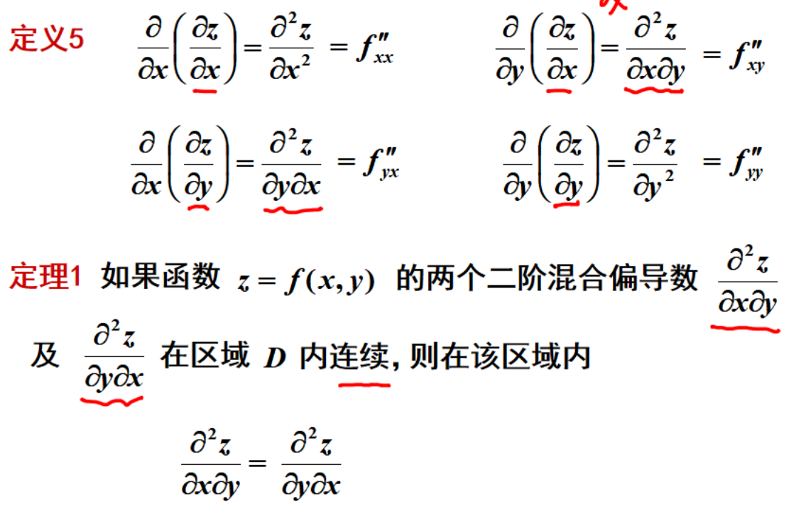
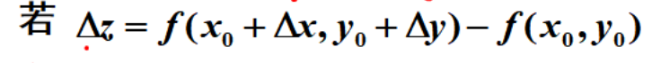
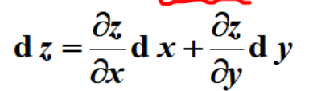
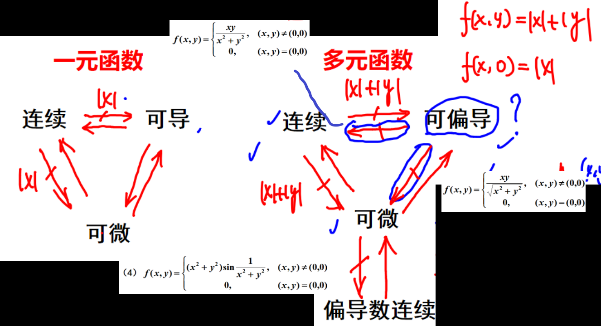
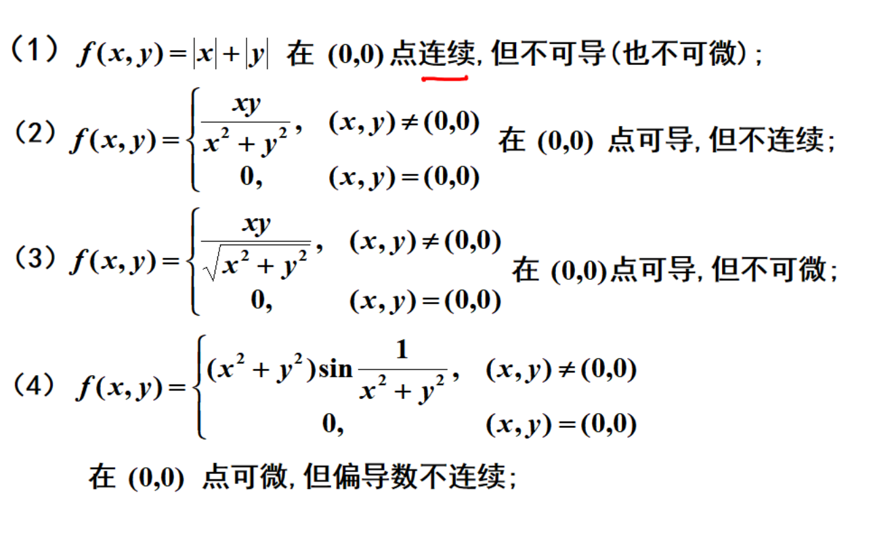

# 多元函数的基本概念
## 多元函数的极限
多元函数的极限定义  [005](bookxnotepro://opennote/?nb={eaae9369-1988-4e39-8c00-ce441fc1deb4}&book=0da33fe4293e40420460104f8af59907&page=4&x=148&y=70&id=17887&uuid=6587d3486c4b65d8810b240d0d229a55) 教材定义 [132](bookxnotepro://opennote/?nb={eaae9369-1988-4e39-8c00-ce441fc1deb4}&book=d0dac1405a88c26e98b69ca42b093eab&page=131&x=87&y=140&id=17889&uuid=9bc45c7c9a21b7855fe3d89dd73edccb)
	任意方向趋向一个点
	拥有夹逼性、保号性、无穷小等性质

	[006](bookxnotepro://opennote/?nb={eaae9369-1988-4e39-8c00-ce441fc1deb4}&book=0da33fe4293e40420460104f8af59907&page=5&x=337&y=75&id=17888&uuid=7105720a2202f0df08cb79e15a42fcc3)
[[求极限方法]]：
1 初步判断
	
 | 分子分母幂的大小 | 考试中极限的一般结果 (并不绝对) |
 | ---------------- | ------------------------------- |
 | 上>下            | 0                               |
 | 上下同次幂       | 不存在极限                      |
 | 上<下            | $\infty$                                |
 
 2 两边绝对值  ` |   |` 。
 3 夹逼求极限

 
	[007](bookxnotepro://opennote/?nb={eaae9369-1988-4e39-8c00-ce441fc1deb4}&book=0da33fe4293e40420460104f8af59907&page=6&x=244&y=147&id=17891&uuid=11e9e794c3701271ac4b8f219df16ced)
	极限不存在的证明方法：
	上下同次幂——不存在
	通过 y=kx 方向趋向于原点
^mw75ch

## 多元函数的连续性
定义和性质，和一元函数的连续性质类似 [008](bookxnotepro://opennote/?nb={eaae9369-1988-4e39-8c00-ce441fc1deb4}&book=0da33fe4293e40420460104f8af59907&page=7&x=124&y=22&id=17892&uuid=a3b66fc7b3900a706cf3031987cc16a1)

## 偏导数
本质是一元函数的导数

但连续性的判断需要多个变量趋向于一个点 

	[022](bookxnotepro://opennote/?nb={eaae9369-1988-4e39-8c00-ce441fc1deb4}&book=0da33fe4293e40420460104f8af59907&page=21&x=259&y=238&id=17904&uuid=bbf1bd4773fba717c39beaf8c7b5a8a4)
	$$
	f_{x x}^{\prime \prime}(x,y)
	$$
	**偏导数仍是关于 x、y 的导数**

[011](bookxnotepro://opennote/?nb={eaae9369-1988-4e39-8c00-ce441fc1deb4}&book=0da33fe4293e40420460104f8af59907&page=10&x=240&y=174&id=17893&uuid=f048610bc4390d711147fac240544e74)
高阶偏导数
高阶偏导数若连续，求导顺序可互换

## 全微分

	[012](bookxnotepro://opennote/?nb={eaae9369-1988-4e39-8c00-ce441fc1deb4}&book=0da33fe4293e40420460104f8af59907&page=11&x=307&y=85&id=17894&uuid=3136ae023a93f9f1068e3f69be130876)
	如果 $\Delta z$  能写成线性表达式和一个函数（$\rho$ 的高阶无穷小），则表明在该点可微。
	注意： $\Delta z$ 是两个部分之差：

### 全微分的一充分、一必要条件

#### 必要：可微，必可导
即可写成如下形式

#### 充分：有导数+导数连续，则可微

### 判断可微
1. 首先判断必要条件，是否有导数
2. 定义判断：有导数则判断 $o(\rho)$ [012](bookxnotepro://opennote/?nb={eaae9369-1988-4e39-8c00-ce441fc1deb4}&book=0da33fe4293e40420460104f8af59907&page=11&x=101&y=267&id=17897&uuid=09ec81dba82ee0db73dbc8f7aef7d843)
	导数不存在或是非 0 都表示不可谓

## 连续、可导、可微的关系

	[014](bookxnotepro://opennote/?nb={eaae9369-1988-4e39-8c00-ce441fc1deb4}&book=0da33fe4293e40420460104f8af59907&page=13&x=275&y=158&id=17898&uuid=0ba5e7d374d19c363b9373521a8ef1a6)
	[[@记忆]]
	多元导数 (偏导数）**弱**了
	只有偏导自己什么都推不出来
	连续都推不出来

#### 反例

	[018](bookxnotepro://opennote/?nb={eaae9369-1988-4e39-8c00-ce441fc1deb4}&book=0da33fe4293e40420460104f8af59907&page=17&x=259&y=182&id=17901&uuid=420dcae4a559f1ed89dfbeb5a270997b)
	[[@记忆]]
	1 连续，不可导 显然
	2 可导，不连续 [[第八章 多元微分及其应用#^mw75ch|不连续的证明]]
	3 可导，不可微 
	4 可微，导数不连续 
	
[[todo]]
## 题型
[015](bookxnotepro://opennote/?nb={eaae9369-1988-4e39-8c00-ce441fc1deb4}&book=0da33fe4293e40420460104f8af59907&page=14&x=239&y=26&id=17900&uuid=d9bb026a7f6a634e8d6669862d77aefc)
确定的点+求导——定义法（可搭配先代后求）

# 多元函数微分法
## 复合函数微分法
## 隐函数微分法

# 多元函数的极值与最值
## 无约束极值
## 条件极值及拉格朗日乘数法
## 最大值最小值
# 重点题型讲解
# 一些细节

![[Pasted image 20221002205441.png]]
极限中自变量的两种表示方法

# 处理方法

固定一点的偏导数都可以思考一下**先代后求**

[[应试技巧]]

# 习题积累
