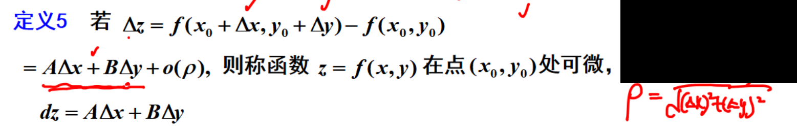
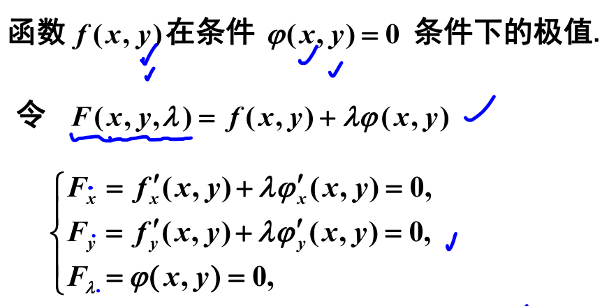

# 多元函数的基本概念
## 多元函数的极限
多元函数的极限定义  [005](bookxnotepro://opennote/?nb={eaae9369-1988-4e39-8c00-ce441fc1deb4}&book=0da33fe4293e40420460104f8af59907&page=4&x=148&y=70&id=17887&uuid=6587d3486c4b65d8810b240d0d229a55) 教材定义 [132](bookxnotepro://opennote/?nb={eaae9369-1988-4e39-8c00-ce441fc1deb4}&book=d0dac1405a88c26e98b69ca42b093eab&page=131&x=87&y=140&id=17889&uuid=9bc45c7c9a21b7855fe3d89dd73edccb)
	任意方向趋向一个点
	拥有夹逼性、保号性、无穷小等性质

	[006](bookxnotepro://opennote/?nb={eaae9369-1988-4e39-8c00-ce441fc1deb4}&book=0da33fe4293e40420460104f8af59907&page=5&x=337&y=75&id=17888&uuid=7105720a2202f0df08cb79e15a42fcc3)
[[求极限方法]]：
1 初步判断
	
 | 分子分母幂的大小 | 考试中极限的一般结果 (并不绝对) |
 | ---------------- | ------------------------------- |
 | 上>下            | 0                               |
 | 上下同次幂       | 不存在极限                      |
 | 上<下            | $\infty$                                |
 
 2 两边绝对值  ` |   |` 。
 3 夹逼求极限

 
	[007](bookxnotepro://opennote/?nb={eaae9369-1988-4e39-8c00-ce441fc1deb4}&book=0da33fe4293e40420460104f8af59907&page=6&x=244&y=147&id=17891&uuid=11e9e794c3701271ac4b8f219df16ced)
	极限不存在的证明方法：
	上下同次幂——不存在
	通过 y=kx 方向趋向于原点
^mw75ch

## 多元函数的连续性
定义和性质，和一元函数的连续性质类似 [008](bookxnotepro://opennote/?nb={eaae9369-1988-4e39-8c00-ce441fc1deb4}&book=0da33fe4293e40420460104f8af59907&page=7&x=124&y=22&id=17892&uuid=a3b66fc7b3900a706cf3031987cc16a1)

## 偏导数
一般可以看作是一元函数的导数

但偏导数连续性的判断需要多个变量趋向于一个点不能当作一元函数

	[022](bookxnotepro://opennote/?nb={eaae9369-1988-4e39-8c00-ce441fc1deb4}&book=0da33fe4293e40420460104f8af59907&page=21&x=259&y=238&id=17904&uuid=bbf1bd4773fba717c39beaf8c7b5a8a4)
	$$
	f_{x x}^{\prime \prime}(x,y)
	$$
	**偏导数仍是关于 x、y 的导数**
 ^j9qlft

[011](bookxnotepro://opennote/?nb={eaae9369-1988-4e39-8c00-ce441fc1deb4}&book=0da33fe4293e40420460104f8af59907&page=10&x=240&y=174&id=17893&uuid=f048610bc4390d711147fac240544e74)
高阶偏导数
高阶偏导数若连续，求导顺序可互换

## 全微分

	[012](bookxnotepro://opennote/?nb={eaae9369-1988-4e39-8c00-ce441fc1deb4}&book=0da33fe4293e40420460104f8af59907&page=11&x=307&y=85&id=17894&uuid=3136ae023a93f9f1068e3f69be130876)
	如果 $\Delta z$  能写成线性表达式和一个函数（$\rho$ 的高阶无穷小），则表明在该点可微。
	注意： $\Delta z$ 是两个部分之差：

### 全微分的一充分、一必要条件

#### 必要：可微，必可导
即可写成如下形式

#### 充分：有导数+导数连续，可微

### 判断可微
1. 首先判断必要条件，是否有导数
2. 定义判断：有导数则判断 $o(\rho)$ [012](bookxnotepro://opennote/?nb={eaae9369-1988-4e39-8c00-ce441fc1deb4}&book=0da33fe4293e40420460104f8af59907&page=11&x=101&y=267&id=17897&uuid=09ec81dba82ee0db73dbc8f7aef7d843)
	导数不存在或是非 0 都表示不可谓

## 连续、可导、可微的关系

	[014](bookxnotepro://opennote/?nb={eaae9369-1988-4e39-8c00-ce441fc1deb4}&book=0da33fe4293e40420460104f8af59907&page=13&x=275&y=158&id=17898&uuid=0ba5e7d374d19c363b9373521a8ef1a6)
	[[@记忆]]
	多元导数 (偏导数）**弱**了
	只有偏导自己什么都推不出来
	连续都推不出来

#### 反例

	[018](bookxnotepro://opennote/?nb={eaae9369-1988-4e39-8c00-ce441fc1deb4}&book=0da33fe4293e40420460104f8af59907&page=17&x=259&y=182&id=17901&uuid=420dcae4a559f1ed89dfbeb5a270997b)
	[[@记忆]]
	1 连续，不可导 显然
	2 可导，不连续 [[第八章 多元微分及其应用#^mw75ch|不连续的证明]]
	3 可导，不可微 
	4 可微，导数不连续 [[第八章 多元微分及其应用#^j9qlft|偏导数连续性的说明]]

# 多元函数微分法

## 复合函数微分法

[003](bookxnotepro://opennote/?nb={eaae9369-1988-4e39-8c00-ce441fc1deb4}&book=8734308cb27c57eb36a49d0cf038f18d&page=2&x=187&y=72&id=16993&uuid=75aec66ddb6b4ece1e23767725793e56)
复合函数的链式法则
全微分形式不变性
——都和一阶类似
——不过要求有一阶**连续**偏导数 ^lrx79d

## 隐函数微分法

1. 求微分：
	1. 两边直接求微分
	2. 求偏导
		1. 代公式
		2. 两边求偏导
2. 求一阶导：
	1. 求偏导
		1. 两边求偏导
		2. 带公式
	2. 两边求微分，两个偏导一起求出来 [019](bookxnotepro://opennote/?nb={eaae9369-1988-4e39-8c00-ce441fc1deb4}&book=8734308cb27c57eb36a49d0cf038f18d&page=18&x=622&y=400&id=17008&uuid=09be7b15848d0db14b851bfbb1b219f1)
3. 暴力解法

前两者大同小异

直接两边求微分，一般都要求方程结构比较简单，否则和求导区别不大

	[004](bookxnotepro://opennote/?nb={eaae9369-1988-4e39-8c00-ce441fc1deb4}&book=8734308cb27c57eb36a49d0cf038f18d&page=3&x=342&y=298&id=16995&uuid=12b71156fdd4b98f23fc3dcbf8f0d89a)
	[[@记忆]]
$F’$ 求导把 x、y 均看作常数，不考虑链式关系
推导：方程两边求导即可
公式2 红框不等于 0 ，表示 z 是需要被表示的变量
	- 符合 F 的对 z 的一阶导不为 0 ，才能确定 z 以及它的偏导数——确定函数 z 就可以随便写导数
	- 红框是需要带值进去，xyz 都要代入——注意，是某一个**点**处 F 为 0，公式1 是所有点处都为 0

![[第八章题目#隐函数的偏导数和全微分]]
# 多元函数的极值与最值
## 无约束极值

类一元的极值，求导即可

极值的定义、极值的必要条件——和一元类似 [004](bookxnotepro://opennote/?nb={eaae9369-1988-4e39-8c00-ce441fc1deb4}&book=435058b634642c1446573ed990d8c027&page=3&x=130&y=91&id=17013&uuid=5b733d92e91ec5eb03835f28c02fc132)
驻点不一定是极值点 $z=xy$

### 驻点是极值的充分条件

	[005](bookxnotepro://opennote/?nb={eaae9369-1988-4e39-8c00-ce441fc1deb4}&book=435058b634642c1446573ed990d8c027&page=4&x=384&y=197&id=17014&uuid=70edcf1e5cdeade86cf51e53aead7cba)
	[[@记忆]]
	判断驻点是不是极值，二阶导数满足一定的关系

## 条件极值及拉格朗日乘数法

条件下的极值
1. 化多元为一元 [[todo]]
2. 用拉格朗日乘数法硬解——解出 x 和 y 就行——不能判断

### 拉格朗日乘数法

	[006](bookxnotepro://opennote/?nb={eaae9369-1988-4e39-8c00-ce441fc1deb4}&book=435058b634642c1446573ed990d8c027&page=5&x=335&y=198&id=17015&uuid=ecf49b943b66ea9991d961ab1cd770bd)
	[[@记忆]]
	拉格朗日乘数法 [[@记忆]]
	构造带 $\lambda$ 的表达式，对所有参数求一阶导为 0，麻烦的解方程
	解出来也不能验证是否本驻点是极值，靠其他条件推理
	 ^mwglit

## 最大值最小值

有界闭区间上的最大值最小值
1. D 内部的极值点——无约束极值
2. 边界上的最值——条件极值
	1. 拉格朗日乘数法——复杂但通用
	2. 化有条件为无条件——消元
		1. 把已知几个式子代在一起消元 [[第八章题目#^gahxig]]
		2. 圆锥曲线相关用参数法 [[第八章题目#^gahxig]]

![[第八章题目#求最大值最小值]]
# 题型
![[第八章题目]]