# 重点题型讲解

## 求偏导

注意：想要求二阶导，把一阶导写成 $f_{1}(x,y)$ 的形式 ^a6a192

[015](bookxnotepro://opennote/?nb={eaae9369-1988-4e39-8c00-ce441fc1deb4}&book=0da33fe4293e40420460104f8af59907&page=14&x=239&y=26&id=17900&uuid=d9bb026a7f6a634e8d6669862d77aefc)
确定的点+求导——定义法（可搭配[[先代后求]]）
![[#^qd461m]]
## 求微分

1. 直接求微分（类似导数的求导法则）
2. 求偏导数组成微分——（固定点的先代后求）
[两种方法求]  [008](bookxnotepro://opennote/?nb={eaae9369-1988-4e39-8c00-ce441fc1deb4}&book=8734308cb27c57eb36a49d0cf038f18d&page=7&x=62&y=44&id=17000&uuid=1edd126806d0a207d283cb5aa3cee75a)
[求偏微分组]  [012](bookxnotepro://opennote/?nb={eaae9369-1988-4e39-8c00-ce441fc1deb4}&book=8734308cb27c57eb36a49d0cf038f18d&page=11&x=58&y=37&id=17001&uuid=6e4f3366de29ae6975e0f5766ef45215)

## 复合函数的偏导数和全微分

复合函数偏导数与全微分  [006](bookxnotepro://opennote/?nb={eaae9369-1988-4e39-8c00-ce441fc1deb4}&book=8734308cb27c57eb36a49d0cf038f18d&page=5&x=325&y=39&id=16997&uuid=d2c2803a1e0923e106594d702596b87b)

## 隐函数的偏导数和全微分

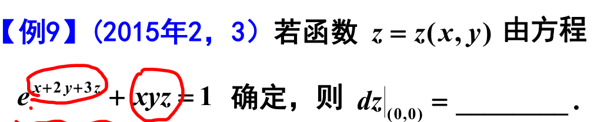
	[017](bookxnotepro://opennote/?nb={eaae9369-1988-4e39-8c00-ce441fc1deb4}&book=8734308cb27c57eb36a49d0cf038f18d&page=16&x=271&y=120&id=17005&uuid=1a1c89ed326f1ff4c0c86f2987a7a203)
	求隐函数的微分：
	1. 可以直接求微分，因为结构形式简单——复杂就不行了
	2. 对隐函数两边求偏导数，组微分——隐函数也可以用[[先代后求]]——先代，两侧求导。

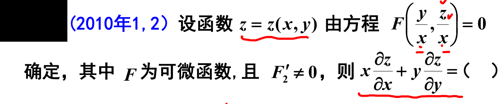
	[020](bookxnotepro://opennote/?nb={eaae9369-1988-4e39-8c00-ce441fc1deb4}&book=8734308cb27c57eb36a49d0cf038f18d&page=19&x=345&y=76&id=17009&uuid=cfdbe4d323ae95b494cd19a62761e385)
	这种适合代公式

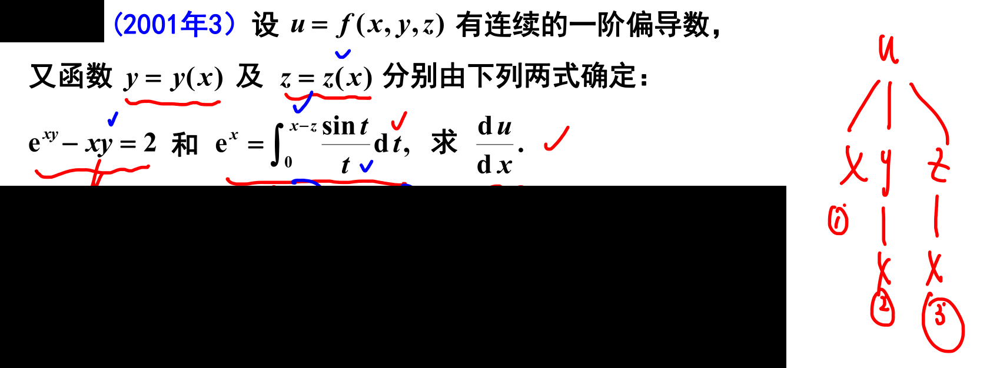
	[021](bookxnotepro://opennote/?nb={eaae9369-1988-4e39-8c00-ce441fc1deb4}&book=8734308cb27c57eb36a49d0cf038f18d&page=20&x=439&y=163&id=17010&uuid=89cc0d5fafd870534b833a786e5b625c)
	这种综合题，能理的清楚，可以顺序求解
	理不清楚的话，直接**暴力解法**：所有公式均求微分，消掉无关项

## 求无约束极值
求导=0、算 ABC、判断 [013](bookxnotepro://opennote/?nb={eaae9369-1988-4e39-8c00-ce441fc1deb4}&book=435058b634642c1446573ed990d8c027&page=12&x=884&y=33&id=17019&uuid=b1b5dd25678fecadb9c60f594518f5ff)
[[第八章 多元微分及其应用#驻点是极值的充分条件|极值充分条件]]

## 求最大值最小值
### 条件最值

因为[[第八章 多元微分及其应用#^mwglit|拉格朗日乘数法]]不能判断算出的点是否极值点，只能判断最值

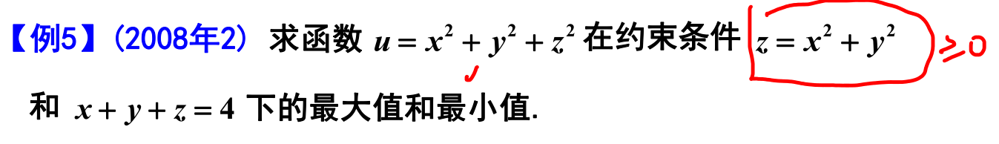
	[015](bookxnotepro://opennote/?nb={eaae9369-1988-4e39-8c00-ce441fc1deb4}&book=435058b634642c1446573ed990d8c027&page=14&x=386&y=60&id=17020&uuid=3859c260ffbd9358fd52a8ab8fa6e7dc)
	1. 这个用拉格朗日乘数法有五个方程，注意主要解 x 和 y——比较**复杂**
		1. 经常会有未知数的次方，注意可能有多个解——比如二次有两个解

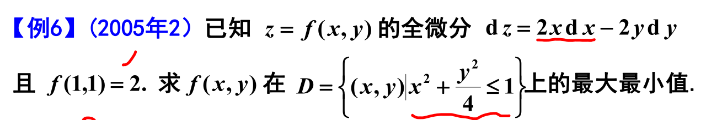
	[016](bookxnotepro://opennote/?nb={eaae9369-1988-4e39-8c00-ce441fc1deb4}&book=435058b634642c1446573ed990d8c027&page=15&x=368&y=66&id=17021&uuid=f5729f12ffb900f607f30327d5780b2a)
	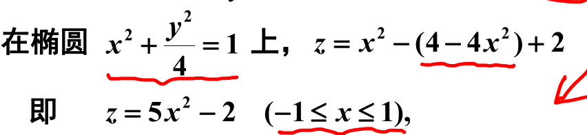
	[016](bookxnotepro://opennote/?nb={eaae9369-1988-4e39-8c00-ce441fc1deb4}&book=435058b634642c1446573ed990d8c027&page=15&x=307&y=375&id=17022&uuid=7b0e5af77f3df3dc6f11da8a0a51d9e4)
	这个题可以不用拉格朗日乘数法来求，直接消元，就可以求出最值
	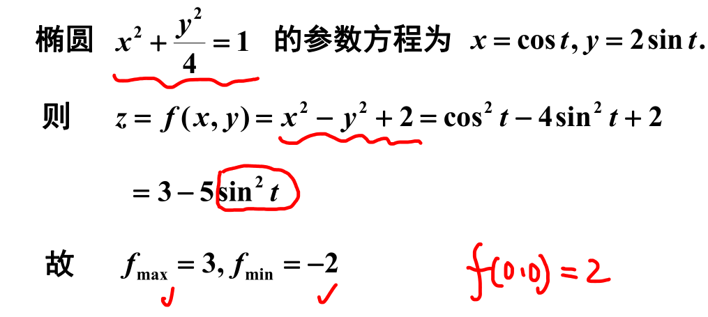
	[018](bookxnotepro://opennote/?nb={eaae9369-1988-4e39-8c00-ce441fc1deb4}&book=435058b634642c1446573ed990d8c027&page=17&x=305&y=201&id=17023&uuid=457b50346db8b9c84c0787cadb5a1aeb)
	这个题是圆，还可以用参数化简
	 ^gahxig

# 最大值最小值应用题

# 一些细节

![[Pasted image 20221002205441.png]]
极限中自变量的两种表示方法

# 处理方法

固定一点的偏导数都可以思考一下**先代后求**
一切偏导数都可以——比如组成微分的偏导数

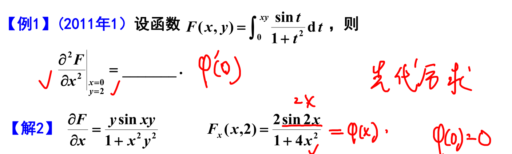
	[007](bookxnotepro://opennote/?nb={eaae9369-1988-4e39-8c00-ce441fc1deb4}&book=8734308cb27c57eb36a49d0cf038f18d&page=6&x=409&y=127&id=16998&uuid=0cfc299dee17829a544b76d8af4bd80e)
	1. 确定点的导数可以先代后求
	2. 确定点的导数可以观察是否可以用定义算——尤其有很多 $f(0)=0$ 形况，而不用求商
 ^qd461m

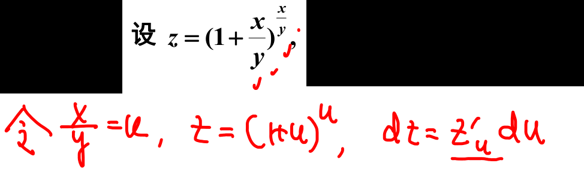
	[008](bookxnotepro://opennote/?nb={eaae9369-1988-4e39-8c00-ce441fc1deb4}&book=8734308cb27c57eb36a49d0cf038f18d&page=7&x=372&y=90&id=16999&uuid=1f9a705acf00060dd32af5826235e6e1)
	用[[第八章 多元微分及其应用#^lrx79d|链式来简便计算]] 
	可以用在多元**微分**，似乎也可用在微分

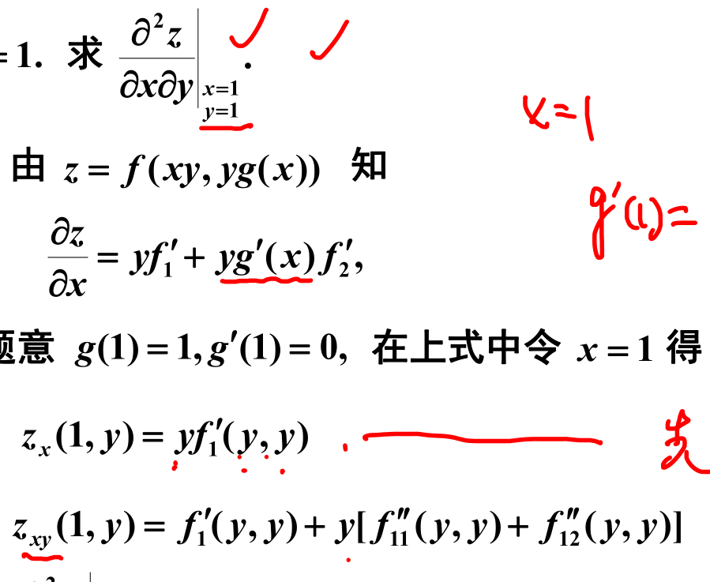
	[014](bookxnotepro://opennote/?nb={eaae9369-1988-4e39-8c00-ce441fc1deb4}&book=8734308cb27c57eb36a49d0cf038f18d&page=13&x=313&y=283&id=17003&uuid=4c11aa0cb45cfe18e16a3e4ccbcc29fa)
	最后一次求导，可以先代后求——先代不求导的项
	注意这里的先代后求，同时代入了 $f'_1(xy,yg(x))$ 中，化成了 $f'_1(y,y)$

一阶方程观察就可以

# 反直觉

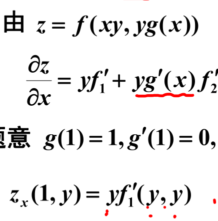
	[014](bookxnotepro://opennote/?nb={eaae9369-1988-4e39-8c00-ce441fc1deb4}&book=8734308cb27c57eb36a49d0cf038f18d&page=13&x=201&y=292&id=17002&uuid=24d8d176f395e1a9244fcc6de21b2b40)
	$z_{x} = \frac{\partial z}{\partial x}$ 和 $f'_{1}= \frac{\partial f}{\partial u}$ 不同，所以 $z_x(x,y)$ 括号内的两个变量表示树的末梢的两个变量，不等于 $f_1(xy,yg(x))$ 

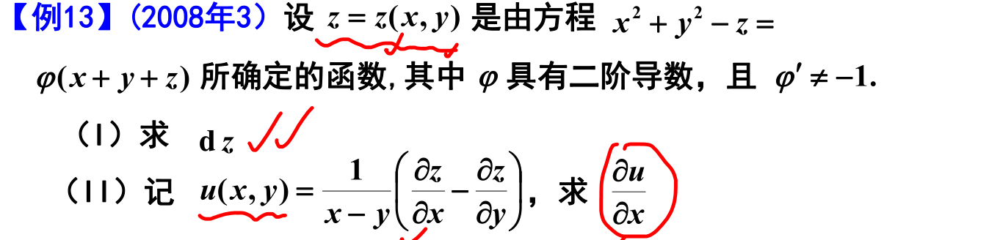
	[023](bookxnotepro://opennote/?nb={eaae9369-1988-4e39-8c00-ce441fc1deb4}&book=8734308cb27c57eb36a49d0cf038f18d&page=22&x=388&y=106&id=17011&uuid=b9fa335dc29a655189be57e70e8212f4)
	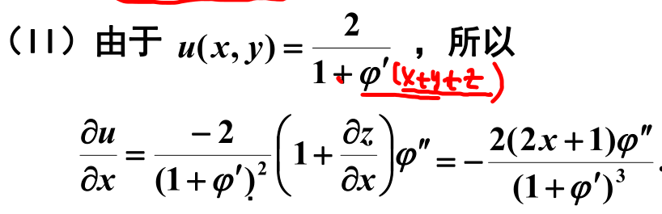
	[023](bookxnotepro://opennote/?nb={eaae9369-1988-4e39-8c00-ce441fc1deb4}&book=8734308cb27c57eb36a49d0cf038f18d&page=22&x=284&y=466&id=17012&uuid=b52ca9c46c4f3f7f090a6406565cfb44)
	注意，类似 [[#^a6a192|一阶偏导求偏导]]，在 $\varphi (x+y+z)=\varphi (u)$ ，也要写清楚

# 习题积累

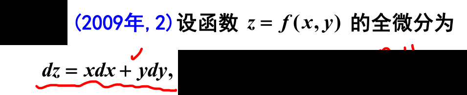
	[011](bookxnotepro://opennote/?nb={eaae9369-1988-4e39-8c00-ce441fc1deb4}&book=435058b634642c1446573ed990d8c027&page=10&x=281&y=69&id=17016&uuid=d8b7acc3dce1fa019453543a0f4514d3)
	这道题本身是用导数求极值点的题，这里直接解出原方程
	[[@思维]]：全微分对应原方程
	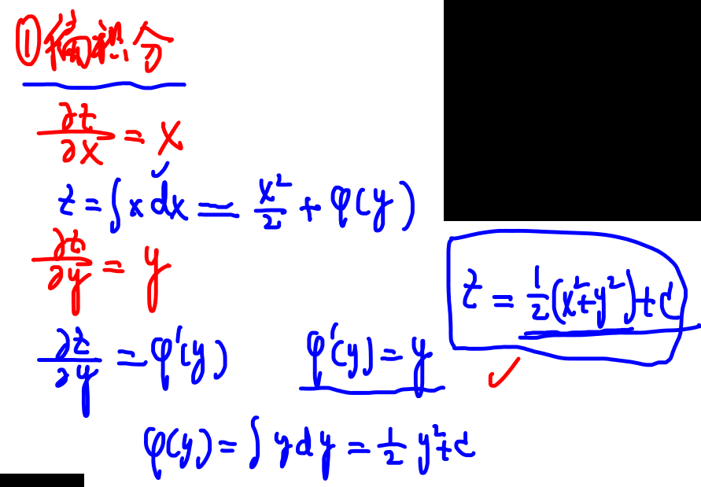
	[011](bookxnotepro://opennote/?nb={eaae9369-1988-4e39-8c00-ce441fc1deb4}&book=435058b634642c1446573ed990d8c027&page=10&x=685&y=232&id=17017&uuid=db2955d4ed6cf5d3bdf8cbbe8c6c5193)
	用偏积分做，两个根据两个偏导数求出原始函数
	注意：
	1. 偏积分 x 后，“常数项”是一个和 y 相关的
	2. 不是把两个偏微分方程都偏积分——而是偏积分一个，表示 z, 再把 z 代进另一个方程，变成了一个常微分方程了
	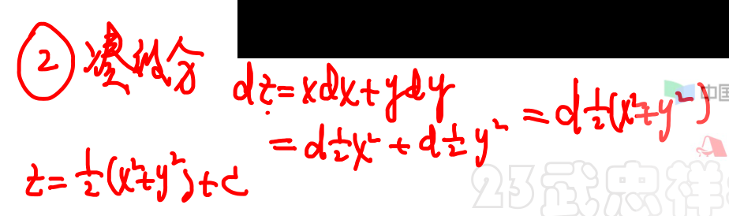
	[011](bookxnotepro://opennote/?nb={eaae9369-1988-4e39-8c00-ce441fc1deb4}&book=435058b634642c1446573ed990d8c027&page=10&x=604&y=451&id=17018&uuid=fa96dca544a8f2c5a209d66a6dfc6b78)
	凑微分，求原始导数
	把公式都放进 d 里，恒等于常数
	 ^b1055g

