# 向量代数
[017](bookxnotepro://opennote/?nb={eaae9369-1988-4e39-8c00-ce441fc1deb4}&book=fc6371d1fa9480dfd7b2bcaf96ce46da&page=16&x=337&y=35&id=19277&uuid=c86c8e46ac9c4296a785a2555a695a22)
三种乘法——点乘叉乘混合积
- 数量积——判垂直
- 向量积——判平行（不过一般用坐标成比例）
	- 没有交换律（加负号）
- 混合积——三向量共面判定，顺序交换类似三阶行列式

# 平面和直线
空间平面与直线 [021](bookxnotepro://opennote/?nb={eaae9369-1988-4e39-8c00-ce441fc1deb4}&book=fc6371d1fa9480dfd7b2bcaf96ce46da&page=20&x=366&y=30&id=19279&uuid=136eb3c625b8ac9d39293cfb540ddbb1)

1. ==平==面方程——xyz 线性相加
	1. 点法式
	2. 一般式
	3. 截距式
	4. 三点式 [226](bookxnotepro://opennote/?nb={c287edd4-3f25-4bbd-a744-a478182b9e21}&book=326d5a790e5c8d426122928be7ab41a9&page=225&x=259&y=394&id=6&uuid=99dc48b2cabe348be3c11c1f4af8864e)
	5. 平面族方程——绕一条直线旋转 [226](bookxnotepro://opennote/?nb={c287edd4-3f25-4bbd-a744-a478182b9e21}&book=326d5a790e5c8d426122928be7ab41a9&page=225&x=219&y=520&id=9&uuid=4c987a4dceda61bd0427027ab99f17bb) ^44732d
2. 直线的方程 ^e12370
	1. 两面相交
	2. 连等对称形式
	3. 参数形式——从上面化来
	4. 两点式——连等，分母变成两点坐标的差 [227](bookxnotepro://opennote/?nb={c287edd4-3f25-4bbd-a744-a478182b9e21}&book=326d5a790e5c8d426122928be7ab41a9&page=226&x=196&y=163&id=5&uuid=d01a8f0962a0ad49828ae2b12fe7bcf0) ^be77b8
3. 平面和直线的位置关系——平面与直线夹角取余角
4. 点到面、点到线的距离

# 空间的曲线、曲面
[024](bookxnotepro://opennote/?nb={eaae9369-1988-4e39-8c00-ce441fc1deb4}&book=fc6371d1fa9480dfd7b2bcaf96ce46da&page=23&x=353&y=30&id=19283&uuid=16f9c0d7aff7e778e3cd666bd90187dc)

- ==曲==面
- 空间曲线
	- 两面相交 ^11lsso
	- 参数式 ^d9wyoh

## 常见曲面
[024](bookxnotepro://opennote/?nb={eaae9369-1988-4e39-8c00-ce441fc1deb4}&book=fc6371d1fa9480dfd7b2bcaf96ce46da&page=23&x=120&y=332&id=19285&uuid=4cf2cf139fd5074290faaa35f4178252)

### 旋转面
- 曲线在坐标面+绕坐标轴：绕哪转，哪不动 [228](bookxnotepro://opennote/?nb={c287edd4-3f25-4bbd-a744-a478182b9e21}&book=326d5a790e5c8d426122928be7ab41a9&page=227&x=221&y=358&id=7&uuid=b13ec6b4440e1b01cc1024191ca8eb10) ^nu65ty
- 空间曲线+绕坐标轴：$x^2+y^2=x_0^2+y_0^2$. 用 x0y0 表示 z [228](bookxnotepro://opennote/?nb={c287edd4-3f25-4bbd-a744-a478182b9e21}&book=326d5a790e5c8d426122928be7ab41a9&page=227&x=260&y=483&id=8&uuid=99d899624359a5af1c4e794c1e5698d7)

### 柱面
- 曲线的两个方程相加，消掉曲线的一个轴

### 二次曲面
[025](bookxnotepro://opennote/?nb={eaae9369-1988-4e39-8c00-ce441fc1deb4}&book=fc6371d1fa9480dfd7b2bcaf96ce46da&page=24&x=109&y=361&id=19286&uuid=6aedf4453ba631e2737eb6c99de84dc0)
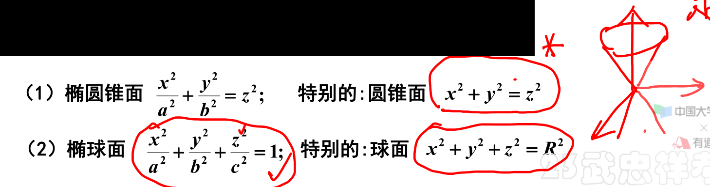
	[025](bookxnotepro://opennote/?nb={eaae9369-1988-4e39-8c00-ce441fc1deb4}&book=fc6371d1fa9480dfd7b2bcaf96ce46da&page=24&x=456&y=418&id=19288&uuid=34bec5eafa7dd5e1799fc1adca32b202)
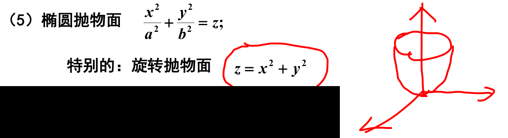
	[026](bookxnotepro://opennote/?nb={eaae9369-1988-4e39-8c00-ce441fc1deb4}&book=fc6371d1fa9480dfd7b2bcaf96ce46da&page=25&x=397&y=248&id=19290&uuid=74b93f5fac1e391186ed926531d22c78)
	常见二次曲面

	[078](bookxnotepro://opennote/?nb={4b0b849c-f284-459f-9b9c-e14b0ecf8ba2}&book=4db326750425a2eac028b50acbc37456&page=77&x=186&y=447&id=80&uuid=fb6965703e0e7c5bbcc69e199018acf0)
	
## 空间曲线投影
- 柱面+坐标平面联例
- 注意要画出范围，再做投影 [[第十一章 向量代数与空间解析结合及多元微分学在几何上的应用#^bk2msp|注意范围]]

# 曲面的切平面法线+曲线的切线法平面（多元微分的应用）

多元微分在几何上的应用 [031](bookxnotepro://opennote/?nb={eaae9369-1988-4e39-8c00-ce441fc1deb4}&book=fc6371d1fa9480dfd7b2bcaf96ce46da&page=30&x=426&y=36&id=19292&uuid=0ba213c026a77d8b194ac84cda9267e5)

## 曲面的切平面与法线

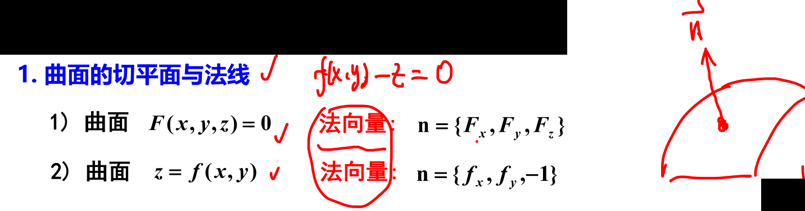
	[031](bookxnotepro://opennote/?nb={eaae9369-1988-4e39-8c00-ce441fc1deb4}&book=fc6371d1fa9480dfd7b2bcaf96ce46da&page=30&x=448&y=124&id=19294&uuid=79532138dcac8940ef16aa77bbb97d0a)
	对曲面方程求大 F 偏导即可

## 曲线的切线与法平面

曲线的切线与法平面 [031](bookxnotepro://opennote/?nb={eaae9369-1988-4e39-8c00-ce441fc1deb4}&book=fc6371d1fa9480dfd7b2bcaf96ce46da&page=30&x=180&y=249&id=19295&uuid=eec6ca642e1d9d4f7aee5d347f0cc351)

求切线
- ![[第十一章 向量代数与空间解析结合及多元微分学在几何上的应用#^d9wyoh]]
	- 分别对参数求导
- ![[第十一章 向量代数与空间解析结合及多元微分学在几何上的应用#^11lsso]]
	- 求面的切平面的法向量的==叉积==

# 重点题型讲解

## 向量的计算
[020](bookxnotepro://opennote/?nb={eaae9369-1988-4e39-8c00-ce441fc1deb4}&book=fc6371d1fa9480dfd7b2bcaf96ce46da&page=19&x=200&y=161&id=19282&uuid=c6cf59083eacfb6bda5cfbef1c469e1b)
### 建立平面和直线方程
[023](bookxnotepro://opennote/?nb={eaae9369-1988-4e39-8c00-ce441fc1deb4}&book=fc6371d1fa9480dfd7b2bcaf96ce46da&page=22&x=197&y=148&id=19281&uuid=540c53e9718f51c3e3be43c0d95f2155)
### 建立柱面和旋转面方程
[027](bookxnotepro://opennote/?nb={eaae9369-1988-4e39-8c00-ce441fc1deb4}&book=fc6371d1fa9480dfd7b2bcaf96ce46da&page=26&x=203&y=159&id=19296&uuid=9bc379f79f4447683718a9a2dd57e28b)
### 建立曲面的切平面和法线、曲线的切线和法平面
[032](bookxnotepro://opennote/?nb={eaae9369-1988-4e39-8c00-ce441fc1deb4}&book=fc6371d1fa9480dfd7b2bcaf96ce46da&page=31&x=363&y=159&id=19297&uuid=0697eaf1650de75b7175d557d143e99f)

## 一些细节

## 处理方法

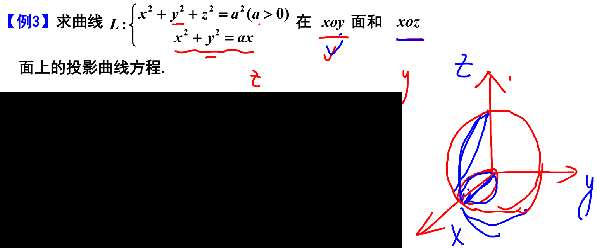
	[030](bookxnotepro://opennote/?nb={eaae9369-1988-4e39-8c00-ce441fc1deb4}&book=fc6371d1fa9480dfd7b2bcaf96ce46da&page=29&x=464&y=204&id=19291&uuid=d4018cf7cd7a1ae907dab9ef7d246751)
	求投影范围，需要明确范围
	 ^bk2msp

	[034](bookxnotepro://opennote/?nb={eaae9369-1988-4e39-8c00-ce441fc1deb4}&book=fc6371d1fa9480dfd7b2bcaf96ce46da&page=33&x=363&y=80&id=19298&uuid=9022aece2a26fdc6959f67d988783fcb)
	指向外侧？——画出来看：向量锐角为正，钝角为负数

## 反直觉

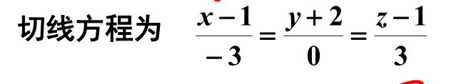
	[037](bookxnotepro://opennote/?nb={eaae9369-1988-4e39-8c00-ce441fc1deb4}&book=fc6371d1fa9480dfd7b2bcaf96ce46da&page=36&x=270&y=441&id=19299&uuid=b451564c3d1398061823800b430edca7)
	这样写是不是不用考虑分母为 0

## 计算错误
![[第十一章 向量代数与空间解析结合及多元微分学在几何上的应用#^nu65ty]] 坐标轴的变量不变+带进去的根号式子也不含坐标轴的符号

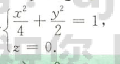
	[080](bookxnotepro://opennote/?nb={4b0b849c-f284-459f-9b9c-e14b0ecf8ba2}&book=4db326750425a2eac028b50acbc37456&page=79&x=247&y=308&id=82&uuid=0d00db076cba65ecfd46d8c23d4bcedd)
	投影曲线要加第二个=0，只写第一个是个柱面

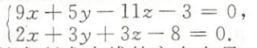
	[081](bookxnotepro://opennote/?nb={4b0b849c-f284-459f-9b9c-e14b0ecf8ba2}&book=4db326750425a2eac028b50acbc37456&page=80&x=237&y=481&id=90&uuid=35f7925311445cdad63519335dad099b)
	一条直线在一个平面上的投影
	- [[#^44732d|平面族]]找垂直的面
	- 注意被把**被投影的面**括起来，别忘了，算的结果是一条线，不是一个面
	
## 习题积累

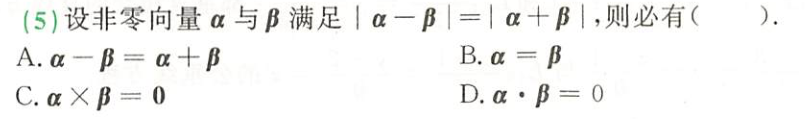
	[033](bookxnotepro://opennote/?nb={4b0b849c-f284-459f-9b9c-e14b0ecf8ba2}&book=4f1972a39d8f1176257957a09d832b75&page=32&x=200&y=408&id=81&uuid=dc69918b635d072723f5e931345e50da)
	画图三角图做

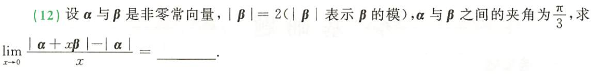
	[034](bookxnotepro://opennote/?nb={4b0b849c-f284-459f-9b9c-e14b0ecf8ba2}&book=4f1972a39d8f1176257957a09d832b75&page=33&x=257&y=158&id=83&uuid=a033b9438f7eb69cfebfa172c802bf0e)
	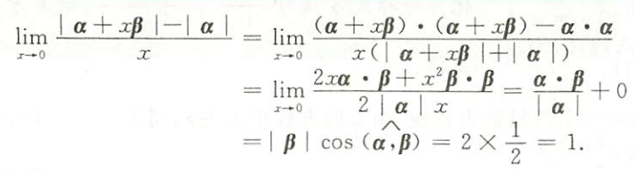
	[080](bookxnotepro://opennote/?nb={4b0b849c-f284-459f-9b9c-e14b0ecf8ba2}&book=4db326750425a2eac028b50acbc37456&page=79&x=236&y=535&id=84&uuid=b204aff934b4df5d549a7a7f80acc439)
	模其实可以用定义的形式来做，化成两个向量的数量积
	我用解三角做的，比较复杂

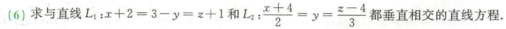
	[034](bookxnotepro://opennote/?nb={4b0b849c-f284-459f-9b9c-e14b0ecf8ba2}&book=4f1972a39d8f1176257957a09d832b75&page=33&x=260&y=386&id=78&uuid=83005026bf68682b34c154a2101c8c34)
	"垂直相交"——找一条直线垂直于两条直线容易（有无限条），但还要需要和两条垂直的直线都相交，只有一条。
1. 求出垂线的方向向量
2. 新方法
	1. 方法 1——找到一个点，配合已经求得的法向向量，确定直线 [082](bookxnotepro://opennote/?nb={4b0b849c-f284-459f-9b9c-e14b0ecf8ba2}&book=4db326750425a2eac028b50acbc37456&page=81&x=85&y=122&id=92&uuid=c2595f103b8fc75067e1ca78f72dc1a0)
		1. 用[[#^e12370|参数形式]]表示两个直线——因为参数方程各自只有一个参数——两条直线一个参数，一共两个
		2. 用类似[[#^be77b8|两点式]]的形式比例—— $\frac{x轴坐标之差}{x法向向量}=常数$ 的形式来求两个参数
	2. 方法 2——特殊方法[081](bookxnotepro://opennote/?nb={4b0b849c-f284-459f-9b9c-e14b0ecf8ba2}&book=4db326750425a2eac028b50acbc37456&page=80&x=79&y=593&id=91&uuid=db9113a243a2be7d3554e23218ae1c08)
		1. 垂线和 L1、L2 都相交——垂线在垂线和 L1 确定的面上+垂线在垂线和 L2 确定的面上——垂线是这两个平面的交线——两个平面联立表示即可 
		2. 这两个平面怎么求？
			1. 容易求出两个平面的法向向量
			2. L1L2 上的点就是对应平面上的点

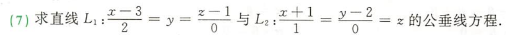
	[034](bookxnotepro://opennote/?nb={4b0b849c-f284-459f-9b9c-e14b0ecf8ba2}&book=4f1972a39d8f1176257957a09d832b75&page=33&x=237&y=411&id=93&uuid=7413c40786b5f262f43f006ec52cf5f1)
	类似的上一题
