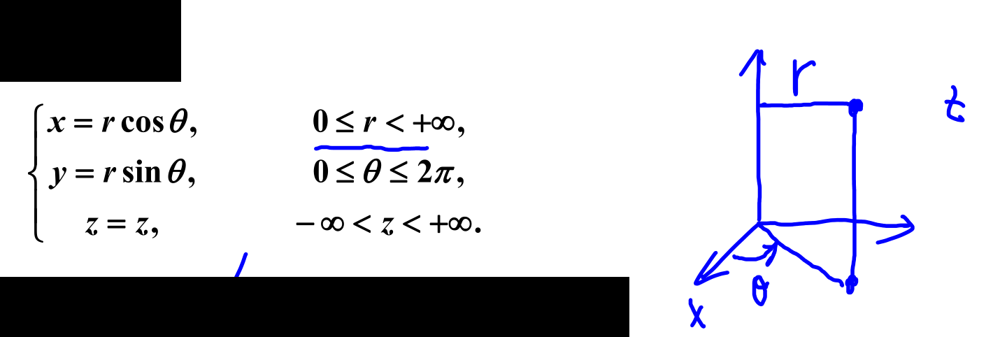
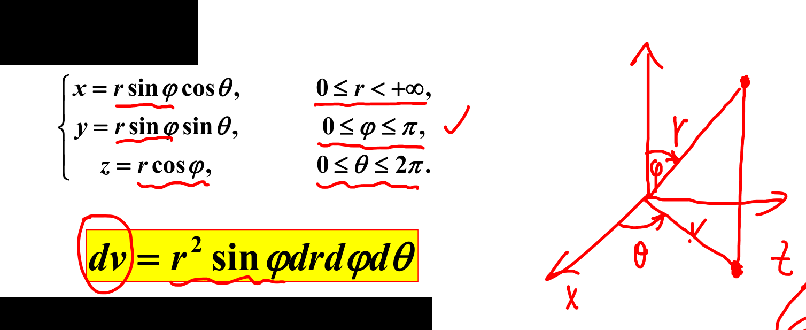
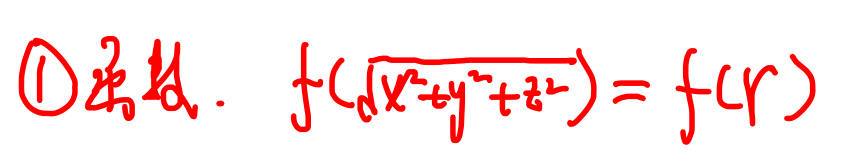
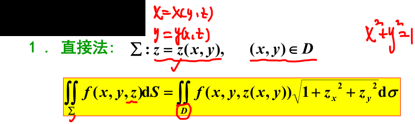

# 三重积分

定义 [003](bookxnotepro://opennote/?nb={eaae9369-1988-4e39-8c00-ce441fc1deb4}&book=54c5b9ae3433e2c72a012cc255d42319&page=2&x=113&y=109&id=19300&uuid=9567318685061248780153b87e0bccc3)
性质 [003](bookxnotepro://opennote/?nb={eaae9369-1988-4e39-8c00-ce441fc1deb4}&book=54c5b9ae3433e2c72a012cc255d42319&page=2&x=112&y=155&id=19301&uuid=067ae1651c5c56fb125e32594e970600)
	主要是不等式和中值定理

## 计算
[003](bookxnotepro://opennote/?nb={eaae9369-1988-4e39-8c00-ce441fc1deb4}&book=54c5b9ae3433e2c72a012cc255d42319&page=2&x=112&y=202&id=19302&uuid=89b2ea7e04c4010e65444cdafd955575)

- 直角坐标
	- 先一后二——最好还是先压缩 z，没有 z 最好 ^a7m3ar
	- 先二后一 ^fhj01e
		1. f (z)——没有 x 和 y ，只用求截面即可
		2. 横截面的面积好求的
- 柱坐标：我感觉有点类似先一后二（先一的上下限变成了极坐标表示），但要求 z 和其他变量分离 (先压缩 z) ^310fce
	- 
	- 
	- 条件
		1. 函数
			- Z 可以单独分离出来的	
		2. 范围：中心柱体、中心**锥**体、偏心锥体
- 球坐标 ^f3d4e8
	- 
	- 条件
		- 
		- 球体、半个球体、1/4个球体
			偏心球面——球面过原点
			曲顶锥体
- 奇偶性——区间对于坐标平面的镜面对称，和[[第九章 二重积分#对称性和奇偶性|二重积分的轴对称性质]]类似 ^d53feb
- 变量对称性 ^075a83
	- ![[Pasted image 20221017190610.png]]

# 曲线积分

两类积分的联系 [290](bookxnotepro://opennote/?nb={c287edd4-3f25-4bbd-a744-a478182b9e21}&book=326d5a790e5c8d426122928be7ab41a9&page=289&x=260&y=432&id=14&uuid=640d4bfe66e66d11e4c23a6e40bc169f)
联系用的少，但要知道，$\alpha$ 是切线的倾角（看作方向余弦）、$\beta$ 和$\alpha$ 互余
ds 乘两个方向余弦 $\cos \alpha ，\cos \beta$ 等于 x、y 方向上的变化率

## 对弧长的线积分（第一类线积分）
[015](bookxnotepro://opennote/?nb={eaae9369-1988-4e39-8c00-ce441fc1deb4}&book=54c5b9ae3433e2c72a012cc255d42319&page=14&x=273&y=86&id=20034&uuid=eb2fa97296707016f2f35510e8bd43e7)
与路径方向无关——从小积到大 [015](bookxnotepro://opennote/?nb={eaae9369-1988-4e39-8c00-ce441fc1deb4}&book=54c5b9ae3433e2c72a012cc255d42319&page=14&x=564&y=204&id=20035&uuid=00c4f457af79b88040d5e1621380ca9e)

### 平面
[015](bookxnotepro://opennote/?nb={eaae9369-1988-4e39-8c00-ce441fc1deb4}&book=54c5b9ae3433e2c72a012cc255d42319&page=14&x=114&y=244&id=20036&uuid=89721208788200950e09e55b96712fcc)

- 直接法——
	- 选一个做参数，x 或构造一个 t (参数方程)、$\theta$、$\rho$ （极坐标）之类
	- ds 类似二元线积分展开
	-  ![[Pasted image 20221109132411.png]]
- 奇偶性
- 参数对称性 y=x

### 空间

- 空间一型线积分——一般用参数法，用 t 表示其他三个坐标 ^i945rp
	- [[第十二章 多元积分学及其应用#^8e0s9b|直接法]]类似空间二类线积分
	- 也可用[[十二章习题#^s7mm18|空间对称性]]

## 对坐标的线积分（第二类线积分）

[018](bookxnotepro://opennote/?nb={eaae9369-1988-4e39-8c00-ce441fc1deb4}&book=54c5b9ae3433e2c72a012cc255d42319&page=17&x=270&y=33&id=20037&uuid=1b0ee359751dfb72b1d532c634fed18d)
和起点有关

### 平面

- L是否**封闭**
	- 是—— [[第十二章 多元积分学及其应用#格林公式|格林公式]]
	- 否——是否与 [[第十二章 多元积分学及其应用#线积分与路径无关|路径无关]]
		- 是——更换路径、[[第七章 微分方程#全微分方程|全微分求原函数]]
		- 否——**直接算或者补线格林公式**（很多既不是封闭，又不是路径无关题目）

#### 直接算
**消元**
找一个参数 t 表示 xy，两个积分变量 dxdy 化为一个积分变量 dt
或者 t=x

#### 格林公式

逆时针为正

注意积分函数有取不到的点，不能用格林公式，需要挖洞 [[十二章习题#^vzmwek]]

	[018](bookxnotepro://opennote/?nb={eaae9369-1988-4e39-8c00-ce441fc1deb4}&book=54c5b9ae3433e2c72a012cc255d42319&page=17&x=383&y=532&id=20038&uuid=2131a55be794db19e6d553c8cd0be161)
	格林公式 [[@记忆]] 
	线积分转为面积分——y 前对 x 求导-x 前对 y 求导

补线用格林

#### 线积分与路径无关

[[十二章习题#^46nxjh|一般化成直线和圆]]

判定：
1. 区域单连通
2. 满足公式（刚好满足这个公式，也可以用[[第七章 微分方程#全微分方程|全微分求原函数]]） $$
\frac{\partial P}{\partial y}=\frac{\partial Q}{\partial x}$$

### 空间第二类曲线

[020](bookxnotepro://opennote/?nb={eaae9369-1988-4e39-8c00-ce441fc1deb4}&book=54c5b9ae3433e2c72a012cc255d42319&page=19&x=154&y=26&id=20041&uuid=aa4a6897c2f91924947b13ce028cc610)

例 8 [034](bookxnotepro://opennote/?nb={eaae9369-1988-4e39-8c00-ce441fc1deb4}&book=54c5b9ae3433e2c72a012cc255d42319&page=33&x=52&y=31&id=20048&uuid=5675e360ac21d2fbcbc491091c6bcc96)
- 直接法——找 t 写空间曲线的参数方程  举例 [034](bookxnotepro://opennote/?nb={eaae9369-1988-4e39-8c00-ce441fc1deb4}&book=54c5b9ae3433e2c72a012cc255d42319&page=33&x=128&y=195&id=20049&uuid=f035c5ba228d411590826cd562a4595f) ^8e0s9b
	1. 空间曲线的投影曲线写出 t 参数方程
	2. 表示第三个坐标，表示整个曲线，写出参数方程
- 斯托克斯公式——转封闭空间曲线为空间面的[[#曲面积分|面积分 ]] [[@记忆]]
	- 
		[020](bookxnotepro://opennote/?nb={eaae9369-1988-4e39-8c00-ce441fc1deb4}&book=54c5b9ae3433e2c72a012cc255d42319&page=19&x=472&y=327&id=20042&uuid=1ba8e42e0e90b5c9d5f5a948f0d6ca2f)
		两种形式，第一种形式各变量对齐，第二种形式括号内部交错
	- 选曲线围成的平面（一般考平面，积分余弦固定）：
		1. 注意法向量方向，影响积分余弦的正负
		2. 积分余弦是单位法向量的三个坐标
		3. dS 是斜着的面积 [035](bookxnotepro://opennote/?nb={eaae9369-1988-4e39-8c00-ce441fc1deb4}&book=54c5b9ae3433e2c72a012cc255d42319&page=34&x=520&y=193&id=19925&uuid=b5f4f34606c1e56a3ed17604d3bbb69f)
- 消元 z——转化成平面，用格林公式，积分区域变为投影
	- 若是平面和曲面的交线
		1. 平面：方便用 x 和 y 表示 z
		2. 代入消元z，此时积分范围变成原空间曲线在xy平面的投影
		3. 用格林公式

## 截图
![[Pasted image 20221109135305.png]]
# 曲面积分

两类面积分的联系 [005](bookxnotepro://opennote/?nb={eaae9369-1988-4e39-8c00-ce441fc1deb4}&book=9941ea13d386b894e42ffdb607e71fb2&page=4&x=156&y=241&id=20060&uuid=22912f270e4c4fb583149dbc06e938df)
![[Pasted image 20221109155959.png]]

## 对面积的面积分（第一类面积分）
[002](bookxnotepro://opennote/?nb={eaae9369-1988-4e39-8c00-ce441fc1deb4}&book=9941ea13d386b894e42ffdb607e71fb2&page=1&x=321&y=115&id=20050&uuid=ebc72e956a07e0825026a866f5fd4ee8)

- 直接法——消元（是不是不方便找 t）[[@记忆]]
	- 
		[002](bookxnotepro://opennote/?nb={eaae9369-1988-4e39-8c00-ce441fc1deb4}&book=9941ea13d386b894e42ffdb607e71fb2&page=1&x=343&y=438&id=20057&uuid=2cf462834bab95f73bba02522b29244e)
		dS 被消掉的一个未知数 z 进行求导
	- 积分区域变为投影区域
- 奇偶性
	- 有时还可以“平移” [[十二章习题#^osocjm]]
- 变量对称性比如沿着 x=y=z 轴对称的积分面可互换

## 对坐标的面积分（第二类面积分）
[003](bookxnotepro://opennote/?nb={eaae9369-1988-4e39-8c00-ce441fc1deb4}&book=9941ea13d386b894e42ffdb607e71fb2&page=2&x=332&y=282&id=20051&uuid=e56fedbecbd62457e34f6f39b7d3e406)
和方向有关

- 直接法 ^j7m3ad
	- 分成三部分投影
	- 三部分别二重积分
		- 若是 dxdy，则用 xy 消元 z，投影面到 xoy 平面（**注意加正负号**）
		- 
		[004](bookxnotepro://opennote/?nb={eaae9369-1988-4e39-8c00-ce441fc1deb4}&book=9941ea13d386b894e42ffdb607e71fb2&page=3&x=473&y=270&id=20058&uuid=6445b836a3af8e891b577b5f6979f31f)
- 高斯公式——封闭曲面**外侧**变围成的区域三重积分（内侧需要加负号）[[@记忆]] ^89ppsn
	- 
		[005](bookxnotepro://opennote/?nb={eaae9369-1988-4e39-8c00-ce441fc1deb4}&book=9941ea13d386b894e42ffdb607e71fb2&page=4&x=401&y=84&id=20059&uuid=84ef4de482c280b1d5ecce09b8d6f4bc)
- 补面用高斯 -例 6 [012](bookxnotepro://opennote/?nb={eaae9369-1988-4e39-8c00-ce441fc1deb4}&book=9941ea13d386b894e42ffdb607e71fb2&page=11&x=52&y=33&id=20063&uuid=a0434e503303ecbfa28ee6e76f6628bd)
	- 注意补的平面的方向，内侧加负号例 7 [013](bookxnotepro://opennote/?nb={eaae9369-1988-4e39-8c00-ce441fc1deb4}&book=9941ea13d386b894e42ffdb607e71fb2&page=12&x=58&y=33&id=20064&uuid=9aa1abc45a0554f385d7c7a103ace435)
		- 用了高斯就不是面积分了，符号只涉及到内外，不涉及到投影
	- 考的最多

封闭——高斯
不封闭——直接算、补面。如果太复杂补面

# 多元积分应用
![[Pasted image 20221109162352.png]]
多元积分应用 [014](bookxnotepro://opennote/?nb={eaae9369-1988-4e39-8c00-ce441fc1deb4}&book=9941ea13d386b894e42ffdb607e71fb2&page=13&x=443&y=55&id=20065&uuid=dcc12f7359b6801cdc91159a4014bf6e)
质心、形心、变力做功、通量

# 场论初步
[020](bookxnotepro://opennote/?nb={eaae9369-1988-4e39-8c00-ce441fc1deb4}&book=9941ea13d386b894e42ffdb607e71fb2&page=19&x=410&y=36&id=20054&uuid=0576e97319f17f030a6c81cf96e33202)

![[Pasted image 20221109164138.png]]
	- 方向导数 [020](bookxnotepro://opennote/?nb={eaae9369-1988-4e39-8c00-ce441fc1deb4}&book=9941ea13d386b894e42ffdb607e71fb2&page=19&x=110&y=97&id=20068&uuid=a7cca26d147dada90b175482d5b762c5)
		- - 如果可微，则任意方向的方向导数都存在
		- - 两个偏导矢量求和可以表示任意一个方向导数
	- 梯度 [020](bookxnotepro://opennote/?nb={eaae9369-1988-4e39-8c00-ce441fc1deb4}&book=9941ea13d386b894e42ffdb607e71fb2&page=19&x=89&y=366&id=20069&uuid=5ac2059d1939c5b64dbbfdc6e1118ea3)
		- - 有连续一阶导数
		- - 求的是方向，这个方向代进方向导数，可以求得方向导数最大值
	- 散度 [021](bookxnotepro://opennote/?nb={eaae9369-1988-4e39-8c00-ce441fc1deb4}&book=9941ea13d386b894e42ffdb607e71fb2&page=20&x=92&y=32&id=20070&uuid=8df108bccfd3253c67aef2a07a5d6639)
	- 旋度 [021](bookxnotepro://opennote/?nb={eaae9369-1988-4e39-8c00-ce441fc1deb4}&book=9941ea13d386b894e42ffdb607e71fb2&page=20&x=91&y=181&id=20071&uuid=e2374530446fef9c8c050af200219213)

# [[十二章习题]]
