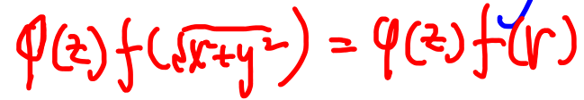

# 三重积分

定义 [003](bookxnotepro://opennote/?nb={eaae9369-1988-4e39-8c00-ce441fc1deb4}&book=54c5b9ae3433e2c72a012cc255d42319&page=2&x=113&y=109&id=19300&uuid=9567318685061248780153b87e0bccc3)
性质 [003](bookxnotepro://opennote/?nb={eaae9369-1988-4e39-8c00-ce441fc1deb4}&book=54c5b9ae3433e2c72a012cc255d42319&page=2&x=112&y=155&id=19301&uuid=067ae1651c5c56fb125e32594e970600)
	主要是不等式和中值定理

## 计算
[003](bookxnotepro://opennote/?nb={eaae9369-1988-4e39-8c00-ce441fc1deb4}&book=54c5b9ae3433e2c72a012cc255d42319&page=2&x=112&y=202&id=19302&uuid=89b2ea7e04c4010e65444cdafd955575)

- 直角坐标
	- 先一后二——最好还是先压缩 z，没有 z 最好 ^a7m3ar
	- 先二后一 ^fhj01e
		1. f (z)——没有 x 和 y ，只用求截面即可
		2. 横截面的面积好求的
- 柱坐标：我感觉有点类似先一后二，但要求 z 和其他变量分离 (先压缩 z) ^310fce
	- 
	- 
	- 条件
		1. 函数
			- Z 可以单独分离出来的	
		2. 范围：中心柱体、中心**锥**体、偏心锥体
- 球坐标 ^f3d4e8
	- 
	- 条件
		- 
		- 球体、半个球体、1/4个球体
			偏心球面——球面过原点
			曲顶锥体
- 奇偶性——区间对于坐标平面的镜面对称，和[[第九章 二重积分#对称性和奇偶性|二重积分的轴对称性质]]类似 ^d53feb
- 变量对称性 ^075a83
	- ![[Pasted image 20221017190610.png]]

# 曲线积分
题没看
# 曲面积分
全没看
# 多元积分应用
## 形
## 梯

# [[十二章习题]]
