# 常数项级数
## 级数的概念与性质
### 概念
级数的概念+敛散性 [004](bookxnotepro://opennote/?nb={eaae9369-1988-4e39-8c00-ce441fc1deb4}&book=d75c72e7b77289534b29d34dc209cef7&page=3&x=144&y=162&id=19784&uuid=b277a4c433adc558d1a5849203060e9f)

定义法——n 项和相加取极限

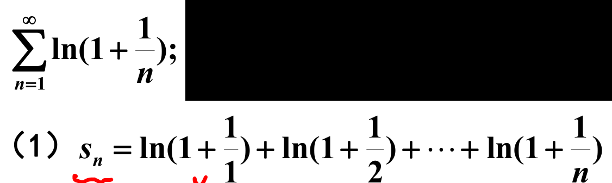
	[005](bookxnotepro://opennote/?nb={eaae9369-1988-4e39-8c00-ce441fc1deb4}&book=d75c72e7b77289534b29d34dc209cef7&page=4&x=328&y=127&id=19786&uuid=6044ded19e93bfe77695fdf50e89f803)
	对数可以化和为积

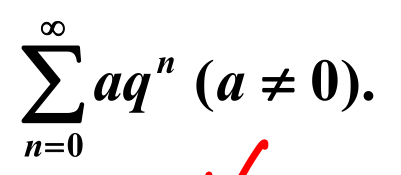
	[005](bookxnotepro://opennote/?nb={eaae9369-1988-4e39-8c00-ce441fc1deb4}&book=d75c72e7b77289534b29d34dc209cef7&page=4&x=563&y=98&id=19787&uuid=fa172b805dc7917ea9d8ecc33840124e)
	[[等比数列]]，可以化和为积
	只有公比在 -1 和 1 之间才收敛，留意

### 性质

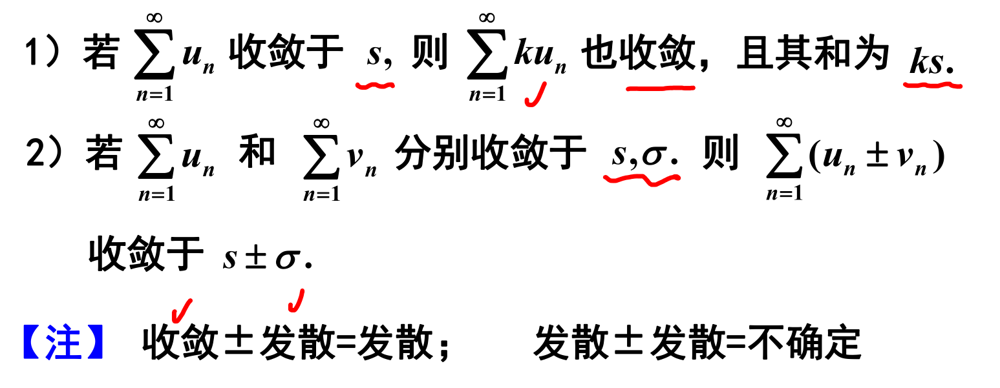
	[007](bookxnotepro://opennote/?nb={eaae9369-1988-4e39-8c00-ce441fc1deb4}&book=d75c72e7b77289534b29d34dc209cef7&page=6&x=378&y=183&id=19788&uuid=722a51e5d772d785d9f160d5115982f6)
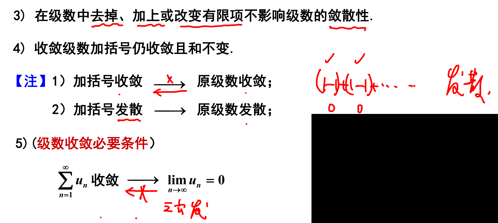
	[008](bookxnotepro://opennote/?nb={eaae9369-1988-4e39-8c00-ce441fc1deb4}&book=d75c72e7b77289534b29d34dc209cef7&page=7&x=468&y=210&id=19789&uuid=b773b87be37c53a456f9d6dcaa9b0f6a)
	不熟悉的：存在一种加括号方法，使得数列发散，则本数列发散
	无穷级数的性质
	 ^9enwlu

## 级数的审敛准则——级数收不收敛

敛散性的判定：
1. 正向五种方法
2. 交错一种方法 
3. 一般（任意项）一种方法
4. 想不到了可以用定义和性质
### 判断结论
[[@记忆]]
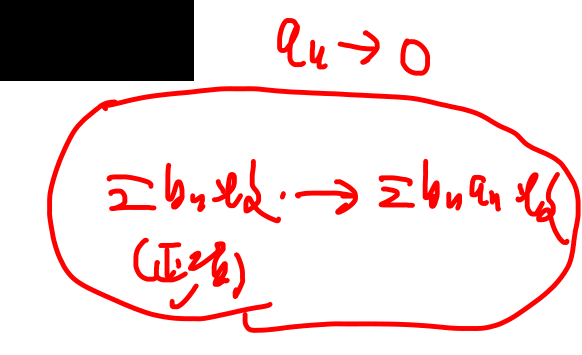
	[017](bookxnotepro://opennote/?nb={eaae9369-1988-4e39-8c00-ce441fc1deb4}&book=d75c72e7b77289534b29d34dc209cef7&page=16&x=800&y=206&id=19551&uuid=a2e31bd7b2cfc5818d89c58216938628)
	==正项==收敛，乘趋于 0 的序列->仍收敛

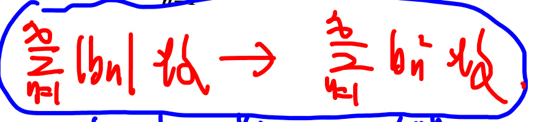
	[017](bookxnotepro://opennote/?nb={eaae9369-1988-4e39-8c00-ce441fc1deb4}&book=d75c72e7b77289534b29d34dc209cef7&page=16&x=364&y=333&id=19813&uuid=627aa57dae1686ebdcc1b79aa61e8f3a)
	绝对值收敛->平方收敛，证明：趋于无穷时的分数和 1 的大小关系
	而收敛，不一定平凡收敛——正负

![[2022-11-01 152915.jpg]]

#### 举反例
[[第十章 无穷级数#^coejns|锯齿状递减]]
[[第十章习题#^1rhaqd|两收敛极限比值无穷]] ——都趋于 0，感觉像不同阶无穷小
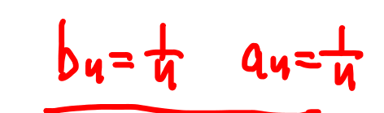
	[017](bookxnotepro://opennote/?nb={eaae9369-1988-4e39-8c00-ce441fc1deb4}&book=d75c72e7b77289534b29d34dc209cef7&page=16&x=534&y=161&id=19814&uuid=dd0907a5fc49c410d883537524447cec)
	经常被举: 本身不收敛，平方收敛、相乘收敛
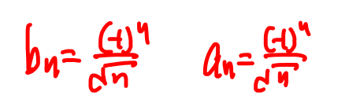
	[017](bookxnotepro://opennote/?nb={eaae9369-1988-4e39-8c00-ce441fc1deb4}&book=d75c72e7b77289534b29d34dc209cef7&page=16&x=586&y=99&id=19549&uuid=1c2be1d081f4dae809e2eaad195c53f2)
	本身收敛、绝对值不收敛、相乘不收敛
	==一个偶然收敛的式子（条件收敛），去掉正负号就不太行了==
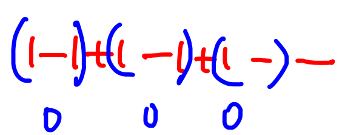
	[018](bookxnotepro://opennote/?nb={eaae9369-1988-4e39-8c00-ce441fc1deb4}&book=d75c72e7b77289534b29d34dc209cef7&page=17&x=651&y=168&id=19816&uuid=14cc71f5f193dd98c32e2e4d6c1ac104)
	加括号

### 正项级数
[009](bookxnotepro://opennote/?nb={eaae9369-1988-4e39-8c00-ce441fc1deb4}&book=d75c72e7b77289534b29d34dc209cef7&page=8&x=129&y=91&id=19791&uuid=b5171ccccd380b6fc66b951fca235ee3)

判断方法：
- 比较法 [[第十章 无穷级数#^xh0ke0|通项比较]] [[第十章 无穷级数#^cae5pn|极限比较]]
	- 比值根植用不了可以尝试
	- $n^p,\ln n$
- [[第十章 无穷级数#^zlq3ja|比值根值法]]
	- 三巨头 $a^n,n!,n^n$
		- 阶乘——比值
		- 剩下两个——都行，根值比较方便
	- 方便，自己和自己
	- 很多明显的不收敛，无法判断
- [[第十章 无穷级数#^jb1nnq|定义法]]，以及[[第十章 无穷级数#^9enwlu|性质]]，前两种不行了可以尝试
- [[第十章 无穷级数#^gh44ca|积分判别法]] ^7ljjy6

	[009](bookxnotepro://opennote/?nb={eaae9369-1988-4e39-8c00-ce441fc1deb4}&book=d75c72e7b77289534b29d34dc209cef7&page=8&x=296&y=157&id=19792&uuid=ba87c0f4d53784ceba9d8900ac4ac3b3)
	n 项和单调递增（不减）——级数收敛和 n 项和有上届充要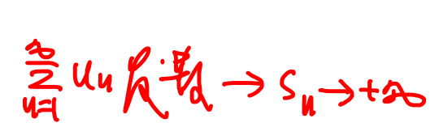
	[009](bookxnotepro://opennote/?nb={eaae9369-1988-4e39-8c00-ce441fc1deb4}&book=d75c72e7b77289534b29d34dc209cef7&page=8&x=732&y=275&id=19433&uuid=c7e06821100835cf3d458762451d6c39)
	发散则 n 项和趋于无穷
	基本定理
	 ^jb1nnq

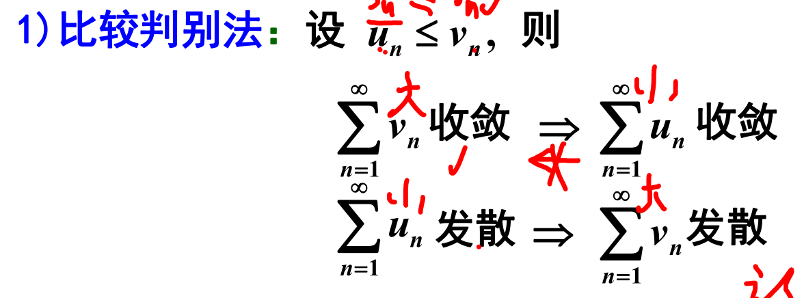
	[009](bookxnotepro://opennote/?nb={eaae9369-1988-4e39-8c00-ce441fc1deb4}&book=d75c72e7b77289534b29d34dc209cef7&page=8&x=280&y=290&id=19795&uuid=164f3c47677e34d84925e2efc38f409c)
	比较判别法，比每一项通式
	1. 需要初步判断——收敛还是发散
	2. 在无穷远处[[放缩]]
	 ^xh0ke0

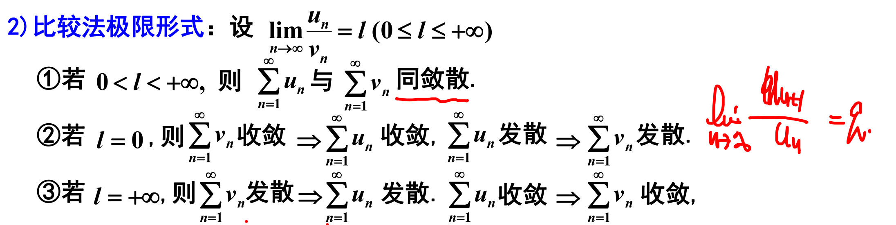
	[010](bookxnotepro://opennote/?nb={eaae9369-1988-4e39-8c00-ce441fc1deb4}&book=d75c72e7b77289534b29d34dc209cef7&page=9&x=469&y=114&id=19794&uuid=b6a6e35576ed395f7451a356bfcbad1d)
	比较法极限形式——两个函数比
	注意：可以判断同收敛形式
	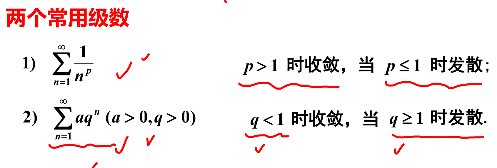
	[010](bookxnotepro://opennote/?nb={eaae9369-1988-4e39-8c00-ce441fc1deb4}&book=d75c72e7b77289534b29d34dc209cef7&page=9&x=385&y=346&id=19796&uuid=e2d7b9bc5610a7d67f5f44c59bf6037f)
	常用级数——目前是正向级数
	 ^cae5pn

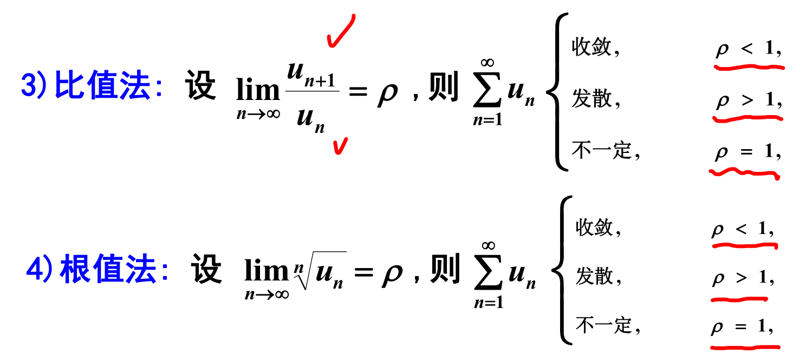
	[011](bookxnotepro://opennote/?nb={eaae9369-1988-4e39-8c00-ce441fc1deb4}&book=d75c72e7b77289534b29d34dc209cef7&page=10&x=316&y=143&id=19797&uuid=cdeddaa3850248b65313fe5e32eb6d65)
	比值法和根值法
	自己和自己比，和 1 比。
	比值等于 1 时，不确定
	 ^zlq3ja

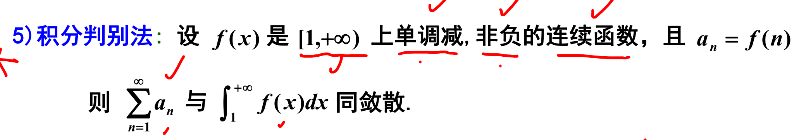
	[012](bookxnotepro://opennote/?nb={eaae9369-1988-4e39-8c00-ce441fc1deb4}&book=d75c72e7b77289534b29d34dc209cef7&page=11&x=441&y=91&id=19798&uuid=eeaa0ade3b7f174566989bc9a61a9267)
	积分判别法——积分收敛
	1. \[1, 闭区间，从哪里开始求和，从哪里开始
	2. 单调减少
	举例：  [012](bookxnotepro://opennote/?nb={eaae9369-1988-4e39-8c00-ce441fc1deb4}&book=d75c72e7b77289534b29d34dc209cef7&page=11&x=373&y=207&id=19799&uuid=9b91b2ae2144f8473a081dd403683617)
	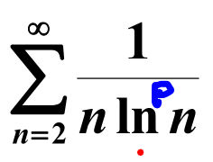
	[012](bookxnotepro://opennote/?nb={eaae9369-1988-4e39-8c00-ce441fc1deb4}&book=d75c72e7b77289534b29d34dc209cef7&page=11&x=250&y=382&id=19800&uuid=4e8f1d10a99c69f1d67fa5c03f68ca65)
	 ^gh44ca

### 交错级数
属于[[第十章 无穷级数#任意项级数|任意项级数]]
[013](bookxnotepro://opennote/?nb={eaae9369-1988-4e39-8c00-ce441fc1deb4}&book=d75c72e7b77289534b29d34dc209cef7&page=12&x=117&y=37&id=19801&uuid=bc4f064c4c52cc5473acc8a997b72017)

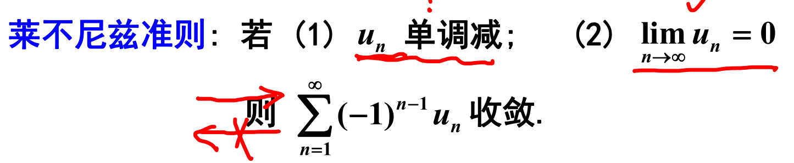
	[013](bookxnotepro://opennote/?nb={eaae9369-1988-4e39-8c00-ce441fc1deb4}&book=d75c72e7b77289534b29d34dc209cef7&page=12&x=337&y=134&id=19802&uuid=7a50c49fc7275a965403d6dde13ad5f5) 莱布尼兹
	充分条件
	$u_n$看作绝对值
	反例，锯齿装递减： 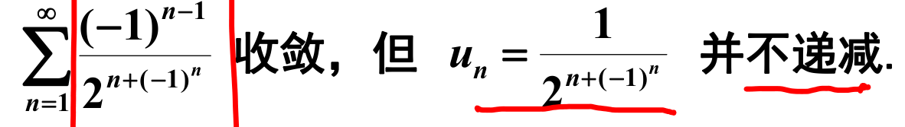  [013](bookxnotepro://opennote/?nb={eaae9369-1988-4e39-8c00-ce441fc1deb4}&book=d75c72e7b77289534b29d34dc209cef7&page=12&x=353&y=316&id=19808&uuid=ff029598cc2dbd25f9ae0a054ba09ed2)
	属于[[第十章 无穷级数#任意项级数|任意项级数]]，加绝对值分析，收敛。 ^coejns

### 任意项级数
这种，加绝对值化为正项问题
[014](bookxnotepro://opennote/?nb={eaae9369-1988-4e39-8c00-ce441fc1deb4}&book=d75c72e7b77289534b29d34dc209cef7&page=13&x=116&y=27&id=19803&uuid=cb74576e71fad76e462d009ddde07832) ^66oygz

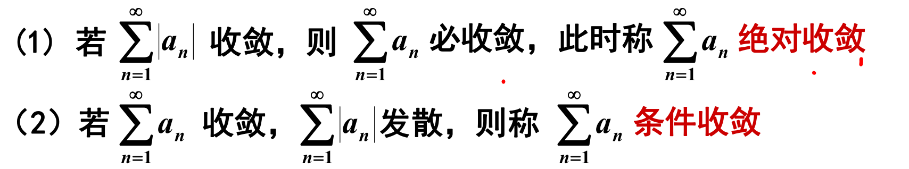
	[014](bookxnotepro://opennote/?nb={eaae9369-1988-4e39-8c00-ce441fc1deb4}&book=d75c72e7b77289534b29d34dc209cef7&page=13&x=403&y=169&id=19805&uuid=1c737985a541d04fe8b1e6804467ca2b)
	绝对收敛与条件收敛概念 [014](bookxnotepro://opennote/?nb={eaae9369-1988-4e39-8c00-ce441fc1deb4}&book=d75c72e7b77289534b29d34dc209cef7&page=13&x=195&y=78&id=19804&uuid=d60e651d9f9ab6ff7fc2b18ca79c8b3d) ^3d5f0e

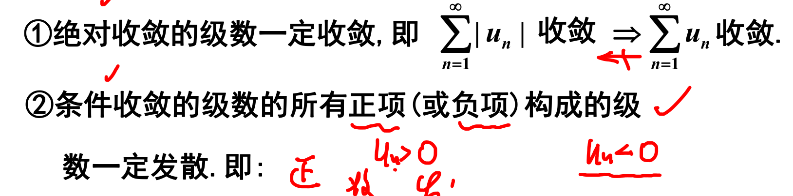
	[014](bookxnotepro://opennote/?nb={eaae9369-1988-4e39-8c00-ce441fc1deb4}&book=d75c72e7b77289534b29d34dc209cef7&page=13&x=359&y=366&id=19806&uuid=52d7bda3a2c0d0b45913820835ae5847)
	1. 绝对收敛一定收敛；**收敛**==不==能推**绝对值收敛**——条件收敛
	2. ==条件收敛是正负两个不收敛的级数累积起来的==：证明
		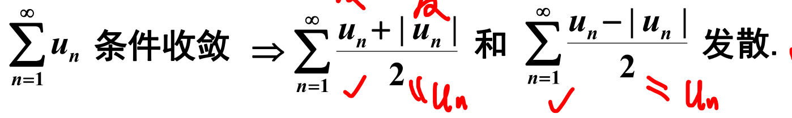
	[014](bookxnotepro://opennote/?nb={eaae9369-1988-4e39-8c00-ce441fc1deb4}&book=d75c72e7b77289534b29d34dc209cef7&page=13&x=366&y=486&id=19807&uuid=2f8285915de846875b88236c99a5c55c)
	这个式子[[特殊结构]]，排除所有小于 0 的项 ^b5012a

# 幂级数
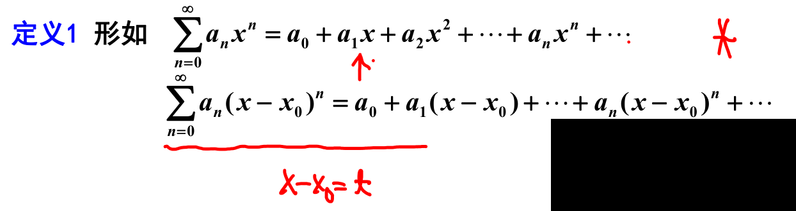
	[003](bookxnotepro://opennote/?nb={eaae9369-1988-4e39-8c00-ce441fc1deb4}&book=ea8fea145241c9812323f9119a3c9c0f&page=2&x=375&y=204&id=19817&uuid=3d4f4888960a10aca7a0ac28512fb738)
	幂级数定义
	一般下面的形式可以转化为上面的形式

## 收敛半径、收敛区间、收敛域

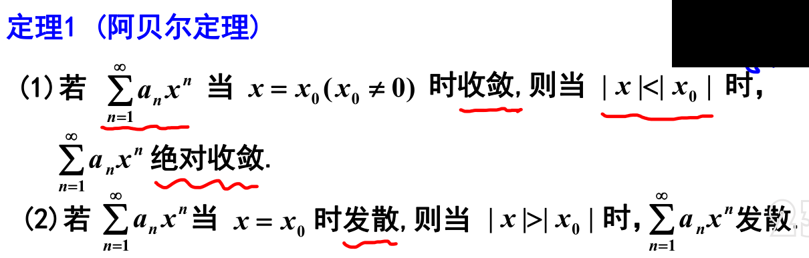
	[003](bookxnotepro://opennote/?nb={eaae9369-1988-4e39-8c00-ce441fc1deb4}&book=ea8fea145241c9812323f9119a3c9c0f&page=2&x=373&y=433&id=19818&uuid=66d218f29617e3f5af14069a9c5dc1e1)
	阿贝尔定理，针对的是 $x^n$，而不是 $(x-x_0)^n$

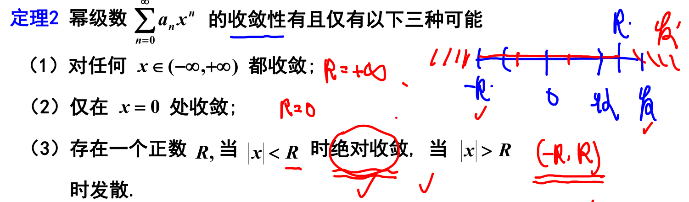
	[004](bookxnotepro://opennote/?nb={eaae9369-1988-4e39-8c00-ce441fc1deb4}&book=ea8fea145241c9812323f9119a3c9c0f&page=3&x=454&y=133&id=19819&uuid=fd234f94866a258edd9fd674759cd48a)
	幂级数至少收敛于 0——必然了，每一项都为 0，必然收敛

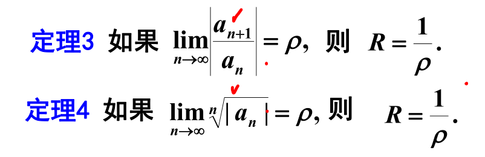
	[005](bookxnotepro://opennote/?nb={eaae9369-1988-4e39-8c00-ce441fc1deb4}&book=ea8fea145241c9812323f9119a3c9c0f&page=4&x=277&y=78&id=19820&uuid=2ae06c54cdc622875360dcefcac7e450)
	 求幂级数收敛半径
	 只处理系数——取绝对值

## 幂级数的性质

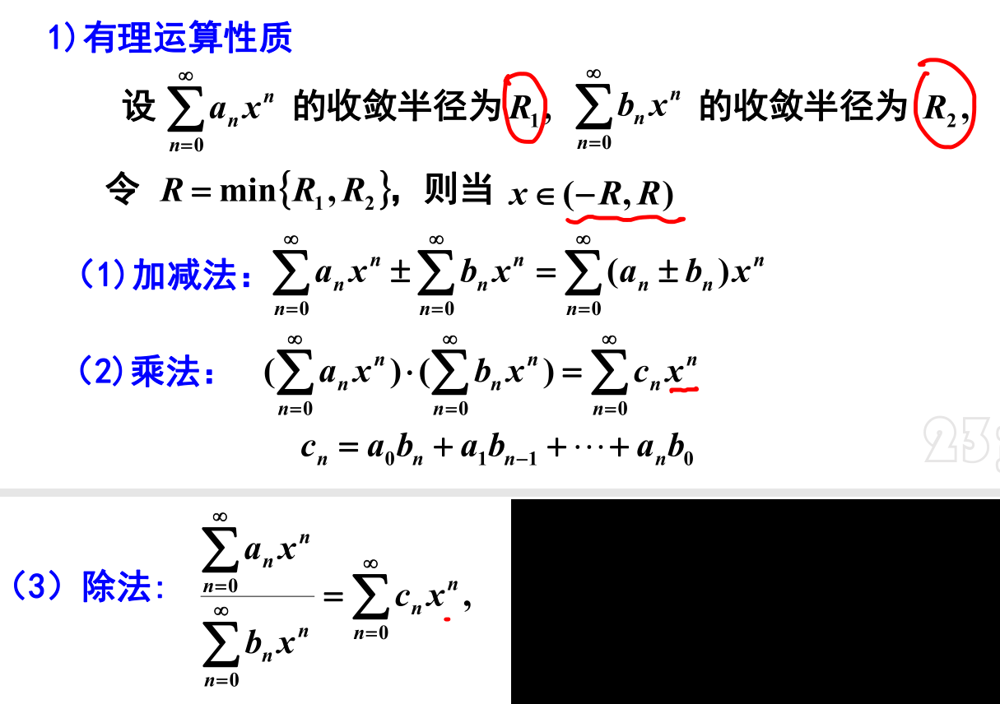
	[005](bookxnotepro://opennote/?nb={eaae9369-1988-4e39-8c00-ce441fc1deb4}&book=ea8fea145241c9812323f9119a3c9c0f&page=4&x=391&y=447&id=19821&uuid=64ede7acbec2d4b340f1b2ba150672e9)
	四则运算：在收敛区间的公共部分做加减乘除
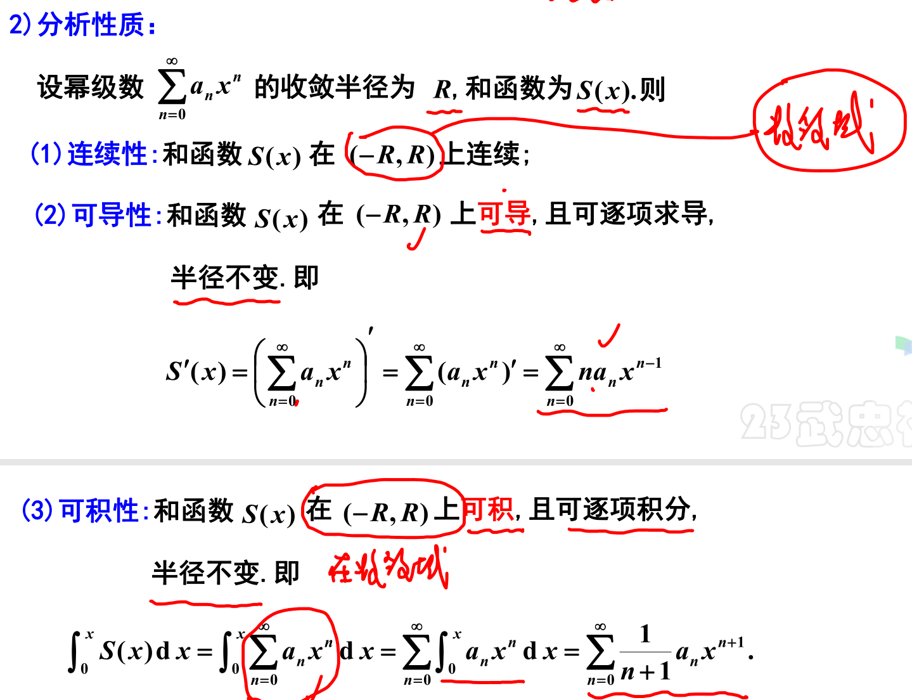
	[006](bookxnotepro://opennote/?nb={eaae9369-1988-4e39-8c00-ce441fc1deb4}&book=ea8fea145241c9812323f9119a3c9c0f&page=5&x=428&y=443&id=19823&uuid=7a0ef54859fe85ceac35aeb35ed14fb4)
	1. 幂级数和函数在收敛区间连续——可以改成收敛域上连续，不过求导不能改成收敛于上可导，微分可以。
	2. 和函数可以求任意阶导数
		- 半径不变，因为求出来仍是一个幂级数——乘 n 不影响收敛半径
	3. 这里用变上限定积分
		- 变限积分没有未知常数，如果用不定积分就得确定常数
		- 除以 n 也不影响收敛半径
	幂级数的分析性质
	 ^ubbrhl

## 函数的幂级数展开

- 直接法 [010](bookxnotepro://opennote/?nb={eaae9369-1988-4e39-8c00-ce441fc1deb4}&book=ea8fea145241c9812323f9119a3c9c0f&page=9&x=117&y=89&id=19829&uuid=c870e9c46297d41d44f58f0acdcc3d2f)
	- 求各阶导数——准备列泰勒
	- 证明余项趋于 0
- 间接展开法 [010](bookxnotepro://opennote/?nb={eaae9369-1988-4e39-8c00-ce441fc1deb4}&book=ea8fea145241c9812323f9119a3c9c0f&page=9&x=146&y=350&id=19830&uuid=ef7c6be0309491d38d8ec10c27ef06ff)
	- 从某些已知函数的展开式出发[[第十章 无穷级数#^3879hz]]
	- 利用幂级数的性质[[第十章 无穷级数#^ubbrhl]]
		- 四则运算
		- 逐项求导
		- 逐项积分

### 定理
定理 1 [007](bookxnotepro://opennote/?nb={eaae9369-1988-4e39-8c00-ce441fc1deb4}&book=ea8fea145241c9812323f9119a3c9c0f&page=6&x=92&y=299&id=19825&uuid=78a0b2c2c9923fcf92059565cf60d733)
泰勒展开是唯一的

定理 2 [008](bookxnotepro://opennote/?nb={eaae9369-1988-4e39-8c00-ce441fc1deb4}&book=ea8fea145241c9812323f9119a3c9c0f&page=7&x=71&y=33&id=19826&uuid=8f52e1164e77745d99b86415f044a67b)
[[泰勒]]展开后，余项极限为 0，则可以用幂级数拟合和函数的收敛部分——cdc：和函数在其他地方是发散的，取不到

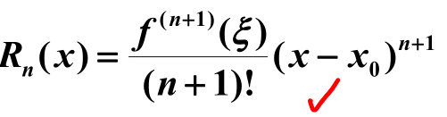
	[008](bookxnotepro://opennote/?nb={eaae9369-1988-4e39-8c00-ce441fc1deb4}&book=ea8fea145241c9812323f9119a3c9c0f&page=7&x=256&y=156&id=19827&uuid=b3cff73a9c0c0392267a22361ca19c1a)
	余项

### 常见公式

几个常用的展开式 [009](bookxnotepro://opennote/?nb={eaae9369-1988-4e39-8c00-ce441fc1deb4}&book=ea8fea145241c9812323f9119a3c9c0f&page=8&x=133&y=35&id=19828&uuid=d151b7d5fc74bc08b2a69033649849ca)
![[Pasted image 20221103153528.png]]
[[@记忆]]
这里 x 可替换为 $x-x_0$ 、$x^2$ 之类——因为是 x-0=x 的级数
注意范围代换，注意标出收敛范围
^3879hz

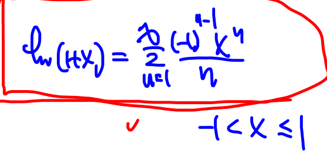
	[019](bookxnotepro://opennote/?nb={eaae9369-1988-4e39-8c00-ce441fc1deb4}&book=ea8fea145241c9812323f9119a3c9c0f&page=18&x=775&y=173&id=19845&uuid=6949e1a8874ef45e7187d28a11d2f62a)
	

# 傅里叶级数

## 傅里叶系数与傅里叶级数
## 收敛定理狄利克雷函数
## 展开为傅里叶级数

# 杂七杂八

[[第五章 定积分及其应用#广义积分#区间无限]]中似乎汤家凤没提 ![[Pasted image 20221027150643.png]] 这个 p 函数

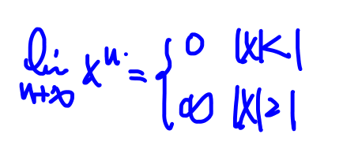
	[012](bookxnotepro://opennote/?nb={eaae9369-1988-4e39-8c00-ce441fc1deb4}&book=ea8fea145241c9812323f9119a3c9c0f&page=11&x=828&y=68&id=19604&uuid=d9cb6f73a8896b9ec9a4b6b217eee064)
	无论正负

![[Pasted image 20221027223531.png]]
绝对值收敛 -> 平方收敛——证明：趋于无穷时小于 1，平方更小
收敛则不能推平方收敛——比如交错级数：+-调和级数 $\frac{(-1)^n}{\sqrt{n}}$

	[017](bookxnotepro://opennote/?nb={eaae9369-1988-4e39-8c00-ce441fc1deb4}&book=d75c72e7b77289534b29d34dc209cef7&page=16&x=800&y=206&id=19551&uuid=a2e31bd7b2cfc5818d89c58216938628)
	bn 是收敛的**正向**级数时，乘一个趋向于 0 的序列（可正负交错），收敛
	不是正向级数则不可以 [017](bookxnotepro://opennote/?nb={eaae9369-1988-4e39-8c00-ce441fc1deb4}&book=d75c72e7b77289534b29d34dc209cef7&page=16&x=235&y=92&id=19552&uuid=c614b475b1da30b97138886010bd2c09)

# [[第十章习题]]