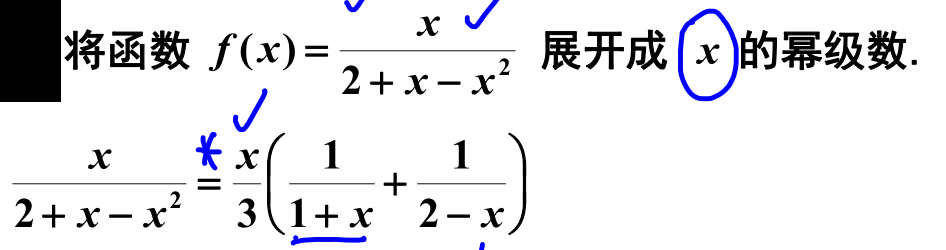
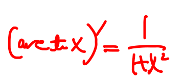
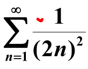
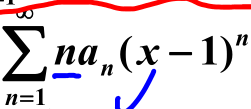

# 重点题型讲解

## 常数项级数
### 常数项级数敛散性的判定

	[015](bookxnotepro://opennote/?nb={eaae9369-1988-4e39-8c00-ce441fc1deb4}&book=d75c72e7b77289534b29d34dc209cef7&page=14&x=504&y=266&id=19809&uuid=e70f8e66ce2cdd1dd34b42796de51961)
	判断是否发散
	
	[015](bookxnotepro://opennote/?nb={eaae9369-1988-4e39-8c00-ce441fc1deb4}&book=d75c72e7b77289534b29d34dc209cef7&page=14&x=644&y=267&id=19529&uuid=c969098b6f67ca73641090579508a051)
	趋向于极限时，可以用[[第一章 极限与连续#等价无穷小]]替换

## 幂级数
### 求收敛半径、收敛区间及收敛域

	[013](bookxnotepro://opennote/?nb={eaae9369-1988-4e39-8c00-ce441fc1deb4}&book=ea8fea145241c9812323f9119a3c9c0f&page=12&x=422&y=43&id=19835&uuid=43888ad5b80b698d9d4c31f384d4d17a) 
	奇数项——缺项
	缺项直接用公式，再==对结果开方==，相当于把 $x^2$ 当做x
	
	对结果开方，最后一步一定要开平方！！

	[015](bookxnotepro://opennote/?nb={eaae9369-1988-4e39-8c00-ce441fc1deb4}&book=ea8fea145241c9812323f9119a3c9c0f&page=14&x=389&y=74&id=19838&uuid=1062fb4c57b7802a859c1b44d686a89b)
	阿贝尔定理求判断收敛域——尤其是系数没给的抽象级数，不能用系数算半径
	[[第十章习题#^3t2e4b|另一个阿贝尔定理的题]]

### 将函数展开为幂级数
我甚至感觉只要在题目里找到一个可以用公式的，就能处理

	[017](bookxnotepro://opennote/?nb={eaae9369-1988-4e39-8c00-ce441fc1deb4}&book=ea8fea145241c9812323f9119a3c9c0f&page=16&x=416&y=137&id=19842&uuid=e3dec31cb09969bb3e2ddbdd609cac8a)
	分式主要用 

	[018](bookxnotepro://opennote/?nb={eaae9369-1988-4e39-8c00-ce441fc1deb4}&book=ea8fea145241c9812323f9119a3c9c0f&page=17&x=345&y=62&id=19844&uuid=4f85c2b869d9d5b8bd79159da1090e49)
	再 x-1 出展开，换元 [[第十章 无穷级数#^3879hz]]

	[019](bookxnotepro://opennote/?nb={eaae9369-1988-4e39-8c00-ce441fc1deb4}&book=ea8fea145241c9812323f9119a3c9c0f&page=18&x=399&y=100&id=19658&uuid=bec76c8c71b227f217e9c2b342096bd0)
	用对数的性质拆开，再展开[[第十章 无穷级数#^3879hz]]

展开 sin 函数 [020](bookxnotepro://opennote/?nb={eaae9369-1988-4e39-8c00-ce441fc1deb4}&book=ea8fea145241c9812323f9119a3c9c0f&page=19&x=49&y=39&id=19846&uuid=2e06dcda014e89a104df6e66aa80c822)

	[021](bookxnotepro://opennote/?nb={eaae9369-1988-4e39-8c00-ce441fc1deb4}&book=ea8fea145241c9812323f9119a3c9c0f&page=20&x=344&y=39&id=19847&uuid=9ab23a7519914f56dc0eb62a95476842)
	
	[021](bookxnotepro://opennote/?nb={eaae9369-1988-4e39-8c00-ce441fc1deb4}&book=ea8fea145241c9812323f9119a3c9c0f&page=20&x=758&y=64&id=19848&uuid=88ada7c9fb02bffa4378a037210defbb)
	没有[[第十章 无穷级数#^3879hz|公式]]的可以构造
	
	[021](bookxnotepro://opennote/?nb={eaae9369-1988-4e39-8c00-ce441fc1deb4}&book=ea8fea145241c9812323f9119a3c9c0f&page=20&x=256&y=127&id=19849&uuid=039774bd22d2f7dde6201bbe6c1d9338)
	这个式子不一定要拆，也可把 $x^4$ 换成 $t^2$。

### 级数求和
注意取不到的部分
级数求和 [022](bookxnotepro://opennote/?nb={eaae9369-1988-4e39-8c00-ce441fc1deb4}&book=ea8fea145241c9812323f9119a3c9c0f&page=21&x=361&y=35&id=19850&uuid=12703c01b541402b762fd01911674da0)

	[022](bookxnotepro://opennote/?nb={eaae9369-1988-4e39-8c00-ce441fc1deb4}&book=ea8fea145241c9812323f9119a3c9c0f&page=21&x=270&y=358&id=19675&uuid=a8a646c2791cbb9e64513627c6fcee8f)
	积分消 n——注意这么表示，相当于积分提到 d 后面 [[第四章 不定积分#不定积分基本公式]]

## 傅里叶级数

### 有关收敛定理 (迪利克雷) 的问题

傅里叶级数不一定收敛到 f (x)——根据迪利克雷计算 [011](bookxnotepro://opennote/?nb={eaae9369-1988-4e39-8c00-ce441fc1deb4}&book=fc6371d1fa9480dfd7b2bcaf96ce46da&page=10&x=691&y=237&id=19746&uuid=16775091af0b187498335250bdab5b65)

![[Pasted image 20221103220539.png]]
[012](bookxnotepro://opennote/?nb={eaae9369-1988-4e39-8c00-ce441fc1deb4}&book=fc6371d1fa9480dfd7b2bcaf96ce46da&page=11&x=51&y=33&id=19860&uuid=413ddc4295883553f094a5ecf3e6ce6c)
由结构分析，发现法线本例子是做奇延拓展开的——因为里面只有正弦项——有点怪，叫人去发现 [012](bookxnotepro://opennote/?nb={eaae9369-1988-4e39-8c00-ce441fc1deb4}&book=fc6371d1fa9480dfd7b2bcaf96ce46da&page=11&x=737&y=38&id=19748&uuid=16b71f8f362e6ae6b73508076897d684)

### 将函数展开为傅里叶级数

将函数展为傅里叶级数 [013](bookxnotepro://opennote/?nb={eaae9369-1988-4e39-8c00-ce441fc1deb4}&book=fc6371d1fa9480dfd7b2bcaf96ce46da&page=12&x=345&y=46&id=19861&uuid=6d627c0264011758dc9e5dcfc4925022)

![[Pasted image 20221103221957.png]]
[014](bookxnotepro://opennote/?nb={eaae9369-1988-4e39-8c00-ce441fc1deb4}&book=fc6371d1fa9480dfd7b2bcaf96ce46da&page=13&x=46&y=27&id=19863&uuid=ccf35fe76f1348ce95dbe8607cb0267d)

# 一些细节

分析边界的收敛性？为什么之前不分析？ [021](bookxnotepro://opennote/?nb={eaae9369-1988-4e39-8c00-ce441fc1deb4}&book=ea8fea145241c9812323f9119a3c9c0f&page=20&x=648&y=504&id=19670&uuid=9e51fc92318238e3133a6d720540a404)
[[@听讲]] 怎么看有的收敛域分析边界，有的不分析，算了，以后都分析吧

# 处理方法

$$
\lim_{n\to +\infty}\sqrt[n]{n}=1
$$
常见结论

	[015](bookxnotepro://opennote/?nb={eaae9369-1988-4e39-8c00-ce441fc1deb4}&book=d75c72e7b77289534b29d34dc209cef7&page=14&x=490&y=137&id=19534&uuid=55f0a6b98d62a4e5a4ff70cb8c021eb8)
	这个极限为 1
	但
	[015](bookxnotepro://opennote/?nb={eaae9369-1988-4e39-8c00-ce441fc1deb4}&book=d75c72e7b77289534b29d34dc209cef7&page=14&x=897&y=467&id=19531&uuid=3be1abcf6b0c55a746b2d64b1a507710)
	p 不能为变量 n，结果不为 1

	[015](bookxnotepro://opennote/?nb={eaae9369-1988-4e39-8c00-ce441fc1deb4}&book=d75c72e7b77289534b29d34dc209cef7&page=14&x=399&y=452&id=19810&uuid=cdf789aef175453b17061e435a818147)
	拆，常见方法

	[016](bookxnotepro://opennote/?nb={eaae9369-1988-4e39-8c00-ce441fc1deb4}&book=d75c72e7b77289534b29d34dc209cef7&page=15&x=373&y=270&id=19812&uuid=7ef57c3b31f3752d88646109ea07dc5b)
	 
	[016](bookxnotepro://opennote/?nb={eaae9369-1988-4e39-8c00-ce441fc1deb4}&book=d75c72e7b77289534b29d34dc209cef7&page=15&x=394&y=360&id=19811&uuid=fb013063cb22e65b239a5481c3ed38c6)
	1. 极限存在，等于 0 或等于常数
	2. 将放到 $n^p$ 放下来，变成 [[第十章 无穷级数#^cae5pn|常用级数]]

	[016](bookxnotepro://opennote/?nb={eaae9369-1988-4e39-8c00-ce441fc1deb4}&book=d75c72e7b77289534b29d34dc209cef7&page=15&x=375&y=203&id=19543&uuid=58d6b1e6bbbb1aef2502d4aaf8eceed8)
	先可以把 $n^p$ 放到分母
	翻译一下：甲收敛，乙收敛，极限值的比值一定存在
	有时也要借助逆否命题
	反例：
	[016](bookxnotepro://opennote/?nb={eaae9369-1988-4e39-8c00-ce441fc1deb4}&book=d75c72e7b77289534b29d34dc209cef7&page=15&x=805&y=196&id=19545&uuid=741f503dd45af364ba9ff184ef4d9f4a)
	因为 ln 比 n 增的慢，容易配出无穷
	之所以是平方，公式方便求积分，[[第十章 无穷级数#^7ljjy6|积分判别法]]可证明收敛
	 ^1rhaqd

	[017](bookxnotepro://opennote/?nb={eaae9369-1988-4e39-8c00-ce441fc1deb4}&book=d75c72e7b77289534b29d34dc209cef7&page=16&x=327&y=73&id=19552&uuid=c614b475b1da30b97138886010bd2c09)
	==一个偶然收敛的式子（[[第十章 无穷级数#^b5012a|条件收敛]]，正负相抵），去掉正负号就不太行了==
	

	[006](bookxnotepro://opennote/?nb={eaae9369-1988-4e39-8c00-ce441fc1deb4}&book=ea8fea145241c9812323f9119a3c9c0f&page=5&x=564&y=95&id=19578&uuid=a1a06654a3573475b95f262287a0750e)
	这个一般方法求不出来，可用幂级数展开来求

	[012](bookxnotepro://opennote/?nb={eaae9369-1988-4e39-8c00-ce441fc1deb4}&book=ea8fea145241c9812323f9119a3c9c0f&page=11&x=531&y=206&id=19832&uuid=ab4cee276b8d2ce330febb88a8d7c23e)
	上下同除 e 的 n 次方，积累一下

	[012](bookxnotepro://opennote/?nb={eaae9369-1988-4e39-8c00-ce441fc1deb4}&book=ea8fea145241c9812323f9119a3c9c0f&page=11&x=597&y=440&id=19833&uuid=213db52939cb74f1dc0ea5e89ad78dc5)
	从根号中提常数 e，基本功积累

	[013](bookxnotepro://opennote/?nb={eaae9369-1988-4e39-8c00-ce441fc1deb4}&book=ea8fea145241c9812323f9119a3c9c0f&page=12&x=306&y=148&id=19836&uuid=9214749638f101971d30f30255170813)
	绝对值大的数带有负号——提取负号，提出根号，消掉，让绝对值小的数带正负号

	[014](bookxnotepro://opennote/?nb={eaae9369-1988-4e39-8c00-ce441fc1deb4}&book=ea8fea145241c9812323f9119a3c9c0f&page=13&x=349&y=477&id=19624&uuid=13cc4fb85c668bbe8bcb66a922e75a38)
	若用[[第十章 无穷级数#^coejns|莱布尼兹]]，但是证明单调减比较困难——试试拆项
	为什么加减拆项？提出负号后，拆项会从下面引来 $(-2)^x$ 的正负号，可以消掉 $(-1)^n$ ——提分母负号-1、拆项（为了变正向级数），其中复杂的部分变成正向级数。

	[024](bookxnotepro://opennote/?nb={eaae9369-1988-4e39-8c00-ce441fc1deb4}&book=ea8fea145241c9812323f9119a3c9c0f&page=23&x=380&y=245&id=19851&uuid=f72452408e57c157bb5a0b16afea28b5)
	不连贯可以拆成两项

	[024](bookxnotepro://opennote/?nb={eaae9369-1988-4e39-8c00-ce441fc1deb4}&book=ea8fea145241c9812323f9119a3c9c0f&page=23&x=519&y=327&id=19852&uuid=73095a1b4c766ff569a498aa789c99d8)
	这种分式求高阶导，经常拆分式，算的快

	[025](bookxnotepro://opennote/?nb={eaae9369-1988-4e39-8c00-ce441fc1deb4}&book=ea8fea145241c9812323f9119a3c9c0f&page=24&x=266&y=37&id=19853&uuid=15ab75179bd07b0d645a6c91c541763d)
	可以用 x 求导消 n，但慢，还有两个积分
	拆开再用[[第十章 无穷级数#^l1i2r2]]
		- 拆分母，用 ln 的公式，这个比较特殊，原方程为二阶，可以拆开的两个分母丢失一阶的，所以分子没有 n
		- [[自然限定的范围]] ：幂级数凑导数时，乘除 x 的时候，会出现 $\frac{1}{x}$ ，==需要考虑 $x=0$ 的情况==
		- 
			结果要分段讨论 （**极限逼近不能取 0 和 1 的值即可**），尤其是 
$x=0$ 以及结果[[第十章 无穷级数#常见公式|常见公式]]不包括的部分 $x=1$

	[014](bookxnotepro://opennote/?nb={eaae9369-1988-4e39-8c00-ce441fc1deb4}&book=fc6371d1fa9480dfd7b2bcaf96ce46da&page=13&x=400&y=357&id=19862&uuid=22f6e94c1b4f08d0d96544fecc69000a)
	继续化简注意：若取偶数，就为 1，**消掉偶数项** 

	[014](bookxnotepro://opennote/?nb={eaae9369-1988-4e39-8c00-ce441fc1deb4}&book=fc6371d1fa9480dfd7b2bcaf96ce46da&page=13&x=367&y=471&id=19765&uuid=f120b916342a107002168e2a7cf4284d)
	知奇求全部、知奇求偶
		因为这个式子偶数项比较特殊，可提出 2，变成原方程的一半，可以当作 I，等式两边
	

	[052](bookxnotepro://opennote/?nb={4b0b849c-f284-459f-9b9c-e14b0ecf8ba2}&book=4f1972a39d8f1176257957a09d832b75&page=51&x=109&y=285&id=136&uuid=372cfc5c95ae912851c5454ab754de12)
	这种都算 [[第十章 无穷级数#任意项级数|任意项级数]]求绝对值做!！

# 反直觉

	[018](bookxnotepro://opennote/?nb={eaae9369-1988-4e39-8c00-ce441fc1deb4}&book=d75c72e7b77289534b29d34dc209cef7&page=17&x=276&y=98&id=19815&uuid=e5bfd9b95d144a8f035e66635826055f)
	这个居然是 [[第十章 无穷级数#^9enwlu|加括号]] 的一种描述

	[012](bookxnotepro://opennote/?nb={eaae9369-1988-4e39-8c00-ce441fc1deb4}&book=ea8fea145241c9812323f9119a3c9c0f&page=11&x=749&y=378&id=19834&uuid=b3818475e481a9a4703ed36200fda617)
	不用画根号图，而是直接 1/n 趋向于 0

	[052](bookxnotepro://opennote/?nb={4b0b849c-f284-459f-9b9c-e14b0ecf8ba2}&book=4f1972a39d8f1176257957a09d832b75&page=51&x=316&y=316&id=137&uuid=366a605c0acab2e84b9750cf66906b13)
	- 系数 $\frac{1}{n\ln n}$ 虽然发散，但只代表 x=1 处发散，所以仍然可算收敛周期，所以这里的收敛周期为（-1，1）
	- 幂级数两个系数相加，可以用加法，区间的叠加
	

	[052](bookxnotepro://opennote/?nb={4b0b849c-f284-459f-9b9c-e14b0ecf8ba2}&book=4f1972a39d8f1176257957a09d832b75&page=51&x=195&y=501&id=139&uuid=bfae70818d4cc0ddd773e24816a4cd09)
	
	[144](bookxnotepro://opennote/?nb={4b0b849c-f284-459f-9b9c-e14b0ecf8ba2}&book=4db326750425a2eac028b50acbc37456&page=143&x=278&y=272&id=140&uuid=68887abeb207a3b00332057cdbd39ee3)
	sin 里的 $\frac{\pi}{2}$ 不要忘了。[[第十章 无穷级数#^3879hz|原公式]] 是没有 $\pi$ 的

# 习题积累

	[016](bookxnotepro://opennote/?nb={eaae9369-1988-4e39-8c00-ce441fc1deb4}&book=ea8fea145241c9812323f9119a3c9c0f&page=15&x=303&y=107&id=19839&uuid=01d7388879ada2ff395baf21d2d48353)
	一道阿贝尔定理的题
	条件收敛，则 x=1 是 x 的幂级数的一个端点
	
	[016](bookxnotepro://opennote/?nb={eaae9369-1988-4e39-8c00-ce441fc1deb4}&book=ea8fea145241c9812323f9119a3c9c0f&page=15&x=273&y=93&id=19840&uuid=1a0669c25c443268f699e88a14847db5)
	序列乘 n 收敛区间不改变 [[第十章 无穷级数#^ubbrhl]]
	 ^3t2e4b

	[052](bookxnotepro://opennote/?nb={4b0b849c-f284-459f-9b9c-e14b0ecf8ba2}&book=4f1972a39d8f1176257957a09d832b75&page=51&x=181&y=76&id=126&uuid=63ddba9791c361f155b1610f440db7d1)
	
	[139](bookxnotepro://opennote/?nb={4b0b849c-f284-459f-9b9c-e14b0ecf8ba2}&book=4db326750425a2eac028b50acbc37456&page=138&x=222&y=444&id=132&uuid=fdc75f540b0376727d9c6ef51e96f74f)
	- 构建夹逼放缩：极限趋近于 0 [[第一章 极限与连续#极限的性质|极限有界]] < M
	- 向着结论靠近：$e^n$ 乘过去
	- 积累： $\frac{1}{e^n}$ 一定收敛
	 ^6rkv0m