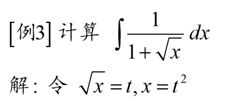
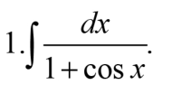
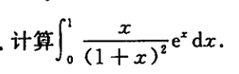

# 不定积分的概念和基本性质

	[001](bookxnotepro://opennote/?nb={34506d4e-c8f1-473b-bc76-12fbc4b6929c}&book=4a47f3469206ada9087e94173785aace&page=0&x=265&y=162&id=2515&uuid=c59a3adcbaa3ff10f0b1bc3584e35b32)
	原函数定义

连续函数一定存在原函数，反之不对  [001](bookxnotepro://opennote/?nb={34506d4e-c8f1-473b-bc76-12fbc4b6929c}&book=4a47f3469206ada9087e94173785aace&page=0&x=240&y=247&id=2516&uuid=ee1cda0a9e2b3721908f9f38f8b1cbe3)


	[001](bookxnotepro://opennote/?nb={34506d4e-c8f1-473b-bc76-12fbc4b6929c}&book=4a47f3469206ada9087e94173785aace&page=0&x=243&y=295&id=2517&uuid=1bad3789fc4ba43375b78c8fbcd04a38)
	不定积分的定义：所有原函数


# 不定积分基本公式与积分法

## 不定积分基本公式

![[Pasted image 20220829125241.png]]
[001](bookxnotepro://opennote/?nb={34506d4e-c8f1-473b-bc76-12fbc4b6929c}&book=4a47f3469206ada9087e94173785aace&page=0&x=256&y=575&id=2518&uuid=9620276a22b7241658c61b692da29ac2)
基本公式[[@记忆]]，一部分公式的推导[011](bookxnotepro://opennote/?nb={34506d4e-c8f1-473b-bc76-12fbc4b6929c}&book=4a47f3469206ada9087e94173785aace&page=10&x=101&y=84&id=2563&uuid=b8b4893e5ba6a595466006e462665a5f)
配合[[三角公式]]使用
注意ln的绝对值内值大于零，去掉绝对值

反三角函数用分部积分法做

![[Pasted image 20220829130405.png]]
[002](bookxnotepro://opennote/?nb={34506d4e-c8f1-473b-bc76-12fbc4b6929c}&book=4a47f3469206ada9087e94173785aace&page=1&x=220&y=235&id=2535&uuid=e16858416a6b5ed2b51c30c9cbdaea4a)
[[@记忆]]
平方和、平方差。这个公式比较特殊
$$\text { (8) } \int \sqrt{a^{2}-x^{2}} d x=\frac{a^{2}}{2} \arcsin \frac{x}{a}+\frac{1}{2} x \sqrt{a^{2}-x^{2}}+C$$


	[002](bookxnotepro://opennote/?nb={34506d4e-c8f1-473b-bc76-12fbc4b6929c}&book=4a47f3469206ada9087e94173785aace&page=1&x=207&y=433&id=2536&uuid=b5605d54cb959d7e7643a0b37406667d)
	满足四则

## 不定积分积分法

### 换元法

#### 第一类换元积分法
[002](bookxnotepro://opennote/?nb={34506d4e-c8f1-473b-bc76-12fbc4b6929c}&book=4a47f3469206ada9087e94173785aace&page=1&x=156&y=523&id=2538&uuid=da5a150d828b1a26edfe2ebe8b6181d7)

用于**方便计算**


	[095](bookxnotepro://opennote/?nb={82757539-2f94-4bc3-ace0-02a57aaa9f41}&book=dd575b1c384fc27331e42ad3fcdc2613&page=94&x=883&y=1354&id=10&uuid=66cdae760663b3ad1dad57e3847ccea2)
	凑微分法
	
	
	不熟悉的

#### 第二类换元积分法

##### 无理转有理

一部分无理没办法求的，无理转换为有理


	[003](bookxnotepro://opennote/?nb={34506d4e-c8f1-473b-bc76-12fbc4b6929c}&book=4a47f3469206ada9087e94173785aace&page=2&x=151&y=493&id=2542&uuid=c5334e1e338c4e84109d08221f5f7f68)
	本例中一次根号没法求

##### 三角代换


	[004](bookxnotepro://opennote/?nb={34506d4e-c8f1-473b-bc76-12fbc4b6929c}&book=4a47f3469206ada9087e94173785aace&page=3&x=158&y=129&id=2543&uuid=836cfdb9bb325f03c63aa34f5f89c803)
	[[@记忆]]也能想到

换元借助画三角
![[Pasted image 20220829152836.png]]

### 分部积分法

	[004](bookxnotepro://opennote/?nb={34506d4e-c8f1-473b-bc76-12fbc4b6929c}&book=4a47f3469206ada9087e94173785aace&page=3&x=267&y=460&id=2544&uuid=3ec804b2b0201c2e24c08ed3dc051003)

表格法：
![[_cgi-bin_mmwebwx-bin_webwxgetmsgimg__&MsgID=3568264581269758914&skey=@crypt_6593f7e6_9b00339d5ebb70ecf8ff10127bf6d09e&mmweb_appid=wx_webfilehelper.jpg]]
从原函数开始划线

#### 分部积分的妙用
```query
分部
```
#### 留幂函数

幂函数×指数函数  [004](bookxnotepro://opennote/?nb={34506d4e-c8f1-473b-bc76-12fbc4b6929c}&book=4a47f3469206ada9087e94173785aace&page=3&x=253&y=490&id=2545&uuid=8b000e2474b29fc91fbf9aed3edfaed8)

幂函数×三角函数  [005](bookxnotepro://opennote/?nb={34506d4e-c8f1-473b-bc76-12fbc4b6929c}&book=4a47f3469206ada9087e94173785aace&page=4&x=306&y=85&id=2547&uuid=3529d1ed78dbf4cb26b12f59f03f2e6c)
	消三角函数前的系数


#### 不留幂函数

幂函数×对数函数  [004](bookxnotepro://opennote/?nb={34506d4e-c8f1-473b-bc76-12fbc4b6929c}&book=4a47f3469206ada9087e94173785aace&page=3&x=301&y=602&id=2546&uuid=5c8ae291ab842249849cff2a3947cbf5)
	留下的求导，对数函数求消掉$\ln$ 

幂函数×反三角函数  [005](bookxnotepro://opennote/?nb={34506d4e-c8f1-473b-bc76-12fbc4b6929c}&book=4a47f3469206ada9087e94173785aace&page=4&x=339&y=500&id=2548&uuid=fef21325595cf1a85b31eff6320dc0a3)

#### 用I指代自己


	[006](bookxnotepro://opennote/?nb={34506d4e-c8f1-473b-bc76-12fbc4b6929c}&book=4a47f3469206ada9087e94173785aace&page=5&x=152&y=97&id=2549&uuid=373a67645835f552167b769384880e40)
	幂函数x指数函数 用I代指自己


	[006](bookxnotepro://opennote/?nb={34506d4e-c8f1-473b-bc76-12fbc4b6929c}&book=4a47f3469206ada9087e94173785aace&page=5&x=211&y=297&id=2550&uuid=f3300a7f68ec9edc00677f0a9065e95d)
1. n为奇数——抽出一个平方提到d后做分部积分，留I
2. n为偶数——$\int \sec^{2}x dx = tan + c$ 、$\int \sec x \tan x dt=\sec x + c$  、$tan^{2}+1=\sec^{2}$ 来做。

# 处理策略（有理函数和三角有理函数）

## 有理数的不定积分
### 常规做法

	[007](bookxnotepro://opennote/?nb={34506d4e-c8f1-473b-bc76-12fbc4b6929c}&book=4a47f3469206ada9087e94173785aace&page=6&x=231&y=136&id=2551&uuid=dc773fa9ed4c58c53aa3da35ee59b289)
1. 真分数化假分式——多项式除法、直接凑

2. 拆成部分和

![[Pasted image 20220829162545.png]]
![[Pasted image 20220829162446.png]]
分母高次，拆开多个，只有一个系数

1. 再分别求积分即可
- 分解不了的二阶分母
零阶常数：分母配方
一阶分子：[[#^97d7ca|分子提分母导数]]

### 非常规做法

![[第四章 不定积分#^9tiic0]]

![[第四章 不定积分#^jegsu0]]

## 无理函数的不定积分

![[第四章 不定积分#无理转有理]]

[009](bookxnotepro://opennote/?nb={34506d4e-c8f1-473b-bc76-12fbc4b6929c}&book=4a47f3469206ada9087e94173785aace&page=8&x=154&y=398&id=2556&uuid=fc849cff6e249226f703ecc0fb205e7b)

## 三角有理函数的不定积分

[万能公式](https://zh.wikipedia.org/zh-cn/%E6%AD%A3%E5%88%87%E5%8D%8A%E8%A7%92%E5%85%AC%E5%BC%8F)没考过

### 求和分母
发现都是合并成cos相关的了，可能是因为好用

![[第四章 不定积分#^aqi19q]]
有的时候和成半角，不好表示——最好用第二种
![[第四章 不定积分#^nirdqw]]

![[第四章 不定积分#^h2rwvn]]
### 拆分子
做题尽量还是先拆吧，求和分母容易变成$\frac{t}{2}$ 不容易用三角型三边还原
![[第四章 不定积分#^n45gv6]]
![[第四章 不定积分#^spt8rd]]

# [[重点题型讲解]]

## 题型一 不定积分的基本概念与性质
## 题型二 换元积分法
![[#换元法]]
## 题型 三分部积分法

![[#分部积分法]]
## 题型四 有理函数与三角有理函数的不定积分

![[#处理策略（有理函数和三角有理函数）]]

## 题型五 分段函数的积分
## 题型六 综合型不定积分

# 处理方法积累

![[Pasted image 20220829134246.png]]
[002](bookxnotepro://opennote/?nb={34506d4e-c8f1-473b-bc76-12fbc4b6929c}&book=4a47f3469206ada9087e94173785aace&page=1&x=227&y=652&id=2537&uuid=f27e8ad8ea4dfa8fea7860061ed88061)
1. 分母$2\sqrt{x}$ 
2. 对于$\sqrt{x}$ ，分母$1+x$ 可以拆成$tan x$ 的导数

![[Pasted image 20220829141157.png]]
[003](bookxnotepro://opennote/?nb={34506d4e-c8f1-473b-bc76-12fbc4b6929c}&book=4a47f3469206ada9087e94173785aace&page=2&x=258&y=111&id=2539&uuid=8d4b0c2064d0d06162895743468415ce)
分母是一个整体，不是多项式之和的形式
1. 直接配**分母括号内的**——其实仍然是**配分母的导数**，不用提分子到d后面升幂——**和提到d后面不一样**
2. 拆开分子——上下相消

![[Pasted image 20220829141654.png]]
[003](bookxnotepro://opennote/?nb={34506d4e-c8f1-473b-bc76-12fbc4b6929c}&book=4a47f3469206ada9087e94173785aace&page=2&x=257&y=204&id=2540&uuid=a515c84bffc36f967fd338676c5a8ba7)
分子**配分母的导数**的形式，提到d后 ^97d7ca


![[Pasted image 20220829144834.png]]
[003](bookxnotepro://opennote/?nb={34506d4e-c8f1-473b-bc76-12fbc4b6929c}&book=4a47f3469206ada9087e94173785aace&page=2&x=242&y=394&id=2541&uuid=1cb108843aa2928d36711359fab12381)
除下来分子有理化，就可以拆开了


	[009](bookxnotepro://opennote/?nb={34506d4e-c8f1-473b-bc76-12fbc4b6929c}&book=4a47f3469206ada9087e94173785aace&page=8&x=194&y=152&id=2554&uuid=d6dd4d290cdb498647ffe5e601db2274)
	上下乘$x^3$ 逼近——上下阶数差太多了 
	[063](bookxnotepro://opennote/?nb={512382f5-a3a5-4617-b335-e716d4b5f10c}&book=b58fa85d19ce1d4b81c4b85dda1d104f&page=62&x=129&y=481&id=162&uuid=dd05235e059ce2fc93e9d820ad27ac49) 另一个类似例子
	^9tiic0

![[Pasted image 20220829170020.png]]
[009](bookxnotepro://opennote/?nb={34506d4e-c8f1-473b-bc76-12fbc4b6929c}&book=4a47f3469206ada9087e94173785aace&page=8&x=219&y=295&id=2555&uuid=3a0c8f9fe49c2f85ed97ccaeaa98bf33)
很厉害
[031](bookxnotepro://opennote/?nb={512382f5-a3a5-4617-b335-e716d4b5f10c}&book=7c79fd0abca65e43b34474f815f9e7ce&page=30&x=97&y=126&id=163&uuid=410c2f96e4db07d6fd5a65ea8323de42)另一个类似
^jegsu0


	[010](bookxnotepro://opennote/?nb={34506d4e-c8f1-473b-bc76-12fbc4b6929c}&book=4a47f3469206ada9087e94173785aace&page=9&x=121&y=250&id=2558&uuid=3d40f907ad2da015645b654ec8aa7fd7)

	[[三角公式#二倍角公式|cos和1的关系]]可以用作合并分母
	
	**上下乘**合并分母 ^aqi19q


	[010](bookxnotepro://opennote/?nb={34506d4e-c8f1-473b-bc76-12fbc4b6929c}&book=4a47f3469206ada9087e94173785aace&page=9&x=170&y=472&id=2560&uuid=5c45a7c3528179e5ac5ea2099d2d8a3b)
	同样合并分母。把sin反用[[三角公式#诱导公式]]转化成cos ^nirdqw


	[010](bookxnotepro://opennote/?nb={34506d4e-c8f1-473b-bc76-12fbc4b6929c}&book=4a47f3469206ada9087e94173785aace&page=9&x=200&y=620&id=2561&uuid=b5d681b68f3f805f4b6444774f2bf15c)
	用[[三角公式#其它公式|用其他公式]]合并 ^h2rwvn

---

![[还原成原函数#^ubu23e]] ^542391


	[029](bookxnotepro://opennote/?nb={512382f5-a3a5-4617-b335-e716d4b5f10c}&book=7c79fd0abca65e43b34474f815f9e7ce&page=28&x=280&y=326&id=158&uuid=0bd6e68c6191fc38a6bc151c05a76521)
	采用类似[[#无理函数的不定积分]]的内容，提出假分式
	
	[063](bookxnotepro://opennote/?nb={512382f5-a3a5-4617-b335-e716d4b5f10c}&book=b58fa85d19ce1d4b81c4b85dda1d104f&page=62&x=196&y=245&id=159&uuid=296490fa7d5fbb6a6a2f448e24fbe5d3)
	又是根据平方差公式提的 ^spt8rd


	[029](bookxnotepro://opennote/?nb={512382f5-a3a5-4617-b335-e716d4b5f10c}&book=7c79fd0abca65e43b34474f815f9e7ce&page=28&x=82&y=353&id=160&uuid=62cbe0f01b0006e8c393d4dfd571b86d)
	
	[063](bookxnotepro://opennote/?nb={512382f5-a3a5-4617-b335-e716d4b5f10c}&book=b58fa85d19ce1d4b81c4b85dda1d104f&page=62&x=239&y=290&id=161&uuid=c86e23d519688cf4ae3b07f330c778df)
	**拆分子**，和分母 ^n45gv6


	[030](bookxnotepro://opennote/?nb={512382f5-a3a5-4617-b335-e716d4b5f10c}&book=7c79fd0abca65e43b34474f815f9e7ce&page=29&x=129&y=130&id=164&uuid=3e59afbb2262cd4d61806500e7746f99)
	分子(x+1)是[[还原成原函数#^1h2wtd|两个函数相乘原函数]]的形式，向上乘一个$e^x$ 
	 ^isf60w


	[030](bookxnotepro://opennote/?nb={512382f5-a3a5-4617-b335-e716d4b5f10c}&book=7c79fd0abca65e43b34474f815f9e7ce&page=29&x=112&y=573&id=179&uuid=f5db3ae68a9dd200c993299ca4a115db)
	分子还是[[第三章 一元函数微分学的应用#^p42nez|两个函数相除的原函数]]的形式
	
	[067](bookxnotepro://opennote/?nb={512382f5-a3a5-4617-b335-e716d4b5f10c}&book=b58fa85d19ce1d4b81c4b85dda1d104f&page=66&x=213&y=394&id=180&uuid=3e4822a7c34aecf50ca7a0a58a71bbd9)
	不过除法需要刻意构造分母


---


	[030](bookxnotepro://opennote/?nb={512382f5-a3a5-4617-b335-e716d4b5f10c}&book=7c79fd0abca65e43b34474f815f9e7ce&page=29&x=122&y=543&id=173&uuid=14b10d41fab6ce056676cb4ce78269eb)
	基本公式不熟练啊看到$\ln(\frac{1+x}{1-x})$ 应该能想到[[#不定积分基本公式]]
	![[还原成原函数#^werqqc]]

	[031](bookxnotepro://opennote/?nb={512382f5-a3a5-4617-b335-e716d4b5f10c}&book=7c79fd0abca65e43b34474f815f9e7ce&page=30&x=288&y=263&id=188&uuid=57993748d4b80a3268a075935a178184)
	
	[069](bookxnotepro://opennote/?nb={512382f5-a3a5-4617-b335-e716d4b5f10c}&book=b58fa85d19ce1d4b81c4b85dda1d104f&page=68&x=220&y=95&id=189&uuid=25c6bc8247d9656cda64de014cbc33b6)
	这个特别结构还是记忆一下吧，之后做题再补充


	[031](bookxnotepro://opennote/?nb={512382f5-a3a5-4617-b335-e716d4b5f10c}&book=7c79fd0abca65e43b34474f815f9e7ce&page=30&x=287&y=292&id=192&uuid=a5088656e89dc507e2951c7e266209d3)
	1可以换成$\sin^{2}+\cos^{2}$ 让上下幂逼近一点


		[031](bookxnotepro://opennote/?nb={512382f5-a3a5-4617-b335-e716d4b5f10c}&book=7c79fd0abca65e43b34474f815f9e7ce&page=30&x=97&y=379&id=197&uuid=8b5a158472aae091c7f5821278f3f195)
	这里$e^x$的处理方式把前面的分式分的细碎，再各部分用分部
	对比[[第四章 不定积分#^isf60w]]
	
	[037](bookxnotepro://opennote/?nb={512382f5-a3a5-4617-b335-e716d4b5f10c}&book=7c79fd0abca65e43b34474f815f9e7ce&page=36&x=104&y=652&id=463&uuid=313f268a1966154dac6258d402f84565)
	这个题也是拆得细碎，但是很巧

![[Pasted image 20220904213557.png]]
[014](bookxnotepro://opennote/?nb={ec423aab-2142-4b0d-a00e-1aaa4360aa38}&book=80380b5d846461f8589b47936e6657ca&page=13&x=99&y=103&id=4685&uuid=1344c4c724056f2d712f2e4552a22eba)
x拆成$1+(\sqrt{x-1})^2$ 

![[WIN_20220915_21_11_09_Pro.jpg]]

