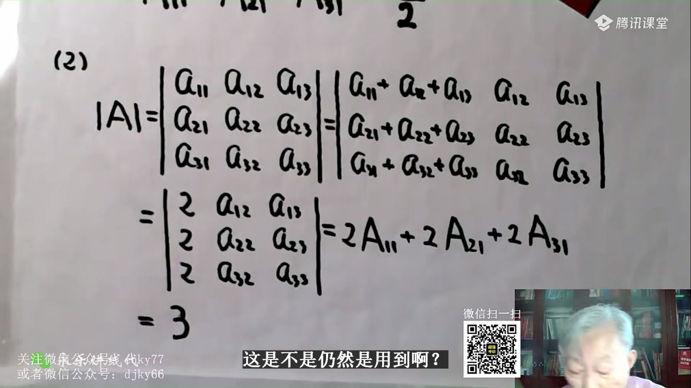
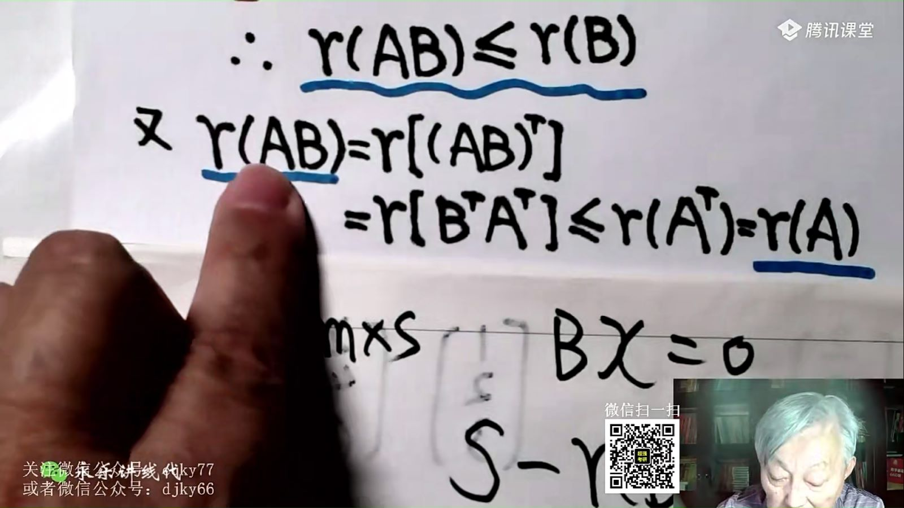
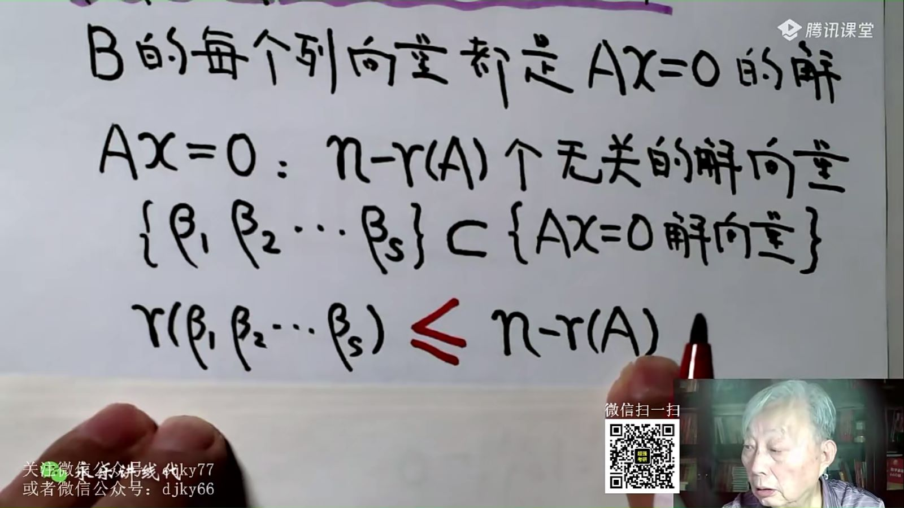

# 1

求常数项，可把x全代0——多项式的性质



00:27:44



注意，这么拆

两种归纳法适用的情况



01:40:05



归纳假设例题

实在不会做第一问，可以用第一问的结论做第二问，独立给分



01:46:35



n阶行列式的考题

隐藏爪形——感觉目的是三角区的数全变0，变爪型

伴随矩阵的重要公式，都要记忆，用蓝的都能推出其他，最后一行A的行列式不为0，推出第一行红的



01:53:35



可逆的：

特征值+相似

特征值和行列式的关系推导

-   特征方程拆开，在书的第二页，8个行列式
-   拆开和解的对比，对比出这两个结论



02:05:38



没有加减法的公式，需要变乘法——单位矩阵恒等变形：E变形，提公因式：



02:25:29



练习题讲解



02:30:04



特征值的公式

# 2

这种题做做，熟悉一下

AB=0的一个性质

至少

一大（随便抽一个二阶）一小（三个无关解）证明秩

一个证明AB的结论

另一种证明方法：用到了一个结论：2的解一定属于1的解

证明方法：ABX=0推BX=0，方程组一定有非零解



01:35:38



每行元素都为2，用矩阵的乘法处理

求伴随矩阵的一行：涉及到每行元素都为2的表示法：



02:26:24



每行元素都为2，也可以加起来处理：

矩阵乘法的三个内容，可以去研究一下

-   上面的前两个转置，后两个是对称矩阵
-   下面的一排都是数，值为上面的记
    -   第二行第三个是乘向量的平方和——其实也是内积的计算方式

A是可逆的，两边不能约分

# 3

主对角线一边全是0的矩阵

伴随和行列式|A|挂钩：

1.  上图的常见公式
2.  伴随的行列式是行列式的n-1次方

矩阵中有数就不是零矩阵了

伴随矩阵=转置矩阵：小a等于大A

大小a的关系=>行列式展开公式

同理：

证明中有：单位矩阵变形，推导需要的结论：

转置和逆的公式比较：

常数，

-   加法
    -   转置有公式，可以直接用来打开
    -   （A+B）-1没公式：又是加法变成乘法，单位矩阵恒等变形

把B带进去，**单位矩阵变形**



01:33:32





01:57:53



AB=E是一个极端重要的式子，一定要注意发现

行列式，拆成两个行列式乘积后，还能乘回去成一个行列式

上面：没有做正交化处理

下面：下面没有施密特正交化

正交一定可逆，A行列式不为0，所以行列式右下角不为0，即可推断出，二元一次x2x3方程只有零解

自己做一做

证|A|的思路：最后一个：等于相反数——这题的计算还挺综合的



02:35:55



注意：两个数相加等于0(a+b=0)，不要总想着一定构造出这两个数的相加，可以直接消元a=-b

# 4


00:24:50



初等矩阵的逆：三个公式

矩阵的逆和伴随矩阵是差个系数的关系（这个系数是行列式），向伴随的关系变化，可以两边求逆

求记：

1.  直接求矩阵
2.  特征值的和：A和A逆特征值互为倒数

一般矩阵的特征值可以是实数可以是复数——实对称矩阵一定是实数

什么时候分组👆

可逆的简单总结：辅对角线上的要交换——导图上的看起来比较复杂

就算是这种表示方法，也用伴随矩阵的核心公式：AA*=E😮

AB的行向量或列向量分别可以由B和A表示

由AB=C，知A和C，解B，可以分成解B的三个列向量（解三个方程）——最近几年比较喜欢考

解X，X是个矩阵，按列分块，解出两个解再拼起来——cdc；三个方程组之一，每个方程组应该只有一个基础解析吧，万一一个方程组的秩为1，有两个基础解系怎么破



01:56:28



拼一个增广矩阵，加减消元，再独立解各个方程：

注意解X的每一列都有不同的未知数

向量线性相关，转换成系数组成的向量+向量组成的系数矩阵——齐次方程有非零解

-   把各个列向量并起来

# 5

这道题是一个结论

这个证明不是显然的：

乘一个可逆矩阵（方的）才不改变秩

左乘一个列满秩，不改变秩

**所以从左推右（线性无关推可逆）**。不能直接划等号：用性质，等号左边秩为3，一定小于等于等号两个矩阵秩的最小值

右推左才能化等号

这种题，先用排除法之类，排除一下哪个能加出0，表示相关。性质之类来判断

观察不错来再用秩（分块矩阵）

一定注意技巧——尤其是排除法，观察法

还有这样解非齐次方程组的？

矩阵等价，列向量组的等价

行等价，列等加

非齐次方程组，b那一侧最后为0，不用讨论了，一定有解（不管是无穷个还是唯一个）

——所以着重讨论系数矩阵这边是不是有一行得0，此时才有可能无解。

讨论时沿着对角线向上讨论的

# 6

出现“没有”，证明题常用反证法



00:54:38



秩可以求具体向量能不能被其他向量组线性表出（系数秩=增广系数的秩），当然**抽象**的向量组也可以用

“不能”：比较难以用符号描述——所以命题人目的是把结论进行合并

-   可以线性表出：$\beta$是由$\alpha_{1}到\alpha_{m}$每一项加一个系数k组成的
-   不可以可以线性表出：$\alpha_{m}$的系数$k_m$不能为0。不为0，就能除了，于是就证明成功

证明向量是否可以线性表出：

(3)：直接除k，方程直接写出几个向量线性组合成一个新向量

爪型，不看主对角线，每一列一样：



02:07:03



一个向量组A能被B表示，则A的秩<B的秩（秩可以理解为**非废物**向量的个数）

# 7

 
 

夹逼，求秩常用

常用结论，这里的k为-1

解是集合的关系

证明r(AB)<r(A)——min(A,B)

证明r(AB)<r(A)——min(A,B)

用齐次方程组的自由变量的个数比较：因为BX=0的解包含在ABX=0的解里，所以BX=0的解向量的少于ABX=0的解向量数

==转置搭把手==：一般用于证明秩——转置不改变矩阵的秩

两边结论都转置，相当于证明另一侧的结论

证明可逆矩阵乘，不改变矩阵的秩：

连等式——也是个常见处理方法

这种分块矩阵是可以的，不信可以画图

AB=0的秩：B中有几个向量无关

n-r(A)的秩：所有解中有几个向量无关

-   我的**错误**理解：增广矩阵左侧的A的秩比右侧AB的秩要大（或等于），所以秩一直为r(A)
-   实际上没有以上这种算法：只有只看左边的系数矩阵以及全部都看的增广矩阵，没有只看右边的矩阵
-   用AB是**A的列向量的一种组合表示**/B的行向量的组合表示来做
    -   相当于A选项中，右侧是左侧A的表示，直接消掉右边即可
-   考试可以带值进去试或者试特例

这是定理八

而

1**不能**由2线性表示，不提供任何消息

可能数字不在一行

A能表出B，B不能表出A

这两个条件连在一起：

严格小于——向量组等价的两个定义法之一

但这道题后面还要验证

可以反着用，伴随不是0矩阵，伴随的秩不为0，r不能不是第三行，应该是n或者n-1

列的爪型：

出现单位矩阵，x1是自由向量，直接写相反数，不用化成行最简，李永乐前面打招呼了——打招呼什么？



02:12:00

# 8

证明是**齐次**方程的解。

-   线性无关，相减一定不等
-   两个解加起来也是解

证基础解系：

1.  验证是解
2.  证明无关
3.  数量足够n-r

考，这里的伴随仍旧用了特殊公式：

特征值和秩关联起来：两个不同的特征向量——至少有两个非零特征值，秩至少为2(通过相似矩阵)

抓住**对角矩阵的秩=行列式的秩**

通过**拼凑齐次方程的解结构**来解抽象方程

1.  一定先算n-r（**先求秩**），有一个自由向量（非齐的）+常数向量
    1.  **题目中的等式$\alpha_3=\alpha_1+2\alpha_2$就是表明一个解**
    2.  方程组的一个特解，这里也是题目条件提供的

基础解析已知，求公共解

非零公共解，要求秩不满：



01:38:52



公共解：解基础解系构成的方程

证明：同解$A^TA\alpha =0 和 A\alpha =0 $同解

r(AB)——A列满秩

r(B)秩相等

证明：ABX=0、BX=0同解，所以秩相同

待定系数法，这种题AC-CA=B

这是方程组的应用，算出来再拼矩阵

这句是错的，可能无解

考场上见到相反的选项CD，则排除AB

具体原因：还能这样缩放，部分向量秩小于等于更多。（行、列均可）（解方程组才涉及到只能行变换）：

大概选 C 吧

# 9

偷懒方法：特征值不是重根，矩阵秩一定为3-1=2，因为矩阵中随便两行都不成比例，所以随意抹去一行

上三角矩阵，特征值就是对角线上的数字

局部也能用克拉默法则？判断局部方程只有0解

（不会就不会吧）

这种矩阵的基础解析一看就是(1,0,0)

矩阵不能事先进行变换

这个5b是方程组的解，可以直接形成A(5b)=b

而$\eta_1 \eta_2$的作为齐次方程的解（齐次方程的非零解（解系的组成向量），可以分别当作0为特征值的特征向量）：

-   通过定义的表达式推断特征值和特征向量
	- 比如：$\because \alpha_{1}=0 ,\therefore A \alpha_{2}=A (2\alpha_{1}+ \alpha_{2})=2 \alpha_{1}+\alpha_{2}$，**等式拼凑，而不是变换矩阵。**
	-   这里为什么没有：不同特征值向量加加减减就不是特征向量的判断呢？因为虽然$\alpha_1$是一个特征值的特征向量，$\alpha_2$却不是。
-   还可以用相似——分块矩阵，这是典型的分块矩阵的特征——向量线性无关+线性方程组的等式：
	- 
		- 相似矩阵的特征值相同，特征向量有变化关系
	- 这块再做一下，有一些细节



01:14:24



特征值，不能先变换，再用性质——而是要么 $\lambda E-A$ 求，要么不变换，再用性质。

$A\alpha_3=0$，齐次方程的解就是 0 的特征向量

# 10
