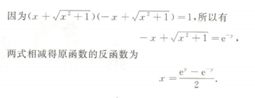
	 [有根号有指数化简不了。左侧式子结构刚好等于1的因式分解，替换原式，相加化简](bookxnotepro://opennote/?nb={bf3dc445-0c59-4185-bcd0-3d63797cc6cb}&book=5a091f463109e55808917619f8d3498b&page=12&x=789&y=447&id=1031)
	 1. 反函数无法化简变化
	 2. x形成的表达式$x+\sqrt{x^2+1}$和另一个平方差结果为1[[特殊结构]]，可做倒数
	 3. 这个式子可以用来消分母[037](bookxnotepro://opennote/?nb={512382f5-a3a5-4617-b335-e716d4b5f10c}&book=7c79fd0abca65e43b34474f815f9e7ce&page=36&x=100&y=536&id=460&uuid=d7721e09e7d70864c02d688dd0169b20) 
		 ![[WIN_20220915_21_31_16_Pro.jpg]]
		 因为  $\ln(x+\sqrt{1+x^2})$  为奇函数，  [084](bookxnotepro://opennote/?nb={512382f5-a3a5-4617-b335-e716d4b5f10c}&book=b58fa85d19ce1d4b81c4b85dda1d104f&page=83&x=166&y=411&id=462&uuid=1af34518738d40ccaff1847a4e29516c)
	  ^8pt3en

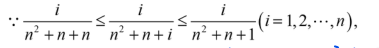
	 [006](bookxnotepro://opennote/?nb={bf3dc445-0c59-4185-bcd0-3d63797cc6cb}&book=43a8ddb447e812db0b53f95f0fb7e921&page=5&x=299&y=584&id=1103)
	 多项式夹逼，每项不同，表示方法

![[第一章 极限与连续#^cfasod]]
这个式子可以从两个维度观察
- 外套根号——用于写表达式
- 右下角加根2——用于看出单调递增

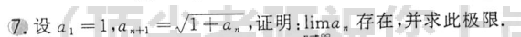
	[011](bookxnotepro://opennote/?nb={512382f5-a3a5-4617-b335-e716d4b5f10c}&book=7c79fd0abca65e43b34474f815f9e7ce&page=10&x=172&y=316&id=1)
	类似例子（同样的题，但没有直接明白的写，比较容易迷糊）

![[第一章 极限与连续#^w3ju6u]]
提出有极限的部分
![[第一章 极限与连续#^5s2cp0]]
![[第一章 极限与连续#^vx7w0d]]

---

![[第一章 极限与连续#^5dva7y]]
![[第一章 极限与连续#^hpvw88]]
这个虽然前面部分是 $\frac{0}{0}$，但似乎不是相减的，就可以等价无穷小

---

$arcsin x - x$ 求导后就是 $(1-x^{2})^{- \frac{1}{2}}-1$
就是个等价无穷小
^kdq34z
[[思考#^uh375y]]

---

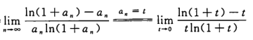
	[013](bookxnotepro://opennote/?nb={512382f5-a3a5-4617-b335-e716d4b5f10c}&book=b58fa85d19ce1d4b81c4b85dda1d104f&page=12&x=239&y=373&id=14&uuid=b92352bfbd50679e2dd945d15202c539)
	特殊题型，序列极限可以直接用作为连续极限
	![[WIN_20220810_20_29_09_Pro.jpg]]这种处理就不靠谱

一种拆的方法
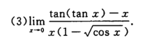
	[015](bookxnotepro://opennote/?nb={512382f5-a3a5-4617-b335-e716d4b5f10c}&book=7c79fd0abca65e43b34474f815f9e7ce&page=14&x=96&y=228&id=43&uuid=4c495e9efa4457800362fc8977689c57)
	第三行
	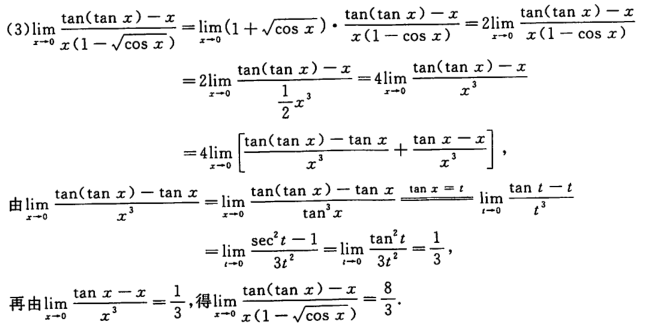
	[023](bookxnotepro://opennote/?nb={512382f5-a3a5-4617-b335-e716d4b5f10c}&book=b58fa85d19ce1d4b81c4b85dda1d104f&page=22&x=236&y=540&id=44&uuid=3ba7c6bc6f37e51154455a4449aa846f)

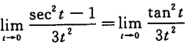
	[023](bookxnotepro://opennote/?nb={512382f5-a3a5-4617-b335-e716d4b5f10c}&book=b58fa85d19ce1d4b81c4b85dda1d104f&page=22&x=232&y=590&id=46&uuid=777bb65d0e851889363b54719fd8feeb)
	$sec^{2}t-1=tan^{2}t$化简
	 ^m0ls71

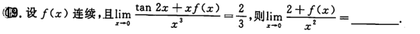
	[012](bookxnotepro://opennote/?nb={512382f5-a3a5-4617-b335-e716d4b5f10c}&book=7c79fd0abca65e43b34474f815f9e7ce&page=11&x=218&y=464&id=28&uuid=117de44d21d0a054111b1cb0c740869e)
	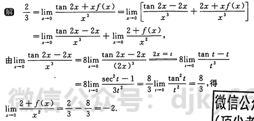
	[017](bookxnotepro://opennote/?nb={512382f5-a3a5-4617-b335-e716d4b5f10c}&book=b58fa85d19ce1d4b81c4b85dda1d104f&page=16&x=199&y=229&id=29&uuid=c77e4b33b0fea4fdf5cc384018a99537)
	拆法 ^u09tn5

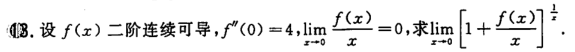
	[015](bookxnotepro://opennote/?nb={512382f5-a3a5-4617-b335-e716d4b5f10c}&book=7c79fd0abca65e43b34474f815f9e7ce&page=14&x=198&y=451&id=53&uuid=03c662dfe1eff2805a6af54826619344)
	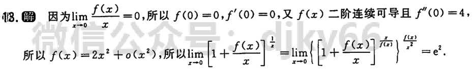
	[025](bookxnotepro://opennote/?nb={512382f5-a3a5-4617-b335-e716d4b5f10c}&book=b58fa85d19ce1d4b81c4b85dda1d104f&page=24&x=234&y=275&id=54&uuid=bf41a53b00e3c5557f607168ecb801bf)
	1. 分式上下极限为0/0才可以洛必达，所以$\frac{\frac{f(x)}{x}}{x}$不能化成$\frac{f(x)}{x^2}$，因为只知道前式子上下为0（虽然这道题做出的答案是正确的
	2. 这道题采用taylor公式

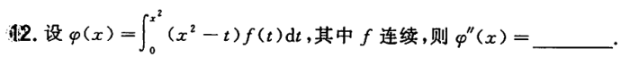
	[018](bookxnotepro://opennote/?nb={512382f5-a3a5-4617-b335-e716d4b5f10c}&book=7c79fd0abca65e43b34474f815f9e7ce&page=17&x=203&y=578&id=75&uuid=f609cec4bf69e097d542081feb767513)
	括号拆开就行，不用分别积分
	这个和u代替$x-t$不是一个处理方法
		如果$xf(x-t)$可以尝试用那个处理方法，把括号内的等式提到外面，然后拆开
- 易错：
	![[WIN_20220817_22_44_05_Pro.jpg]]
	我看到这个式子：
	错：减号左右求导后相等，结果为0
	对：左侧其实是一个**两式相乘形式**——**$x^2$和$\int ^{x^2}_{0}f(t)dt$相乘**——不把$x^2$提出来同一混淆 ^oifnf5

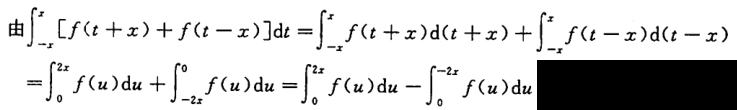
	[034](bookxnotepro://opennote/?nb={512382f5-a3a5-4617-b335-e716d4b5f10c}&book=b58fa85d19ce1d4b81c4b85dda1d104f&page=33&x=264&y=592&id=79&uuid=971375839089aac6b0d0dd4adeed4559)
	常见定积分凑积分变量的操作——积分范围是积分变量的范围，$d(t+1)$积分变量的为$t$而不是$t+1$

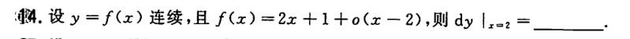
	[018](bookxnotepro://opennote/?nb={512382f5-a3a5-4617-b335-e716d4b5f10c}&book=7c79fd0abca65e43b34474f815f9e7ce&page=17&x=220&y=633&id=80&uuid=645d343e593718f9c84227d6f3be020e)
	微分的定义（带有高阶无穷小）

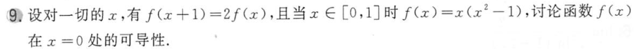
	[021](bookxnotepro://opennote/?nb={512382f5-a3a5-4617-b335-e716d4b5f10c}&book=7c79fd0abca65e43b34474f815f9e7ce&page=20&x=241&y=111&id=90&uuid=bb846e77f880df2478e0f0823ea8a7e3)

	[021](bookxnotepro://opennote/?nb={512382f5-a3a5-4617-b335-e716d4b5f10c}&book=7c79fd0abca65e43b34474f815f9e7ce&page=20&x=241&y=111&id=90&uuid=bb846e77f880df2478e0f0823ea8a7e3)
	平移+缩放处理：
	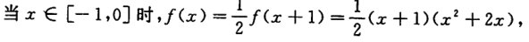
	[040](bookxnotepro://opennote/?nb={512382f5-a3a5-4617-b335-e716d4b5f10c}&book=b58fa85d19ce1d4b81c4b85dda1d104f&page=39&x=226&y=220&id=91&uuid=214e0c0b6b43ee59dd32f145d25bbbfc)
	周期函数不只是加一个缩放，还要平移（左加右减）——以后见到周期（或类周期，如本题）直接用函数的平移处理吧

![[Pasted image 20220824210300.png]]

---

![[第三章 一元函数微分学的应用#^6lbvh6]]

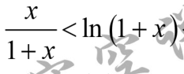
	[022](bookxnotepro://opennote/?nb={214cb125-5d23-4d98-a6be-193ff2248daa}&book=b031d6b3dcd76797850d98a4b61794f8&page=21&x=256&y=92&id=6740&uuid=cbbb747620405a232a42bf4caf6dd8b5)
	这个公式想到lagrange公式
	![[Pasted image 20220824222335.png]]

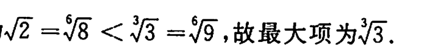
	[044](bookxnotepro://opennote/?nb={512382f5-a3a5-4617-b335-e716d4b5f10c}&book=b58fa85d19ce1d4b81c4b85dda1d104f&page=43&x=163&y=159&id=98&uuid=69515092f600290131191ad6abe1af13)
	比较根号的大小的方法——指数分母
	![[WIN_20220825_20_57_37_Pro.jpg]]

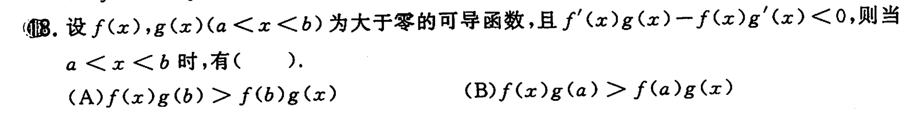
	[025](bookxnotepro://opennote/?nb={512382f5-a3a5-4617-b335-e716d4b5f10c}&book=7c79fd0abca65e43b34474f815f9e7ce&page=24&x=243&y=669&id=123&uuid=6cc98acd2bac82763252740f7faad226)
	单调性证明后，用x替换a或者b，要考虑题目给的x的范围，而不只是替换大的

	[026](bookxnotepro://opennote/?nb={512382f5-a3a5-4617-b335-e716d4b5f10c}&book=7c79fd0abca65e43b34474f815f9e7ce&page=25&x=248&y=108&id=135&uuid=45d3325aefe2157d8ce7cf73a98ee219)
	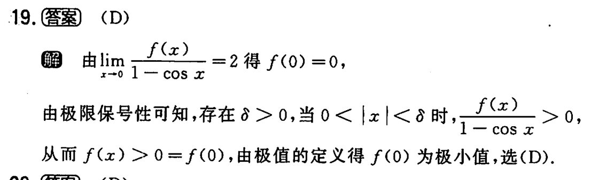
	[052](bookxnotepro://opennote/?nb={512382f5-a3a5-4617-b335-e716d4b5f10c}&book=b58fa85d19ce1d4b81c4b85dda1d104f&page=51&x=209&y=480&id=136&uuid=ea2dce1077d0a05f3a626d47b79760b1)
	最好用极值的定义，而不是自创的方法（但感觉没错过🤔）——极限已知结果，求洛必达仍等于该结果（感觉很不合理，因为我不了解洛必达的性质）
![[WIN_20220827_20_22_27_Pro.jpg]]

---

不定积分的处理
![[第四章 不定积分#处理方法积累]]

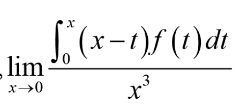
	[006](bookxnotepro://opennote/?nb={ec423aab-2142-4b0d-a00e-1aaa4360aa38}&book=80380b5d846461f8589b47936e6657ca&page=5&x=336&y=515&id=4656&uuid=706d4980f519e4ddfced5eb16f90a6d2)
	定积分表达式内部不应该有积分限x，想办法处理掉——这里是分裂出来
	 ^i17tzt

![[第五章 定积分及其应用#^b5tfhy]]

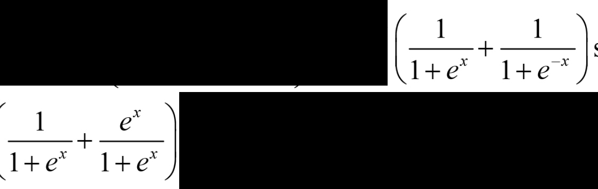
	[009](bookxnotepro://opennote/?nb={ec423aab-2142-4b0d-a00e-1aaa4360aa38}&book=80380b5d846461f8589b47936e6657ca&page=8&x=251&y=618&id=4674&uuid=b69e54dc6003115e6a2181c7e01ff821)
	这两者相加为0

	[071](bookxnotepro://opennote/?nb={512382f5-a3a5-4617-b335-e716d4b5f10c}&book=b58fa85d19ce1d4b81c4b85dda1d104f&page=70&x=191&y=566&id=274&uuid=f651cb88045463db4191e7c473e49236)
	$1-\sin 2x$ 是一个平方的形式[[特殊结构]]

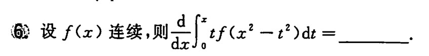
	[032](bookxnotepro://opennote/?nb={512382f5-a3a5-4617-b335-e716d4b5f10c}&book=7c79fd0abca65e43b34474f815f9e7ce&page=31&x=167&y=369&id=277&uuid=5e64e290be4843f36d8f23550ad2b947)
	cdz:用u代替$x^2-t^2$ 会导致代换f前的t时，根号内的x无法剔除[[计算处理方法#^i17tzt]]
	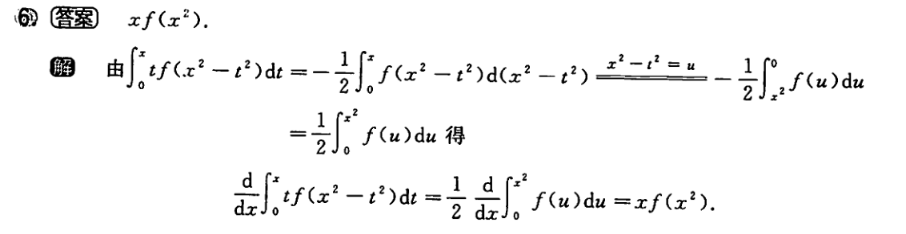
	[072](bookxnotepro://opennote/?nb={512382f5-a3a5-4617-b335-e716d4b5f10c}&book=b58fa85d19ce1d4b81c4b85dda1d104f&page=71&x=246&y=645&id=278&uuid=77d550f7b55c221c009ec3fbd78972be)
	把t提到d后，就不用表示t了，成了$t^2$ 就没有根号了

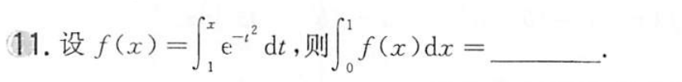
	[034](bookxnotepro://opennote/?nb={512382f5-a3a5-4617-b335-e716d4b5f10c}&book=7c79fd0abca65e43b34474f815f9e7ce&page=33&x=168&y=538&id=281&uuid=a2a48d326131eb5bbfff50120c85c1b0)
	变限积分的积分，常用分部计算中的“求导”来化简本身复杂的形式
	本题[[第五章 定积分及其应用#Gamma 函数|这个形式]] 类似$\Gamma$ 函数的形式[[特殊结构]]

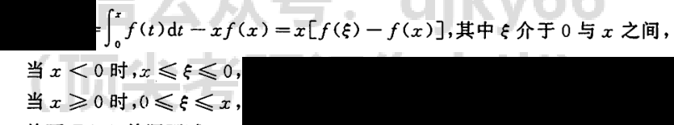
	[082](bookxnotepro://opennote/?nb={512382f5-a3a5-4617-b335-e716d4b5f10c}&book=b58fa85d19ce1d4b81c4b85dda1d104f&page=81&x=221&y=311&id=449&uuid=4736b06482d8aa75c98caf0d45692594)
	这个形式用[[第五章 定积分及其应用#积分中值定理|积分中值定理]]形成$x\times f(\xi)$ 
	要考虑到x在0的左右边$\xi$ 的也会随之变化

---

![[第五章 定积分及其应用#^8tgznf]]

---

![[第五章 定积分及其应用#定积分计算处理方法]]

![[收集的习题#^tnzx9o]]

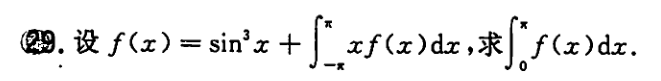
	[038](bookxnotepro://opennote/?nb={512382f5-a3a5-4617-b335-e716d4b5f10c}&book=7c79fd0abca65e43b34474f815f9e7ce&page=37&x=162&y=238&id=475&uuid=dcc7bd8472064e41a3d3bdb56a4077e9)
	套娃题目
	
	[085](bookxnotepro://opennote/?nb={512382f5-a3a5-4617-b335-e716d4b5f10c}&book=b58fa85d19ce1d4b81c4b85dda1d104f&page=84&x=207&y=709&id=476&uuid=03b71e3d0b05c5a3d1afb7b84944f16c)
	1. 令自身积分的部分为A——因为定积分的结果是常数，方便计算
	2. 左侧再构造一个A，可能需要解方程
	3. 求出A，继续解题
	 ^2jr1u7

![[第一章 极限与连续#^5s5rap]]

	[090](bookxnotepro://opennote/?nb={512382f5-a3a5-4617-b335-e716d4b5f10c}&book=b58fa85d19ce1d4b81c4b85dda1d104f&page=89&x=264&y=441&id=495&uuid=d02a9a3de95f164dcf0212b45aa6521f)
	这种三角函数+$\pi$ 积分域的计算，最好用对称法处理一下，消去奇函数，否则拆开一个一个算很复杂。

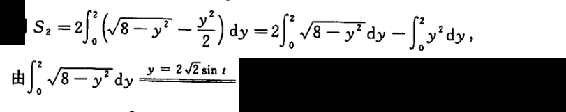
	[090](bookxnotepro://opennote/?nb={512382f5-a3a5-4617-b335-e716d4b5f10c}&book=b58fa85d19ce1d4b81c4b85dda1d104f&page=89&x=218&y=608&id=496&uuid=68389c9cb4cdc020dcaec310a6c0f57b)
	换元法时候，没必要把所有值都带进去——后面这个$y^2$ 可以自己单独算

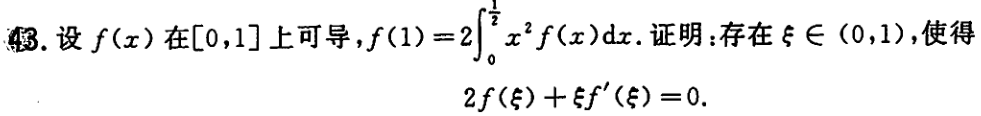
	[039](bookxnotepro://opennote/?nb={512382f5-a3a5-4617-b335-e716d4b5f10c}&book=7c79fd0abca65e43b34474f815f9e7ce&page=38&x=215&y=175&id=488&uuid=de7b05a92c0c0d2b8ae87ebb1fdd2f8b)
	正常的[[第三章 一元函数微分学的应用#题型二 待证结论中只有一个中值 xi ，不含其他字母|两项…存在证明]]的格式。
	
	[088](bookxnotepro://opennote/?nb={512382f5-a3a5-4617-b335-e716d4b5f10c}&book=b58fa85d19ce1d4b81c4b85dda1d104f&page=87&x=255&y=385&id=509&uuid=fa98619774ac4e55c63393e2a33fc041)
	1. 巧的地方：$\varphi(x)=x^{2}f(x)$ 刚好是$2 \int^{\frac{1}{2}}_{0}x^{2}f(x)dx$ 里的式子——所以用积分中值定理“去积分限”
	2. 注意：找两个相等的点，这里找的是0-1/2 里的和1，没找0
	 ^y8o8l2

带积分的证明题：好多把积分上限改成 x，变成变限积分

![[第七章 微分方程#处理方法]]

![[第八章题目#处理方法]]

![[第九章习题#处理方法]]

![[第十章习题#处理方法]]

![[第十一章 向量代数与空间解析结合及多元微分学在几何上的应用#处理方法]]

![[十二章习题#处理方法]]

![[第十章 无穷级数#杂七杂八]]