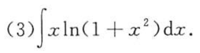
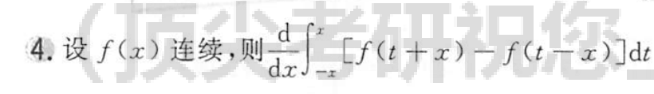
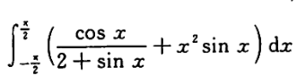
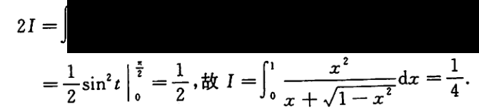
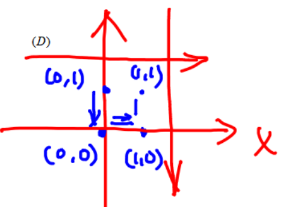
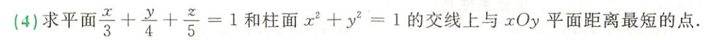
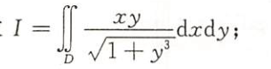
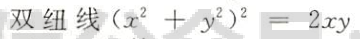
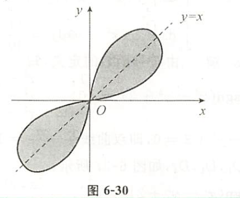

![[WIN_20220810_22_35_45_Pro.jpg]]
e的0次方不是0，而是1。——分子的二项容易和第一项一样顺手写成0，实际上是1

![[WIN_20220810_23_11_58_Pro.jpg]]
计算丢分母

![[WIN_20220810_23_29_38_Pro.jpg]]
[[导数列表|导数]]记错了

正确为[022](bookxnotepro://opennote/?nb={512382f5-a3a5-4617-b335-e716d4b5f10c}&book=b58fa85d19ce1d4b81c4b85dda1d104f&page=21&x=220&y=629&id=41&uuid=043dfb3fe0f8bf7a68794a1d42b6a691)

![[WIN_20220810_23_47_38_Pro.jpg]]
分母括号内的值不为1，为2

	[020](bookxnotepro://opennote/?nb={512382f5-a3a5-4617-b335-e716d4b5f10c}&book=b58fa85d19ce1d4b81c4b85dda1d104f&page=19&x=372&y=461&id=33&uuid=67badf91f2db9cf78bb61b2ffb3d3f04)
	总是把下面的e丢了，**非常普遍**

等价无穷小中，分子等价变换，分母缺求导做洛必达了：

导数记错
![[WIN_20220811_22_23_53_Pro.jpg]]
![[导数列表#^s1d82b|tan的导数和arctan的导数混淆]]![[导数列表#^jbbe5l]]

![[WIN_20220811_22_51_48_Pro.jpg]]
cos-1 经常把cos内部的系数丢失了

	[016](bookxnotepro://opennote/?nb={512382f5-a3a5-4617-b335-e716d4b5f10c}&book=7c79fd0abca65e43b34474f815f9e7ce&page=15&x=193&y=412&id=65&uuid=957c5ee6086e8233fe4f25a5e573daee)
	趋近于1时，$x^2-1$仍然有正负之分，$(x-1)^2$则没有，恒大于0。所以这里$arctan$趋向于$\frac{\pi}{2}$，也有趋向于$-\frac{\pi}{2}$的，是跳跃间断点

![[WIN_20220814_00_14_46_Pro.jpg]]
抄写错误，上式指数的3抄到下面变成括号内的数了

![[WIN_20220814_00_19_27_Pro.jpg]]
抄写错误，缺少元素

![[WIN_20220814_01_03_02_Pro.jpg]]
隐函数的求导中，等式左右移动会忘加引号

![[WIN_20220817_22_32_36_Pro.jpg]]
变限积分不要忘了2x（限）也要求导

![[WIN_20220817_22_44_05_Pro 1.jpg]]
- 左式求导只替换t，不替换x
- ![[计算处理方法#^oifnf5]]

	[019](bookxnotepro://opennote/?nb={512382f5-a3a5-4617-b335-e716d4b5f10c}&book=7c79fd0abca65e43b34474f815f9e7ce&page=18&x=181&y=160&id=82&uuid=01a244adceaf587a5c828fcdd7bc2a11)
	求上一行，求错行了
	![[WIN_20220817_23_17_48_Pro.jpg]]

![[WIN_20220817_23_57_17_Pro.jpg]]
抄写错误——指数3容易抄成2

![[WIN_20220818_00_03_41_Pro.jpg]]
-0次方不是0是1
类似的：
![[WIN_20220818_00_13_41_Pro.jpg]]

![[WIN_20220825_20_18_35_Pro.jpg]]
趋近于负无穷，注意arctanx的符号也是负的，所以趋近于正无穷，不要想当然趋负无穷

![[WIN_20220830_14_27_03_Pro.jpg]]
**不定积分结果的积分：考虑括号前常数+d 后变化产生的常数** ——经常错

	[029](bookxnotepro://opennote/?nb={512382f5-a3a5-4617-b335-e716d4b5f10c}&book=7c79fd0abca65e43b34474f815f9e7ce&page=28&x=96&y=233&id=156&uuid=047b9a90cfd817dbca061677fc5b6b54)
1. ln此时被积分——用的是分部积分，而不是凑，典型错误：
	![[Pasted image 20220830145517.png]]
	并不知道谁的原函数是ln
2. ![[WIN_20220830_15_27_32_Pro.jpg]]
	==分部积分的求导也要把内函数求导==

![[WIN_20220830_15_54_51_Pro.jpg]]
d在分子的写法，容易系数出错

====
==**经常性[[第四章 不定积分#三角代换|不定积分第二类换元法]]忘记变形回来**==
====

$\cot t$ 容易抄成 $\cos t$ 两个t容易混淆

不定积分arctan写成tan
![[WIN_20220901_15_19_09_Pro.jpg]]

![[计算处理方法#^i17tzt]]
- 这类题，拆开之后千万不要把提出来的x当常数算了：![[WIN_20220908_14_44_30_Pro.jpg]]

	[034](bookxnotepro://opennote/?nb={512382f5-a3a5-4617-b335-e716d4b5f10c}&book=7c79fd0abca65e43b34474f815f9e7ce&page=33&x=157&y=325&id=442&uuid=77b132363b480338636fba5fd52f6c7f)
	![[WIN_20220915_13_29_23_Pro.jpg]]
	对称性要对称好积分对象对象，这里是t不是x

![[WIN_20220915_13_38_59_Pro.jpg|100]]
x的积分是$\frac{x^2}{2}$ 不是常数积分的x

	[083](bookxnotepro://opennote/?nb={512382f5-a3a5-4617-b335-e716d4b5f10c}&book=b58fa85d19ce1d4b81c4b85dda1d104f&page=82&x=132&y=498&id=453&uuid=74e32e88c8265d19e7a0f7ee8afdad1e)
	一部分是奇函数，并不代表另一部分是偶函数

	[087](bookxnotepro://opennote/?nb={512382f5-a3a5-4617-b335-e716d4b5f10c}&book=b58fa85d19ce1d4b81c4b85dda1d104f&page=86&x=165&y=422&id=485&uuid=fe19be9dd2a7a6c541db3ba3cdc3ae51)
	2I不要忘了÷2

![[WIN_20220918_18_55_56_Scan.jpg|200]]

	[023](bookxnotepro://opennote/?nb={eaae9369-1988-4e39-8c00-ce441fc1deb4}&book=0da33fe4293e40420460104f8af59907&page=22&x=517&y=151&id=16992&uuid=215f38d1ca59d255833f253ac93b41fc)
	连续的比较，不等式最好一个一个写，再组合，不然容易自己骗自己

	[037](bookxnotepro://opennote/?nb={4b0b849c-f284-459f-9b9c-e14b0ecf8ba2}&book=4f1972a39d8f1176257957a09d832b75&page=36&x=248&y=179&id=49&uuid=b695fab3fbcd481f3dd47c866e4da6d8)
	留意题目要求的点——这里是"距离平面距离最短的点"，也就是 $|z|$ 。不是距离原点的点啊

![[WIN_20221021_15_07_44_Scan.jpg]]
不要以为前面和后面的结构类似 $\frac{2}{\pi}$ 就一定要消掉——做题时候不要想当然

![[WIN_20221021_15_09_36_Scan.jpg]]
==究竟几个负号问题==，经常注意这种问题，反复检查
尤其是 cos

![[WIN_20221021_16_47_34_Scan.jpg]]
口算，这里 3 的倍数

括号中中各项的共有系数提出去，注意别忘了后面的，**遇到这种计算慢慢抄写吧。**
![[Drawing 2022-10-24 15.02.53.excalidraw]]

	[042](bookxnotepro://opennote/?nb={4b0b849c-f284-459f-9b9c-e14b0ecf8ba2}&book=4f1972a39d8f1176257957a09d832b75&page=41&x=359&y=183&id=106&uuid=39f4e2ac27a46624237a738ec87cce13)
	注意这里是 $y^3$

![[十二章习题#^38u3md]]
注意：$D_1$ 才是 x 应用对称性的地方，$D_2$ 老老实实求

	[110](bookxnotepro://opennote/?nb={4b0b849c-f284-459f-9b9c-e14b0ecf8ba2}&book=4db326750425a2eac028b50acbc37456&page=109&x=161&y=270&id=119&uuid=8ce0a06dae848deac1a4ebd1deb1f94e)
	双扭线，化成极极坐标可以取 0（二四象限），$\rho =\sqrt{2\sin(\theta)\cos(\theta)}$（一三象限）——没学就不要自己分析，分析不清😑：

	[110](bookxnotepro://opennote/?nb={4b0b849c-f284-459f-9b9c-e14b0ecf8ba2}&book=4db326750425a2eac028b50acbc37456&page=109&x=355&y=405&id=118&uuid=eaccabbc71c5019ce2377f838f19b63f)
	[[对称]]
