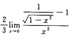
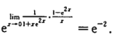
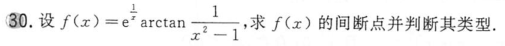
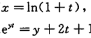

![[WIN_20220810_22_35_45_Pro.jpg]]
e的0次方不是0，而是1。——分子的二项容易和第一项一样顺手写成0，实际上是1

![[WIN_20220810_23_11_58_Pro.jpg]]
计算丢分母

![[WIN_20220810_23_29_38_Pro.jpg]]
[[导数列表|导数]]记错了

正确为[022](bookxnotepro://opennote/?nb={512382f5-a3a5-4617-b335-e716d4b5f10c}&book=b58fa85d19ce1d4b81c4b85dda1d104f&page=21&x=220&y=629&id=41&uuid=043dfb3fe0f8bf7a68794a1d42b6a691)

![[WIN_20220810_23_47_38_Pro.jpg]]
分母括号内的值不为1，为2

	[020](bookxnotepro://opennote/?nb={512382f5-a3a5-4617-b335-e716d4b5f10c}&book=b58fa85d19ce1d4b81c4b85dda1d104f&page=19&x=372&y=461&id=33&uuid=67badf91f2db9cf78bb61b2ffb3d3f04)
	总是把下面的e丢了，**非常普遍**

等价无穷小中，分子等价变换，分母缺求导做洛必达了：

导数记错
![[WIN_20220811_22_23_53_Pro.jpg]]
![[导数列表#^s1d82b|tan的导数和arctan的导数混淆]]![[导数列表#^jbbe5l]]

![[WIN_20220811_22_51_48_Pro.jpg]]
cos-1 经常把cos内部的系数丢失了

	[016](bookxnotepro://opennote/?nb={512382f5-a3a5-4617-b335-e716d4b5f10c}&book=7c79fd0abca65e43b34474f815f9e7ce&page=15&x=193&y=412&id=65&uuid=957c5ee6086e8233fe4f25a5e573daee)
	趋近于1时，$x^2-1$仍然有正负之分，$(x-1)^2$则没有，恒大于0。所以这里$arctan$趋向于$\frac{\pi}{2}$，也有趋向于$-\frac{\pi}{2}$的，是跳跃间断点

![[WIN_20220814_00_14_46_Pro.jpg]]
抄写错误，上式指数的3抄到下面变成括号内的数了

![[WIN_20220814_00_19_27_Pro.jpg]]
抄写错误，缺少元素

![[WIN_20220814_01_03_02_Pro.jpg]]
隐函数的求导中，等式左右移动会忘加引号

![[WIN_20220817_22_32_36_Pro.jpg]]
变限积分不要忘了2x（限）也要求导

![[WIN_20220817_22_44_05_Pro 1.jpg]]
- 左式求导只替换t，不替换x
- ![[计算处理方法#^oifnf5]]

	[019](bookxnotepro://opennote/?nb={512382f5-a3a5-4617-b335-e716d4b5f10c}&book=7c79fd0abca65e43b34474f815f9e7ce&page=18&x=181&y=160&id=82&uuid=01a244adceaf587a5c828fcdd7bc2a11)
	求上一行，求错行了
	![[WIN_20220817_23_17_48_Pro.jpg]]

![[WIN_20220817_23_57_17_Pro.jpg]]
抄写错误——指数3容易抄成2

![[WIN_20220818_00_03_41_Pro.jpg]]
-0次方不是0是1
类似的：
![[WIN_20220818_00_13_41_Pro.jpg]]

![[WIN_20220825_20_18_35_Pro.jpg]]
趋近于负无穷，注意arctanx的符号也是负的，所以趋近于正无穷，不要想当然趋负无穷