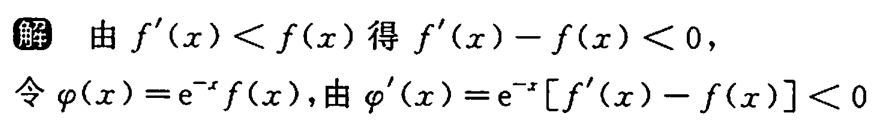

![[第三章 一元函数微分学的应用#^p42nez]]

![[第三章 一元函数微分学的应用#^d6ubkr]]

$$\cot x=\frac{\cos x}{\sin x}$$
来自$\ln(\sin x)$

	[050](bookxnotepro://opennote/?nb={512382f5-a3a5-4617-b335-e716d4b5f10c}&book=b58fa85d19ce1d4b81c4b85dda1d104f&page=49&x=187&y=233&id=128&uuid=7a34bf5cf3fb372679b172f6b51beb3c)
	$f(x)$加减$f'(x)$可以加一个e构成原函数
	**加、减取决于e的分子符号**
	^1h2wtd